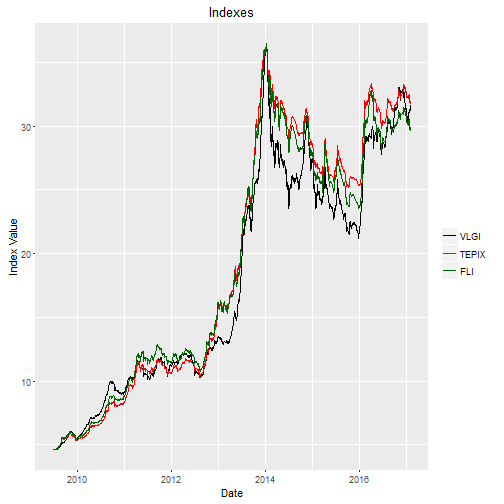

### Benchmark

Before anything get done, I need a benchmark to compare any performance
to it. Tehran Stock Exchange provide numerous indexes which could be
used for this sense. Seeing their definitions two things catches my
eyes, first they use weights based on company size and second using data
that are not adjusted for dividends which would result an inflated
index. Another important thing is that Tehran Stock Exchange provides
lots of groups indexes, some containing only a few companies as their
base group.

What I need from a benchmark is that it provide better out-of-sample
results, in other words I do not need a barometer for economic
performance. What I want is predictory power or a sensible portfolio and
the results would be tested in this sense. For reaching to this
objective I have several things in my mind that I would test them:

-   Creating indexes and compare them to existed indexes
    -   Price based indexes
    -   Indexes like Value Line Composite
-   Mean-Variance portfolio
-   Constant Rebalanced Portfolio

Absence of predetermined logical groups made me to consider cluster
analysis for grouping stocks and building related indexes too, I will
consider it in another post.

### Creating Indexes

For creating indexes I take into account the next two observation.
Firstly there are some companies that are not liquid at all and second,
the number of stocks in the market has increased from about 110 to , 440
during 16 years. So I consider 3/4 of stocks that have higher volume
during last period and I change the basket every six months form
"2001-03-21". In another way we could fix the number of stocks as our
base I chose the six months ending at "2014-03-21" as the base for
index. Adjusted prices is used for this computations. Another
interesting feature of Tehran Stocks data is that they could be not been
allowed for trading for a considerable amount of time. For solving this
problem when I created the data I excluded the stocks that have not
traded for the last 7/10 trading days for each subset. For these matters
following functions are used for this:

    library(plyr)
    library(dplyr)
    library(xts)
    library(data.table)
    library(forecast)

    date_data<- c(seq.Date(from = as.Date("2001-03-21"), to = Sys.Date(), by = "2 quarter"), Sys.Date())

    data_NA_rm<- function(x){
    if(sum(is.na(x$CLOSE)) >= (7/ 10)*dim(x)[1]){
      temp <- NULL
      } else { 
        if(var(x$CLOSE, na.rm = TRUE) == 0) {temp <- NULL} else {
          temp <- x
        }
      }
      return(temp)
    }

    # subsetting data
    sub_year_data<- list()
    for(i in 2: length( date_data)){
    sub_data<- subset( WDATA, WDATA$DATE <= date_data[i] & WDATA$DATE >= date_data[i-1])
    sub_year_data[[i-1]]<- ddply( sub_data, 'sym', .fun = function(x) data_NA_rm(x), .progress = "tk")
    }

    # Sorting stocks based on VOL
    sort_base_index<- function(x, # data 
                               fixed = FALSE, # fixed number of stocks or variable amount
                               n.fix = 90, # number of stocks for fixed method
                               n.var = 3/4 # ratio of stocks for variable method
                               ){
      # getting mean voulume per stock and sorting them
      Ave_year_VOL<- summarise(group_by(x, sym), mean = mean(VOL, na.rm = TRUE))
      Ave_year_VOL<- Ave_year_VOL[order(Ave_year_VOL$mean , decreasing = TRUE),]
      Ave_year_VOL<- as.data.frame(Ave_year_VOL)
      Ave_year_VOL[,1] <- as.character(Ave_year_VOL[,1]) 

      portion<- floor( n.var* dim( Ave_year_VOL)[1])
      if( fixed == TRUE) portion<- n.fix
      portion<- as.numeric(portion)
      portion.sym<- c( Ave_year_VOL[ ( 1: portion) , 1])
      return( portion.sym)
    }

    # results for sorting
    portion.sym<- llply( sub_year_data, function(x) sort_base_index( x, n.var = 3/4))

For the stocks that are included, I would use the last observation for
their NA values. *This is used for creating index and not testing it for
prediction, for the data I would use for predictions NA should be
included. *

    NA_last_obs = function(x) {   
      ind = which(!is.na(x))      
      if(is.na(x[1]))             
        ind = c(1,ind)        
      rep(x[ind], times = diff(   
        c(ind, length(x) + 1) )) 
    }                              

    WDATA_last<- ddply(WDATA, .(sym), colwise(NA_last_obs, 
                                              c("CLOSE", "VOL")))

Now that the data is more clean, I can continue in building indexes. I
used three methods for creating indexes:

-   Value Line Geometric Index
-   Value Line Arithmetic Index
-   Simple mean

And for each of them I consider three kinds of data, fixed amount of
stocks based on volume, variable amount, and all the stocks. \* Only
fixed amount follows the Value line Composite definition.\* Since the
the functions use previous value, I need to use for loops. ( Plz tell me
if a faster way could be used in R.). The first value is considered as
1.

    #  x/lag_x 
    ratio.close<- function(x) {
      lag_x<- c( NA, x[1:( length(x)-1)])
      ratio.close<- x/ lag_x 
      return( ratio.close)
    }
    WDATA_last$r.C<- ddply( WDATA, .(sym), colwise( ratio.close, c( "CLOSE")))[,2]
    WDATA_last$DATE<- as.Date( WDATA$DATE)

    # value line Geometric Index
    VLGI <- function( x,
                     VLIC # previous value
                     ) {
      length_NA<- length( x) - sum( is.na( x))
      if( length_NA == 0) { temp <- 1} else {
      temp <- (prod(x, na.rm = TRUE))^(1/ length_NA )
      }
      VLIC <- VLIC* temp
      return( VLIC)
    }

    # value line Arithmetic Index
    VLAI <- function(x,
                     VLIA # previous value
                     ) {
      length_NA<- length( x) - sum( is.na( x))
      if( length_NA == 0) { temp <- 1} else {
      temp <- ( sum( x, na.rm = TRUE))*(1/ length_NA )
      }
      VLIA <- VLIA* temp
      return( VLIA)
    }

    # loop for variable amount of stocks based on last period

    index_ave<- NULL
    last.VLIA<- 1
    last.VLIC<- 1
    for(i in 2 : ( length( date_data) -1)){
      sub_data<- subset(WDATA_last, WDATA_last$DATE <= date_data[ i+1] & WDATA_last$DATE >= date_data[ i])
      sub_index_data<- sub_data[ sub_data$sym %in% as.factor( portion.sym[[ i-1]]),]
      dates.sub<- as.Date( levels( as.factor( sub_index_data$DATE)))
      
      VLIC<- cbind(c(rep(NA, (length(dates.sub) + 1))), c(rep(NA, (length(dates.sub) + 1))))
      VLIC[ 1, 1]<- last.VLIC
      temp<- summarise_each( group_by( sub_index_data[, c( "DATE", "CLOSE")], DATE),
                            funs( mean, "mean", mean( ., na.rm = TRUE)))
      for ( j in 2: (length( dates.sub) + 1)) {
        sub_index_data_date<- subset( sub_index_data, sub_index_data$DATE == dates.sub[ j-1] )
        VLIC[ j,]<-  cbind(VLGI( sub_index_data_date$r.C, VLIC[ j - 1, 1]), as.Date(dates.sub[j-1]))
      }
      VLIC<- VLIC[ complete.cases(VLIC[ ,2]),][, 1]
      temp$VLGI<- VLIC
      VLIA<- cbind(c(rep(NA, (length(dates.sub) + 1))), c(rep(NA, (length(dates.sub) + 1))))
      VLIA[1, 1]<- last.VLIA
      for ( j in 2: (length( dates.sub) + 1)) {
        sub_index_data_date<- subset( sub_index_data, sub_index_data$DATE == dates.sub[ j-1] )
        VLIA[j]<- cbind(VLAI( sub_index_data_date$r.C, VLIA[ j - 1, 1]), as.Date(dates.sub[j-1]))
      }
      VLIA<- VLIA[ complete.cases(VLIA[ ,2]),][, 1]
      temp$VLAI<- VLIA
      last.VLIC<- VLIC[ length(VLIC)]
      last.VLIA<- VLIA[ length(VLIA)]
      index_ave<- rbind( index_ave, temp)
    }
    # similar ways with different loops could be used for obtaining
    # results for fixed method and all stocks method
    # results are respectively called 'index_ave.fix' and 'index_ave.tout'

### Testing

1 horizon ahead out-of-sample (like leave-one-out cross-validating) is
used for comparing the indexes. Two observation that I made in the
market about this matter are:

-   Due to 1.5 percent price for two way round transaction and \*5
    percent cap on everyday movement

Because of these two auto-regressive term is sometimes significant and
flow of effect of new information on stock price takes time to take
place.

Having this in mind I use
*r**i*, *t* = *α* + *β*1*r**i*, *t* − 1 + *β*2*r**m*, *t* − 1 + *e*
that looks like extension to CAPM without risk free rate and with lag
return term for predictory purposes.

Since a stock could be not available for trading for long time, I prefer
to divide return by the number of open days of market, in this way
number of outlines decreases significantly.

The following function is more general than what we need, we can use it
for explanatory estimations too. It is a remnant of a somehow more
general than this function that I wrote before.

    # log returns for close prices
    WDATA$lnCLOSE <- log( WDATA$CLOSE)

    is.nan.data.frame <- function(x)  do.call( cbind, lapply( x, is.nan))

    WDATA[is.nan.data.frame( WDATA)] <- 0
    WDATA$lnCLOSE[ WDATA$lnCLOSE == -Inf ] <- 0

    # computing diferences divided by open days of market
    diff_na_t_com<-function(x,label="lnCLOSE") {
      ret_t = c( rep( NA, dim(x)[1]))
      xx = x[ complete.cases(x[[label]]),]
      ret_t[ complete.cases( x[[ label]])]=c( NA, diff( as.numeric( xx[[ label]]))) / 
        c( NA, diff( xx$workingday))
      return( ret_t)
    }

    retCL_t<-dlply( WDATA, .( sym),
                   function( x, label) diff_na_t_com( x, label = "lnCLOSE"), 
                   label = "lnCLOSE" )
    WDATA$retCL_t<-unlist(retCL_t)

    # returns based on diffrences
    PerChange<-function(x) {
      diff<- c(NA,diff(as.numeric(x)))
      lag_x<- c(NA, x[1:(length(x)-1)])
      Per<- diff/lag_x
      return(Per)
    }

    TIND.var<- cbind.data.frame(DATE = index_ave$DATE,
                                 apply(index_ave[,c("mean", "VLGI", "VLAI")], 
                                       2, function(x) PerChange(x)))

    TIND.var[is.nan.data.frame(TIND.var)] <- 0
    TIND.var[,2:4]<- apply(TIND.var[,2:4],2,function(x) { x[ x == -Inf | x == Inf] = 0 ; x })
    colnames(TIND.var)<- c("DATE", "DIND", "DVLGI", "DVLAI")

    # Function for the predictory Model

    Arima.prd.IND<- function(xsym = xsym. # data
                             , MAR_MOD = "DIND" # name of index
                             , KK = KK. # index data
                             , h = 1 # look ahead horizon
                             , win = 120 # window
                             , th = 30 # number of rolles
                             , reg.type = "prd" # type of model, explanatory or preditory
                             , Order = c(1,0,0) # order of ARIMA
                             , model="pAR" # model name
                             , dimmodel = 3 # dimention of predictory matrix
                             , regressed = "retCL_t" # name of time series of returns
                             ){
      
      KK = KK
      nsym= as.character(xsym$sym[1])
      J<- left_join( x = xsym, y = KK, by = "DATE")
      J$workingday = c( 1: dim( J)[1])
      CLnam<- MAR_MOD
      CLnam1<- CLnam
      CLnam1L<- paste0( "L", CLnam1)
      if ( reg.type == "exp")  mar.ret<- CLnam
      if ( reg.type == "prd"){
        mar.ret<- CLnam1L
        J[[ mar.ret]]<- cbind( c( NA, J[[ MAR_MOD]][ -dim( J)[1]]))
      }
      J = J[ complete.cases( J$CLOSE),]
      J = J[ complete.cases( J[[ mar.ret]]),]
      
      success.th <- FALSE
      i.th <- 1
      n.th <- th
      if(( dim( J)[1] - win - th +1)<1){
      while ( !success.th) {
        success.th <- ( dim(J)[1] - win - th +1) >= 1
        th<- th - 1
      }
     }
      fcmat = NULL
      temp = NULL
      if(th < 30){
        temp<- cbind.data.frame( sym = nsym, DATE = NA, rsd = NA_real_, h = h)
      } else {
        J1 = J[ ( dim( J)[1] - win - th +1): dim( J)[1],]
        J = J1
        h = h
        win = win
        n = dim( J)[ 1] - win - h + 1
        Order = Order
        if (Order[ 3]== 1) win1 = win - Order[ 1] else win1=0
        model = model
        dimmodel = dimmodel
        
        if( n<1){
          temp<- cbind.data.frame( sym = nsym, DATE = NA, rsd = NA_real_, h = h)
        } else {
          for(i in 1: n)   {  
            train <- cbind( J[ i:( i + win-1),][ c( regressed, "workingday", mar.ret)])
            colnames( train) <- as.character ( c( regressed, "workingday", mar.ret))
            
            test <- cbind(J[( i + win - win1 - Order[ 1]):( i + win -1 + h), 
                            ][c ( regressed, "workingday", CLnam1)])
            colnames( test) <- as.character ( c( regressed, "workingday", mar.ret))
            
            if ( sum( diff( train$workingday)) > ( win + floor(( 7* win)/12))) {
              fcmat<- cbind.data.frame( sym = nsym, DATE = J[ i + win - 1 + h, ]$DATE, rsd = NA_real_, h = h)                          
              
            } else {
              
              fit <- tryCatch( Arima( train[[ regressed]], xreg = train[[ mar.ret]],
                                    order = Order ,method = "CSS-ML"),
                              error = function( e){NA} )
              
              if ( class( fit)[2] != "Arima" | length( fit) < 2) {
                fit <- tryCatch( Arima( train[[ regressed]], xreg = train[[ mar.ret]], 
                                      transform.pars = FALSE, 
                                      order = Order ,method = "ML"),
                                error = function( e){NA})
              }
              if (class( fit)[2] != "Arima" | length( fit) < 2) {
                
                fcmat<- cbind.data.frame( sym = nsym, DATE = NA, rsd = NA_real_, h = h) 
              } else {
                
                fit1<- Arima( test[[ regressed]], xreg = test[[ mar.ret]],
                             model = fit)
                pred<-  tail( fitted( fit1), n = h + 1)
                rsd<- tail( test[[ regressed]], n = h + 1) - pred
                fcmat<- cbind.data.frame( sym = nsym, DATE = J[ i + win - 1 + h, ]$DATE,
                                          rsd = rsd[ h + 1], h = h)
                
              }
            }
            temp<- rbind( temp, fcmat)
          }
        }
      }
      return( temp)
    }

Now that the functions and returns are ready, using [paralell
computation](http://www.numbertheory.nl/2011/11/14/parallelization-using-plyr-loading-objects-and-packages-into-worker-nodes/)
functions as follows and plyr we could get the results. I used
approximate working days from "2014-03-21" to estimate the out-of-sample
results, and for estimating each one a rolling window from 120 days
before that is used. In this way the cross-validation has no overlap
with the fix method and the results are long enough for taking decision.

    clusterExport <- local({
        gets <- function(n, v) { assign(n, v, envir = .GlobalEnv); NULL }
        function(cl, list, envir = .GlobalEnv) {
          ## do this with only one clusterCall--loop on slaves?
          for (name in list) {
            clusterCall(cl, gets, name, get(name, envir = envir))
          }
        }
      })

    # Functions
    createCluster = function(noCores, logfile = "", export = NULL, lib = NULL) {
      require(doSNOW)
      cl <- makeCluster(noCores, type = "SOCK", outfile = logfile)
      if(!is.null(export)) clusterExport(cl, export)
      if(!is.null(lib)) {
        l_ply(lib, function(dum) { 
          clusterExport(cl, "dum", envir = environment())
          clusterEvalQ(cl, library(dum, character.only = TRUE))
        })
      }
      registerDoSNOW(cl)
      return(cl)
    }  
      
      
    th= floor(( Sys.Date() - as.Date( "2014-03-21"))* 240/ 365)
    h<- 1
    Order<-c( 1, 0, 0)
    dimmodel<- 3
    win = 120
    model = "pARp"
    regressed = "retCL_t"
    reg.type = "prd" 
    MAR_MOD. = "DIND" # or other methods
    ######
    #TIND.var

    #index_ave
    WDATA.<- subset(WDATA, WDATA$DATE >= TIND.var$DATE[1])
    cl = createCluster(12, export = list("Arima.prd.IND",
                                         "reg.type",
                                         "h","Order","TIND.var",
                                         "win", "th", "h","MAR_MOD.",
                                         "model","dimmodel","regressed"
    ),
    lib = list("forecast", "dplyr"))

    pARp.DIND.var<-ddply(.data = WDATA., .(sym), .progress= "tk",
                .parallel = TRUE,
                .fun =function(x) Arima.prd.IND(xsym = x,
                                                MAR_MOD = MAR_MOD.,
                                                KK = TIND.var,
                                                h = 1, win = 120, th = th,
                                                Order = c(1,0,0), model = "pARp",
                                                dimmodel = 3, regressed = "retCL_t",
                                                reg.type = "prd"
                                                      ))

    stopCluster(cl)
    # doing the same for other 8 indexes plus TEPIX and Floating Index and storing residuals in 

I have done the same for TEPIX index and Floating index. Minimum
out-of-sample RMSE is for Value line geometric index with variable
stocks, and it is below TEPIX and Floating indexes.

#### RMSE

<table>
<caption>Table continues below</caption>
<colgroup>
<col width="20%" />
<col width="20%" />
<col width="20%" />
<col width="20%" />
<col width="20%" />
</colgroup>
<thead>
<tr class="header">
<th align="center">rsd.DIND.var</th>
<th align="center">rsd.VLGI.var</th>
<th align="center">rsd.VLAI.var</th>
<th align="center">rsd.DIND.fix</th>
<th align="center">rsd.VLGI.fix</th>
</tr>
</thead>
<tbody>
<tr class="odd">
<td align="center">0.02341</td>
<td align="center">0.02293</td>
<td align="center">0.02295</td>
<td align="center">0.02336</td>
<td align="center">0.0231</td>
</tr>
</tbody>
</table>

<table style="width:100%;">
<colgroup>
<col width="17%" />
<col width="19%" />
<col width="19%" />
<col width="19%" />
<col width="14%" />
<col width="10%" />
</colgroup>
<thead>
<tr class="header">
<th align="center">rsd.VLAI.fix</th>
<th align="center">rsd.DIND.tout</th>
<th align="center">rsd.VLGI.tout</th>
<th align="center">rsd.VLAI.tout</th>
<th align="center">rsd.TEPIX</th>
<th align="center">rsd.FLI</th>
</tr>
</thead>
<tbody>
<tr class="odd">
<td align="center">0.02313</td>
<td align="center">0.02321</td>
<td align="center">0.02297</td>
<td align="center">0.02298</td>
<td align="center">0.02338</td>
<td align="center">0.02334</td>
</tr>
</tbody>
</table>

Ploting Value line geometric index with variable stocks, TEPIX, and
FLOATING index, the last to are scaled to the value line range. We see some differences, and sharper reactions in case
of value line.

### Conclusion

Out-of-sample RMSE shows that my guesses are not rejected:

-   Iliquid stocks affect index
-   reported indexes are not best option for prediction
-   Taking a variable set of stock as basis yield better results

In the next post I will see how clustering will affect the results.

\*\* Please inform me about your feedback, I will be deeply grateful for
that :) \*\*
