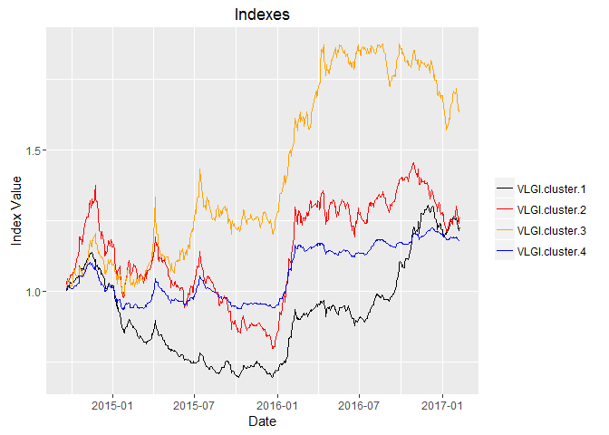

Clustering
----------

I saw that some stocks with industry similarities, like sugar industry
or auto-makers, behave in a different manner than other stocks. Tehran
Stock Exchange provide many different sub-indexes. Some of them have
only handful of companies. As a way to deal with this matter, I prefer
to use cluster analysis. Since I don't want the number of each group to
be similar, I would not use k-means. I would rather use hierarchical
clustering using Ward method.

Having used ward method, first I would consider number of clusters,
varying between 1 to 7 and take the one with the least out-of-sample
rolling RMSE. Then I would consider different kind of distances to find
which one results better results with the same criterion.

I had expect that 3 clusters with Malinowski distances less than 1 (
*L**p**n**o**r**m**s* , before this post I was using p = 0.7,
so the outliers would be less influential in clustering results), yet
the results ,to my surprise, yielded different outcomes.

### Clusters and indexes for each

Making data like previous post we use the following for estimating
clusters and groups:

    retDATAw<- reshape(WDATA_last[, c(1,2,5)], timevar = "DATE",
                       idvar = "sym", direction = "wide")
    retDATAw <- t(retDATAw)
    colnames(retDATAw) <- retDATAw[1,]
    retDATAw <- retDATAw[-1,]
    J<- rownames(retDATAw)
    J<- matrix(unlist(strsplit(J, split= "[.]")), ncol=2,byrow=T)[,2]
    rownames(retDATAw)<- J
    rm(J)
    retDATAw<- apply(retDATAw,2, function(x) as.numeric(x))
    # scaling data
    scale_retDATAw<- apply(retDATAw,2, scale)
    # computing distances
    distance<- dist(t(retDATAw), method = "minkowski", diag = TRUE, p =1)
    distance<- as.matrix(distance)
    for( i in 1:dim(distance)[1]){
      distance <- distance[,complete.cases(distance[i,]) ]
      distance <- distance[complete.cases(distance[,i]), ]
    }
    rm(i)
    distance<- as.dist(distance)
    # fitting cluster
    fit = hclust(distance, method = "ward")

    # finding number of cluster that has at least 5 members
    n.groups.finder <- function(n.groups.) {
      success <- FALSE
      i <- 1
      n.groups <- n.groups.
      while (!success) {
        groups<- cutree(fit, n.groups)
        success <- sum(summary(as.factor(groups)) <= 5) < i
        i <- i + 1
        n.groups <- n.groups + 1
      }
      return(groups)
    }

    # cutting tree
    cluster.results<- list()
    for( i in 2 : 7){
    n.groups <- i
    groups <- n.groups.finder( n.groups)
    n.gr<- which( summary(as.factor( groups))> 5)
    cluster.results[[ i]]<- list( n.gr = n.gr, groups = groups)
    }

    # getting names of members
    groups<- list()
    temp<- list()
    for( i in 2: length( cluster.results)){
      Cl.gr<- cbind( cluster.results[[i]]$groups)
      Cl.gr<- cbind.data.frame( groups = Cl.gr,sym = ( rownames( Cl.gr)))
      for( j in 1: length( cluster.results[[i]]$n.gr)){
        temp1<- Cl.gr[Cl.gr$groups== cluster.results[[i]]$n.gr[j],][,2]
        temp1<- droplevels(temp1)
        temp[[j]]<- temp1 
    }
      groups[[i]]<- temp
    }

*Here I used Whole sample for estimating clusters, this is against crossvalidation methods, since the data have lots of NA and because of that computing distances with rolling window was not possible, I used this method. I used this method with 3 cluster before and* **Temporal graph of clusters varies a lot during time.** 
Now that the we get the name of members for each group we can make
indexes for each of them. Using last posts results we have:

    index.maker<- function(WDATA. = WDATA, date_data. = date_data,
                           sort_base_index. = sort_base_index,
                           WDATA_last. = WDATA_last, data_NA_rm. =data_NA_rm){
      
      sub_year_data<- list()
      for(i in 2: length(date_data.)){
        sub_data<- subset(WDATA., WDATA.$DATE <= date_data.[i] & WDATA.$DATE >= date_data.[i-1])
        sub_year_data[[i-1]]<- ddply(sub_data, 'sym',
                                     .fun = function(x) data_NA_rm.(x), .progress = "tk")
      }
      
      portion.sym<- llply(sub_year_data, function(x) sort_base_index.(x, n.var = 3/4))
      
      index_ave<- NULL
      last.VLIA<- 1
      last.VLIC<- 1
      for(i in 2 : (length (date_data.) -1)){
        sub_data<- subset(WDATA_last., WDATA_last.$DATE <= date_data.[i+1] &
                            WDATA_last.$DATE >= date_data.[i])
        sub_index_data<- sub_data[sub_data$sym %in% as.factor(portion.sym[[i-1]]),]
        dates.sub<- as.Date(levels(as.factor(sub_index_data$DATE)))
        VLIC<- cbind(c(rep(NA, (length(dates.sub) + 1))), c(rep(NA, (length(dates.sub) + 1))))
        VLIC[ 1, 1]<- last.VLIC
        for ( j in 2: (length(dates.sub) + 1)) {
          sub_index_data_date<- subset(sub_index_data, sub_index_data$DATE == dates.sub[j-1] )
          VLIC[j,]<- cbind(VLGI(sub_index_data_date$r.C, VLIC[ j - 1, 1]), as.Date(dates.sub[j-1]))
          
        }
        temp<- VLIC
        
        last.VLIC<- VLIC[ dim(VLIC)[1], 1]
        index_ave<- rbind(index_ave, temp)
      }
      index_ave<- index_ave[ complete.cases(index_ave[ ,2]),]
      colnames(index_ave)<- c("VLGI", "DATE")
      return(index_ave)
    }

    index.VLGI.groups<- list()
    for ( i in 2: length( groups)){
      index.VLGI<- NULL
      for( j in 1: length(groups[[i]])){
        group.data<- subset( WDATA, WDATA$sym %in% groups[[i]][[j]])
        group.data_last<- subset( WDATA_last, WDATA_last$sym %in% groups[[i]][[j]])
        temp<- index.maker(WDATA. = group.data, WDATA_last. = group.data_last)
        temp<- cbind( temp, j)
        index.VLGI<- rbind(index.VLGI, temp)
      }
      index.VLGI.groups[[i]]<- index.VLGI
    }

    # computing reults for whole sample
    index.VLGI.groups[[1]]<- cbind(index.maker(WDATA. = WDATA, WDATA_last. = WDATA_last),1)

### Computing results

Using previously named function, we parallel compute the results for predictory autoregressive model
*r**i*, *t* = *α* + *β*1*r**i*, *t* − 1 + *β*2*r**m*, *t* − 1 + *e*
:

    th= floor((Sys.Date() - as.Date("2014-03-21"))*240/365)
    h<-1
    Order<-c(1,0,0)
    dimmodel<-3
    win=120
    model="pARp"
    regressed="retCL_t"
    reg.type = "prd"
    MAR_MOD.="DVLGI"

    pARp.DVLGI.gr<- list()
    for( i in 2: length(index.VLGI.groups)){
      VLGI.gr.data<- as.data.frame(index.VLGI.groups[[i]])
      colnames(VLGI.gr.data)<- c( "VLGI", "DATE", "gr")
      VLGI.gr.data$DATE<- as.Date( VLGI.gr.data$DATE)
      pARp.DVLGI<- NULL
      for( j in 1: length(levels(as.factor(VLGI.gr.data$gr)))){
        VLGI.data<- subset(VLGI.gr.data, VLGI.gr.data$gr == j)
      group.data<- subset( WDATA, WDATA$sym %in% groups[[i]][[j]])

      TIND.var<- cbind.data.frame(DATE = VLGI.data$DATE, 
                                  PerChange(VLGI.data$VLGI))
      TIND.var[is.nan.data.frame(TIND.var)] <- 0
      TIND.var[,2][ TIND.var[,2] == -Inf | TIND.var[,2] == Inf] = 0 
      colnames(TIND.var)<- c("DATE", "DVLGI")
      
      group.data<- subset(group.data, group.data$DATE >= TIND.var$DATE[1])
      group.data$sym <- droplevels(group.data$sym)
      
      cl = createCluster(12, export = list("Arima.prd.IND", "group.data",
                                           "reg.type",
                                           "h","Order","TIND.var",
                                           "win", "th", "h","MAR_MOD.",
                                           "model","dimmodel","regressed"
      ),
      lib = list("forecast", "dplyr"))
      
      
      
      temp<-ddply(.data = group.data, .(sym), .progress= "tk",
                           .parallel = TRUE,
                           .fun =function(x) Arima.prd.IND(xsym = x,
                                                           MAR_MOD=MAR_MOD.,
                                                           KK=TIND.var,
                                                           h=1,win=120, th=th, Order=c(1,0,0),
                                                           model="pARp",
                                                           dimmodel=3, regressed="retCL_t",
                                                           reg.type = "prd"
                           ))
      
      stopCluster(cl)
      pARp.DVLGI<- rbind( pARp.DVLGI, temp)
      }
      pARp.DVLGI.gr[[i]]<- pARp.DVLGI
    }

I do the same thing for whole sample without clusters too, so I could
compare the results.

### Number of cluster results

The results after "2016-01-01" shows that having four clusters has less
rolling RMSE than others.

<table style="width:94%;">
<colgroup>
<col width="19%" />
<col width="9%" />
<col width="9%" />
<col width="11%" />
<col width="11%" />
<col width="11%" />
<col width="11%" />
<col width="11%" />
</colgroup>
<thead>
<tr class="header">
<th align="center"> </th>
<th align="center">1</th>
<th align="center">2</th>
<th align="center">3</th>
<th align="center">4</th>
<th align="center">5</th>
<th align="center">6</th>
<th align="center">7</th>
</tr>
</thead>
<tbody>
<tr class="odd">
<td align="center"><strong>RMSE.gr</strong></td>
<td align="center">0.0249</td>
<td align="center">0.0249</td>
<td align="center">0.02492</td>
<td align="center">0.02478</td>
<td align="center">0.02479</td>
<td align="center">0.02482</td>
<td align="center">0.0248</td>
</tr>
</tbody>
</table>

Distances
---------

Having seen the results for number of clusters, I choose different
distances for computing the results.

    distance.seq<- c(.4,.5,.6,.7,.8,.9,1,1.5,2,3,4,6)

As I said before, I was choosing .7 as my *p*, but after seeing this I
saw that Elucidian distance yields better results. Since we normalized
returns for this computations, this means that Elucidian distance is
approximately equal to 2(1 − *ρ*) in which *ρ* stands for correlation.
So using correlations as a base for distances would have resulted the
same thing. It is interesting that here, my phobia about including
outliers are false :)) A very good step for overcoming my phobias
experimentally :))

<table style="width:100%;">
<caption>Table continues below</caption>
<colgroup>
<col width="20%" />
<col width="10%" />
<col width="10%" />
<col width="10%" />
<col width="10%" />
<col width="10%" />
<col width="10%" />
<col width="10%" />
<col width="10%" />
</colgroup>
<thead>
<tr class="header">
<th align="center"> </th>
<th align="center">0.4</th>
<th align="center">0.5</th>
<th align="center">0.6</th>
<th align="center">0.7</th>
<th align="center">0.8</th>
<th align="center">0.9</th>
<th align="center">1</th>
<th align="center">1.5</th>
</tr>
</thead>
<tbody>
<tr class="odd">
<td align="center"><strong>RMSE.dist</strong></td>
<td align="center">0.02477</td>
<td align="center">0.02481</td>
<td align="center">0.02477</td>
<td align="center">0.02467</td>
<td align="center">0.02488</td>
<td align="center">0.02488</td>
<td align="center">0.02478</td>
<td align="center">0.02472</td>
</tr>
</tbody>
</table>

<table style="width:67%;">
<colgroup>
<col width="22%" />
<col width="11%" />
<col width="11%" />
<col width="11%" />
<col width="11%" />
</colgroup>
<thead>
<tr class="header">
<th align="center"> </th>
<th align="center">2</th>
<th align="center">3</th>
<th align="center">4</th>
<th align="center">6</th>
</tr>
</thead>
<tbody>
<tr class="odd">
<td align="center"><strong>RMSE.dist</strong></td>
<td align="center">0.02267</td>
<td align="center">0.02271</td>
<td align="center">0.02275</td>
<td align="center">0.02272</td>
</tr>
</tbody>
</table>

Conclusion
----------

The results show that having four number of clusters with Elucidian
distances yield better out-of-sample rolling RMSE results. So my guesses
that some groups of stocks behave differently is not rejected under this
criterion. But my idea about inclusion of outliers is rejected. Although
I have not printed the groups since they are very lengthy, We would see
more similar companies when *p* is less than one, yet the results are
worse. When *p* is less than one one cluster is about auto-makers, and
one include pharmaceutical industries (previously I saw sugar industry), but
with Eluciden distance, results are more mixed, and number of members
are much more. But we can see that most petrochemicals and petroleum
companies are in the same cluster with some other companies of which
some are like them and export oriented and revived after lifting the
sanctions( group 1, 90 members.) And Auto-makers with some other not
related companies are in another one( Group 2, 132 members.) Last group
have more than 170 members and pharmaceutical and financial corporations
are mostly inside that( group 4.)

The plot for the sub-indexes are like this:

Looking at the graph is very interesting, and we see partly different
and partly similar movements among groups. What is very fearsome is
those movements that are common and very sharp, these could easily
destroy my retirement plans. If I see more clearly, I see that these
movements are mostly external and international shocks, like sanctions
or lifting them or any expectations about them. I would write the next
post about how to partly hedge these risk with existed instruments, oh
yeah, I talked about instruments, but there is no options, Forex futures
and short selling of stocks possible in this market and I have no access
to international markets. I would try my best and cross my fingers for
that, Voila! 

###### *Please inform me about your feedback, I will be deeply grateful for that :)*

###### For disclaimer please see about page.
