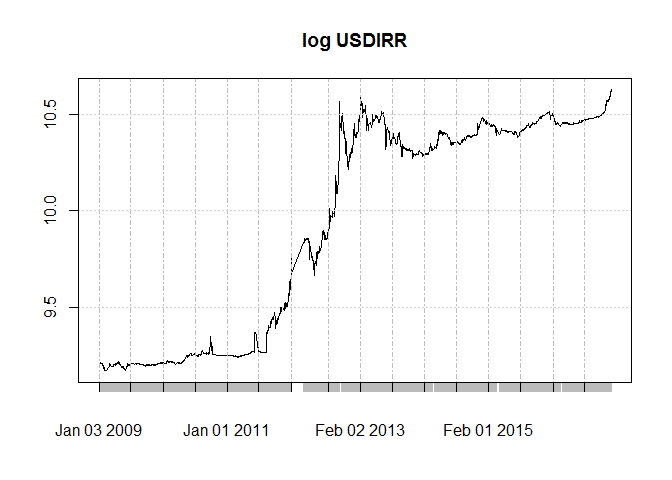

External facors
---------------

In last post I show that some external factors like sanctions, lifting
them, and expectations about them could lead to sharp and extreme
reaction in Tehran Stock Exchange. Absence of short selling, options and
futures on Forex, makes it pretty difficult to hedge against these
extreme and **frequent** drawdowns. These could easily damage any
retirement account, mine is not excluded. So, I thought about how to
hedge my account against them, and it took me some time to get to a
desirable results.

My observations about this matter is as follows:

-   I am a resident of Tehran, as a result I have no access to
    international markets
    -   liquid tradeable assets are Foreign Exchange, gold, bond with
        Rial numerair and Stocks
-   Regional Economy is highly depended on oil exports and as a result
    dollar reserves
-   External factors that are bad for economy have several results:
    -   Export oriented companies have difficulties
    -   Export and import companies gain from barter transactions
    -   Last two depends o whether they are subject to sanctions or not
    -   What is bad for companies means less supply for foreign exchange
        and subsequently devaluation of Rial
-   Both Forex and stock market could be manipulated by authorities
    sooner or later

I could consider these and *AHA* why not seeing the relationship between
lags and leads of USDIRR and VLGI? By the way my numeraire is Rial, so
there would not be much hassle to consider USDIRR and it is by PPP
immune to inflation in long run. So lets put *another brick in the
wall*.

### Data

Getting data for USDIRR is a bit tricky. First of all, we need to take
the "free market rate" and not the official rates for that, the second
is not simply tradable for individuals like me.
<http://demru.com/fa/index> provide some old dated data. For completing
it I used "RSelenium" to extract each days data from
<http://www.sanarate.ir/> and combining it together. This second source
is much more exact than the first, yet it has its hassle and needs
Selenium for getting the data.

    path = "C:/Users/msdeb/Documents/Stock and trades/"
    setwd(path)
    load(".RData")

    source("C:/Users/msdeb/Documents/Stock and trades/functions.R")

    index.VLGI<- index.maker(WDATA. = WDATA, WDATA_last. = WDATA_last)
    index.VLGI<- as.data.frame(index.VLGI)
    index.VLGI$DATE <- as.Date(index.VLGI$DATE)
    index.VLGI<- as.xts(index.VLGI$VLGI, order.by = index.VLGI$DATE)
    colnames(index.VLGI)<- c( "VLGI")
    summary(index.VLGI)

    X_rates63<- read.csv("C:/Users/msdeb/OneDrive/data/Forex/usdirr63.CSV")
    colnames(X_rates63)<- c("DATE", "ind")
    X_rates63$DATE <- as.Date(X_rates63$DATE, "%Y/%m/%d")
    X_rates63<- as.xts(X_rates63$ind, order.by = X_rates63$DATE)
    colnames(X_rates63)<- c( "USD")

    X_rates<- read.csv("C:/Users/msdeb/OneDrive/data/Forex/sana_rates.CSV")

    # 24:00 stands for all day average

    hours_average<- c("08:00","09:00", "10:00", "11:00", "12:00", "13:00", "14:00", "15:00", "16:00"
                      , "17:00", "24:00")
    X_rates_hourly<- cbind(X_rates, hour= hours_average )
    X_rates_16<- subset(X_rates_hourly, X_rates_hourly$hour == c("16:00"))
    X_rates_24<- subset(X_rates_hourly, X_rates_hourly$hour == c("24:00"))
    X_rates_16[,1]<-as.Date(X_rates_16[,1], "%m/%d/%Y")
    X_rates_24[,1]<-as.Date(X_rates_24[,1], "%m/%d/%Y")

    USDIRR_16<- X_rates_16[,c(1:2)]
    USDIRR_16<- as.xts(USDIRR_16$USD, order.by = USDIRR_16$X)
    colnames(USDIRR_16)<- c( "USD")
    USDIRR_24<- X_rates_24[,c(1:2)]
    USDIRR_24<- as.xts(USDIRR_24$USD, order.by = USDIRR_24$X)
    colnames(USDIRR_24)<- c( "USD")
    USDIRR16<- rbind(X_rates63['::2015-06-19'],USDIRR_16)
    USDIRR24<- rbind(X_rates63['::2015-06-19'],USDIRR_24)

    dataDI<- merge.xts(USDIRR24,index.VLGI)
    tail(dataDI)

    plot.xts(log(dataDI$USD), main =  "USDIRR")

    path = "C:/Users/msdeb/Documents/Stock and trades/"
    setwd(path)
    save.image()

Here is what the USDIRR from these two sources looks like (yes! we need
logarithmic scale for it :) :

    tail(USDIRR24)

    ##                USD
    ## 2016-12-23      NA
    ## 2016-12-24 39796.5
    ## 2016-12-25 40365.0
    ## 2016-12-26 40716.5
    ## 2016-12-27 41155.0
    ## 2016-12-28 40878.0

    plot.xts(log(dataDI$USD), main =  "log USDIRR")

We clearly see structural breaks in this series, and the cause is
existence of system of different exchange rates (official or fee
market), or system of pegged foreign exchange rate. As a result I would
use the data after "2009-01-01" so the structural breaks would not be a
problem. After this date free market rate and official one shows
differences.

### negative relation

    dataDI<- dataDI[complete.cases(dataDI$VLGI),]
    dataDI<- dataDI[complete.cases(dataDI$USD),]
    dataDI$DUSD<- diff(log(dataDI$USD))
    dataDI$DVLGI<- diff(log(dataDI$VLGI))

    attr(dataDI, "frequency") <- 1
    dataDI<- dataDI['2009-01-01::']

    # monthly data
    mdataDI<- cbind(to.monthly(dataDI$USD)[,4],to.monthly(dataDI$VLGI)[,4])
    colnames(mdataDI)<- colnames(dataDI)[1:2]
    mdataDI$DUSD<- diff(log(mdataDI$USD))
    mdataDI$DVLGI<- diff(log(mdataDI$VLGI))

    # adding lags

    mdataDI$L_3DUSD<- (lag.xts(mdataDI$DUSD, k = 3))
    mdataDI$L_2DUSD<- (lag.xts(mdataDI$DUSD, k = 2))
    mdataDI$L_1DUSD<- (lag.xts(mdataDI$DUSD, k = 1))
    mdataDI$L1DUSD<- (lag.xts(mdataDI$DUSD, k = -1))
    mdataDI$L2DUSD<- (lag.xts(mdataDI$DUSD, k = -2))
    mdataDI$L3DUSD<- (lag.xts(mdataDI$DUSD, k = -3))

    dataDI<- dataDI[complete.cases(dataDI$DVLGI),]
    mdataDI<- mdataDI[complete.cases(mdataDI$DVLGI),]

Now I need to condition the data based on the times that market return
was negative. This include negative return that are more inclusive than
just negative returns based on external factors. We do that and compute
HAC standard errors for OLS.

    
<table style="width:79%;">
<caption>Fitting linear model: DVLGI ~ L3DUSD - 1</caption>
<colgroup>
<col width="18%" />
<col width="15%" />
<col width="18%" />
<col width="13%" />
<col width="13%" />
</colgroup>
<thead>
<tr class="header">
<th align="center"> </th>
<th align="center">Estimate</th>
<th align="center">Std. Error</th>
<th align="center">t value</th>
<th align="center">Pr(&gt;|t|)</th>
</tr>
</thead>
<tbody>
<tr class="odd">
<td align="center"><strong>L3DUSD</strong></td>
<td align="center">-0.4157</td>
<td align="center">0.1179</td>
<td align="center">-3.527</td>
<td align="center">0.00142</td>
</tr>
</tbody>
</table>

<table style="width:85%;">

<colgroup>
<col width="20%" />
<col width="30%" />
<col width="11%" />
<col width="22%" />
</colgroup>
<thead>
<tr class="header">
<th align="center">Observations</th>
<th align="center">Residual Std. Error</th>
<th align="center"><em>R</em>2</th>
<th align="center">Adjusted <em>R</em>2</th>
</tr>
</thead>
<tbody>
<tr class="odd">
<td align="center">30</td>
<td align="center">0.05132</td>
<td align="center">0.3002</td>
<td align="center">0.2761</td>
</tr>
</tbody>
</table>

<table style="width:81%;">
<caption>Fitting linear model: DVLGI ~ L_3DUSD - 1</caption>
<colgroup>
<col width="19%" />
<col width="15%" />
<col width="18%" />
<col width="13%" />
<col width="13%" />
</colgroup>
<thead>
<tr class="header">
<th align="center"> </th>
<th align="center">Estimate</th>
<th align="center">Std. Error</th>
<th align="center">t value</th>
<th align="center">Pr(&gt;|t|)</th>
</tr>
</thead>
<tbody>
<tr class="odd">
<td align="center"><strong>L_3DUSD</strong></td>
<td align="center">-0.4644</td>
<td align="center">0.1871</td>
<td align="center">-2.482</td>
<td align="center">0.0189</td>
</tr>
</tbody>
</table>

<table style="width:85%;">

<colgroup>
<col width="20%" />
<col width="30%" />
<col width="11%" />
<col width="22%" />
</colgroup>
<thead>
<tr class="header">
<th align="center">Observations</th>
<th align="center">Residual Std. Error</th>
<th align="center"><em>R</em>2</th>
<th align="center">Adjusted <em>R</em>2</th>
</tr>
</thead>
<tbody>
<tr class="odd">
<td align="center">31</td>
<td align="center">0.05541</td>
<td align="center">0.1703</td>
<td align="center">0.1427</td>
</tr>
</tbody>
</table>

    ## 
    ## t test of coefficients:
    ## 
    ##         Estimate Std. Error t value Pr(>|t|)  
    ## L_3DUSD -0.46441    0.19014 -2.4425  0.02069 *
    ## ---
    ## Signif. codes:  0 '***' 0.001 '**' 0.01 '*' 0.05 '.' 0.1 ' ' 1

    ## 
    ## t test of coefficients:
    ## 
    ##         Estimate Std. Error t value  Pr(>|t|)    
    ## L3DUSD -0.415719   0.075202  -5.528 5.855e-06 ***
    ## ---
    ## Signif. codes:  0 '***' 0.001 '**' 0.01 '*' 0.05 '.' 0.1 ' ' 1

So we see negative relation that is significant for lag and leads of 3
months.

Conclusion
----------

My guesses are not rejected and the VLGI could be hedged by using
USDIRR. It need a pretty active monthly management since movement in
USDIRR could be sooner or later than the shocks in VLGI (it could be
figured out by looking at the news and seeing were authorities have
intertwined firstly).

###### *Please inform me about your feedback, I will be deeply grateful for that :)*

###### For disclaimer please see about page.
