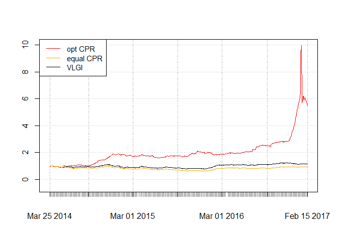

Benchmark Part II
-----------------

For Constantly Rebalanced Portfolio (hereafter CPR) same distribution of
weights is used for all periods. Since CPR uses all the available data,
it is a rather omniscient benchmark that uses least effort. I use
monthly returns to compute the optimal weights for CPR wealth factor $\prod_{t=1}^{n} \sum_{i=1}^{m} w_{i} r_{tj}$ in which *m* is number
of stocks and *w**i*s are their respective weight.

Since newly introduced stocks are numerous I use the same method as
before for computing 3/4 most traded stocks for the six month period
ended at "2014-03-21" as the basis for computation.

Preparing data like previous post and getting monthly returns. Then
changing its shape to wide form so matrix algebra becomes a lot easier:

    source("C:/Users/msdeb/Documents/Stock and trades/functions.R")

    # replacing NA with last observation
    WDATA_last<- ddply(WDATA, .(sym), colwise(NA_last_obs, 
                                              c("CLOSE", "retCL_t", "VOL")))

    WDATA_last$DATE<- WDATA$DATE

    # subseting data and finding most traded stocks 
    date_data<- c(seq.Date(from = as.Date("2001-03-21"), to = Sys.Date(), by = "2 quarter"), Sys.Date())

    sub_year_data<- list()
    for(i in 2: length(date_data)){
      sub_data<- subset(WDATA, WDATA$DATE < date_data[i] & WDATA$DATE >= date_data[i-1])
      sub_year_data[[i-1]]<- ddply(sub_data, 'sym', .fun = function(x) data_NA_rm(x), .progress = "tk")
    }

    portion.sym<- llply(sub_year_data, function(x) sort_base_index(x, n.var = 3/4))

    sub_index_data<- WDATA_last[WDATA_last$sym %in% as.factor(portion.sym[[26]]),]
    sub_index_data<- sub_index_data[ complete.cases(sub_index_data$CLOSE),]
    sub_index_data<- subset(sub_index_data , sub_index_data$DATE >= date_data[27])
    date_month<- c(seq.Date(from = as.Date("2001-03-21"), to = Sys.Date(), by = "month"), Sys.Date())

    # monthly data: end of month
    sub_data.month<- sub_index_data[(sub_index_data$DATE %in% date_month),]
    sub_data.month<- droplevels(sub_data.month)
    # computing monthly returns
    t<- dlply(sub_data.month, 'sym', function(x) PerChange((x$CLOSE)))
    sub_data.month$ret.month<- unlist(t)
    rm(t)

    # Reshaping data
    retDATAw<- reshape(sub_data.month[,c(1,5,6)], timevar = "DATE", idvar = "sym", direction = "wide")
    retDATAw <- t(retDATAw)
    colnames(retDATAw) <- retDATAw[1,]
    retDATAw <- retDATAw[-1,]
    J<- rownames(retDATAw)
    J<- matrix(unlist(strsplit(J, split= "[.]")), ncol=3,byrow=T)[,3]
    retDATAw<- apply(retDATAw,2, function(x) as.numeric(x))
    # removing first NA introduced by differencung
    retDATAw<- retDATAw[-1,]

By next function I find the optimal weights for CPR. Since number of
variables are more than 250, I increase the number of iterations for
optim function.

    CPR_weights<- function(data = retDATAw, w = weigths){
      w <- w/sum(w)
     portfo_return<- (1 +retDATAw) %*% w
     CPR_return<- cumprod( portfo_return)
     CPR_return<- CPR_return[ length( CPR_return)]
     weight_penalty<- (10000* (1 - sum( w))) ^ 2
     negative_penalty<- -sum( w[ w < 0])
     obj<- -(CPR_return) + weight_penalty + negative_penalty
     return( obj)
    }

    opt_CPR<- optim(  par = c(rep(1, 262)), CPR_weights, data = retDATAw, method  = "L-BFGS-B",
                 lower   = 0, control = list(maxit = 1000),
                 upper   = 1) 

    path = "C:/Users/msdeb/Documents/Stock and trades/"
    setwd(path)
    save.image()

Since inflation is high, the term `w <- w/sum(w)` need to be there so
the objective function won't seek UFOs in the sky :) If we use `cumsum`
instead of `cumprod` there would be no need for that term.

Then weights for optimal CPR, equal weights for CPR are computed and
related returns are computed. I also computed VLGI for comparisons.

    w<- opt_CPR$par/sum(opt_CPR$par)
    portfo_return<- (1 +retDATAw) %*% w
    CPR_return<- cumprod( portfo_return)
    CPR_return<- as.xts(CPR_return, order.by = as.Date(J[-1]))

    w.equal<- c(rep(1/262, 262))
    portfo_return.equal<- (1 +retDATAw) %*% w.equal
    CPR_return.equal<- cumprod( portfo_return.equal)
    CPR_return.equal<- as.xts(CPR_return.equal,
                              order.by = as.Date(J[-1]))

    WDATA_last$r.C<- ddply(WDATA, .(sym), colwise(ratio.close, c("CLOSE")))[,2]
    WDATA_last$DATE<- as.Date(WDATA$DATE)
    index.VLGI<- index.maker(WDATA. = WDATA, WDATA_last. = WDATA_last)
    index.VLGI<- as.data.frame(index.VLGI)
    index.VLGI$DATE <- as.Date(index.VLGI$DATE)
    index.VLGI<- as.xts(index.VLGI$VLGI, order.by = index.VLGI$DATE)
    colnames(index.VLGI)<- c( "VLGI")

### Results

The results for optimal CPR weights are:

    ##        Aluminum R.-a Cultur.Herit. Inv.-a     Dr. Abidi Lab.-a 
    ##          0.027529633          0.185255685          0.559913093 
    ##    Parsian Oil&Gas-a         Saipa Azin-a 
    ##          0.218565318          0.008736271

It is interesting that among 262 stocks just 5 of them get chosen and
future just 4 of them have weights more than 1 percent. *(I ve seen
anomal volumes in first two and forth one, maybe this could explain it,
yet this is a in-sample analysis. For furthure analysis I need to change
it to an out-of-sample one, if again these companies exist then the
anomalities could be partly exlained)*

Lets see how the plots for daily rebalanced portfolio by the optimal CPR
monthly weights look. Values for VLGI are divided by its value at first
day and multiplied by first value of optimal CPR so we have the same
scale.

Contrary to my expectations, equal weight CPR is worse than VLGI.
Optimal CPR generally have better results than VLGI. It also suffers
from very sharp drawdown at the end of the chart. Its derivation could
be result of sharp increase at the end of chart so if we use
out-of-sample computations another set of weights would be computed.

If I use Optimal CPR as a benchmark, I think the results would be
depressive :)) , for sure I cannot beat that, but it could be a good to
compare with it, so I would have an eye on it. Before that I need to
make it semi online, or compute it with predictory purposes. I would do
that in another post.

###### *Please inform me about your feedback, I will be deeply grateful for that :)*
