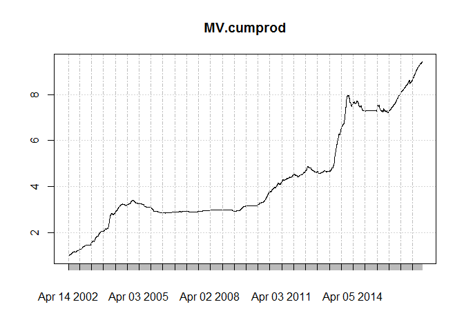
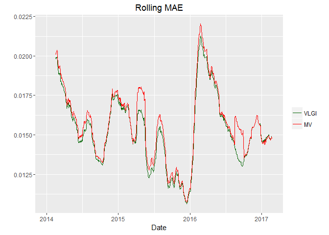

Benchmark Part III
------------------

Lets build mean variance portfolio and compare its out-of-sample
forecasting power to VLGI. Since lots of discontinuities exist in the
data and since the number of stocks grows over time I would use a
variable basis, exactly like VLGI, that uses 3/4 of the most traded
stocks during six month period preceding to the data.

For computing minimum variance portfolio, since there is no possibility
to short stocks in Tehran Stock Exchange, I would use the criteria that
no short is allowed. No leverage is another criteria that I would
consider.

### Data

I would use the same structure for data as before. For making matrix
algebra easier I will change the shape of data.

    source("C:/Users/msdeb/Documents/Stock and trades/functions.R")

    retDATAw<- reshape( WDATA[, c( "DATE", "sym", "retCL_t")],
                       timevar = "DATE", idvar = "sym", direction = "wide")
    retDATAw <- t( retDATAw)
    colnames( retDATAw) <- retDATAw[1,]
    retDATAw <- retDATAw[-1,]
    J<- rownames( retDATAw)
    J<- matrix( unlist( strsplit(J, split = "[.]")), ncol=  2,byrow = T)[, 2]
    retDATAw<- apply( retDATAw, 2, function( x) as.numeric( x))
    retDATAw<- as.data.frame( retDATAw)
    retDATAw$DATE<- as.Date( J)

### Quadratic Programming

For solving the quadratic optimization problem subject to our
constraints I use solve.QP from "quadprog" package. Since data has lots
of NAs there is a high probability that the resulting covariance
function is **not** positive definite. In order to solve this problem I
considered two solutions, first one is to use nearest positive definite
matrix of covariance matrix. the second one is to use global
Optimization by Differential Evolution. Former was computed by
make.positive.definite function from "corocor" package, and second by
"DEoptim" package.

Results with nearest positive definite matrix have less variance in the
sample I used, and computing them are much less computationally
expensive than DEoptim. So here I would write the results about the
former. *(I'm not perfectly familiar with parameter tuning of DEoptim,
so maybe better results are available. For current mean variance
optimization I think that nearest positive definite matrix will suffice,
please tell me if you happen to know any other method and you think its
more suitable, in advance thank you :) )*

    MV.ret<- function(data = train, 
                      date_data. = date_data, NA_last_obs. = NA_last_obs,
             short = FALSE, min.mu = 0.001, ret.min = FALSE){
      date.beg<- as.Date( data$DATE[1])
     ith.break.date<- sum( date.beg >= date_data.) 
     sub_index_data<- data[, ( colnames( data) %in% as.factor( portion.sym[[ ith.break.date]]))]
     sub_index_data<- droplevels( sub_index_data)
     win_length<- dim( sub_index_data)[ 1]
     sum.na.col<- apply( sub_index_data, 2, function(x) sum( is.na(x)))
     sub_index_data<- sub_index_data[, which( sum.na.col< (9*10))]
     
     mu.hat <- colMeans(sub_index_data, na.rm = TRUE)
     
     sigma2.hat <- cov( sub_index_data, use = "pairwise.complete.obs")
     m.sigma2.hat<- mean( sigma2.hat, na.rm = TRUE)
     sigma2.hat <- apply( sigma2.hat, 2, function(x) { x[( 
       is.na( x))]<- m.sigma2.hat ; x})
     D.mat = 2 * sigma2.hat
     meq. = 1
     A.mat = cbind( rep( 1, dim( sigma2.hat)[ 1]),
                    diag(dim(sigma2.hat)[1]))
     
     if( ret.min == TRUE & max( mu.hat) < min.mu ) {
       min.mu <- mean( mu.hat)
       print( " unattainable min.mu changed to avrerage mu.hat ")
     }
     
     if( short == TRUE & ret.min == FALSE) A.mat<- cbind(rep(1,dim(sigma2.hat)[1]))

     b.vec = c(1 , rep(0, dim( sigma2.hat)[1]))
     
     if( ret.min == TRUE & short == FALSE) {
       A.mat = cbind( mu.hat, rep( 1,dim( sigma2.hat)[1]),
                      diag(dim(sigma2.hat)[1]))
       b.vec = c( min.mu, 1 , rep( 0, dim( sigma2.hat)[1]))
       meq. = 2
     }
     
     if( ret.min == TRUE & short == TRUE) {  
       A.mat = cbind( mu.hat, rep( 1,dim( sigma2.hat)[1])) 
       b.vec = c( min.mu, 1)
     }
     
     sigma2.hat.PD<- make.positive.definite( sigma2.hat)
     D.mat = 2*sigma2.hat.PD
     
     qp.out = solve.QP( Dmat  =  D.mat,
                        dvec = rep(0, dim(sigma2.hat.PD)[1]),
                        Amat=A.mat, bvec=b.vec, meq= meq.)
     
     
     weig<- qp.out$solution
     weig[ abs( weig) < 1e-4]<- 0
     weig<- weig / sum( weig)
     

     retDATAw_last<- apply( sub_index_data, 2, NA_last_obs. )
     
     mu.p = crossprod (weig,mu.hat)
     sigma2.p= t( weig) %*%  sigma2.hat %*% weig
     ret.porfolio<- ( 1+ retDATAw_last[ dim (retDATAw_last)[1], ]) %*% weig
     out<- cbind ( mu.p = mu.p, sigma2.p = sigma2.p, ret.porfolio = ret.porfolio )
     colnames( out)<- c( "mu.p", "sigma2.p", "ret.portfolio")
     weig<- rbind( weig)
     colnames( weig) = colnames( sub_index_data)
     out<- cbind( out, weig)
     out<- cbind( out, date.beg)
     return(out)
    }

solve.QP occasionally produces NaN, and I have not found any reasons for
that ( replicating computations sometimes results in non NaN results), I
use previous weights for computing the portfolio return in these cases.

    MV.ret.prv<- function(d ata = train, 
                      date_data. = date_data, NA_last_obs. = NA_last_obs,
                      weig = w.prv, date.beg = date.prv){
      ith.break.date<- sum( date.beg >= date_data.) 
      sub_index_data<- data[, ( colnames(data) %in% as.factor( portion.sym[[ ith.break.date]]))]
      sub_index_data<- droplevels( sub_index_data)
      win_length<- dim( sub_index_data)[1]
      sum.na.col<- apply( sub_index_data, 2, function(x) sum( is.na( x)))
      sub_index_data<- sub_index_data[, which( sum.na.col< ( 9*10))]
      weig<- weig[ ( names( weig) %in% colnames( sub_index_data))]
      
      sigma2.hat <- cov( sub_index_data, use = "pairwise.complete.obs")
      m.sigma2.hat<- mean( sigma2.hat, na.rm = TRUE)
      sigma2.hat <- apply( sigma2.hat, 2, function(x) {x[( is.na( x))]<- m.sigma2.hat ; x})
      
      mu.hat <- colMeans( sub_index_data, na.rm = TRUE)
      weig[ abs( weig) < 1e-4]<- 0
      weig<- weig / sum( weig)

      retDATAw_last<- apply( sub_index_data, 2, NA_last_obs. )
      
      mu.p = crossprod  (weig, mu.hat)
      sigma2.p= t( weig) %*%  sigma2.hat %*% weig
      ret.porfolio<- ( 1+ retDATAw_last[ dim ( retDATAw_last)[1], ]) %*% weig
      out<- cbind ( mu.p = mu.p, sigma2.p = sigma2.p, ret.porfolio = ret.porfolio )
      colnames(out)<- c( "mu.p", "sigma2.p", "ret.portfolio")
      weig<- rbind( weig)
      colnames(weig) = colnames( sub_index_data)
      out<- cbind( out, weig)
      out<- cbind( out, date.beg)
      return(out)
    }

    win=120
    n = dim( retDATAw)[1] - win + 1
    fcmat = NULL
    fit = NULL
      for(i in 130 : n)   {  
        train <- retDATAw[ i:( i + win -1 ),]
        fit <- MV.ret( train, date_data. = date_data, NA_last_obs. = NA_last_obs,
                      short = FALSE, min.mu = 0.001, ret.min = FALSE)
        if( is.nan( fit[1,1]) != TRUE) {
          w.prv = fit[, 4 : ( length(fit) - 1)]
          date.prv = fit[ , length(fit)]
        }
        if( is.nan( fit[1,1])) {
          fit <- MV.ret.prv( data = train, date_data. = date_data,
                             NA_last_obs. = NA_last_obs,
                             weig = w.prv, date.beg = date.prv)
        }
          fit<- ( fit[,1:3])
          names.fit<- names( fit)
          fit<- rbind.data.frame( fit)
          colnames( fit)<- names.fit
          fit$DATE <- retDATAw[ (i + win -1) ,]$DATE
          fcmat<- rbind( fcmat, fit)
      }

This is how cumulative product of returns looks like:

It seems to me that the results are pretty much inferior to [Iran's GDP
deflator](https://www.quandl.com/data/ODA/IRN_NGDP_D-Islamic-Republic-of-Iran-GDP-Deflator).
That is to say even inflation is not covered under this portfolio, who
dares to talk about idiosyncratic risk! Anyway, my objective was to
compare its predictory power so lets see that.Like before I would use
*r**i*, *t* = *α* + *β*1*r**i*, *t* − 1 + *β*2*r**m*, *t* − 1 + *e*
for getting errors.

    th= floor((Sys.Date() - as.Date("2014-03-21"))*240/365)
    h<-1
    Order<-c(1,0,0)
    dimmodel<-3
    win=120
    model="pARp"
    regressed="retCL_t"
    reg.type = "prd"
    MAR_MOD.="ret.portfolio"
    fcmat$ret.portfolio<- fcmat$ret.portfolio -1
    ######

    WDATA.<- subset(WDATA, WDATA$DATE >= fcmat$DATE[1])
    cl = createCluster(12, export = list("Arima.prd.IND",
                                         "reg.type",
                                         "h","Order","fcmat",
                                         "win", "th", "h","MAR_MOD.",
                                         "model","dimmodel","regressed"
    ),
    lib = list("forecast", "dplyr"))

    pARp.DIND.var<-ddply(.data = WDATA., .(sym), .progress= "tk",
                         .parallel = TRUE,
                         .fun =function(x) Arima.prd.IND(xsym = x,
                                                         MAR_MOD=MAR_MOD.,
                                                         KK=fcmat,
                                                         h=1,win=120, th=th, Order=c(1,0,0), model="pARp",
                                                         dimmodel=3, regressed="retCL_t",reg.type = "prd"
                         ))

    stopCluster(cl)

Results
-------

Out-of-sample 1 period ahead RMSE of VLGI is lower than mean variance
method.

<table style="width:29%;">
<colgroup>
<col width="13%" />
<col width="15%" />
</colgroup>
<thead>
<tr class="header">
<th align="center">RMSE MV</th>
<th align="center">RMSE VLGI</th>
</tr>
</thead>
<tbody>
<tr class="odd">
<td align="center">0.02374</td>
<td align="center">0.02308</td>
</tr>
</tbody>
</table>

Lets see how rolling mean of the errors behave. Since square root is a
concave function and I want to take mean for all the sample for each
day, I would use Mean Absolute Error, MAE, instead. otherwise taking two
mean and a square root between them would not result what we want due to
Jensen inequality.

Plot shows that MV predict worse when errors increasing. Yet at the
right part it produce slightly better result than VLGI.

Conclusion
----------

Having all methods, hereafter I think using VLGI as a predictory
variable seems better than others. So I would use that as my benchmark.

###### *Please inform me about your feedback, I will be deeply grateful for that :)*
