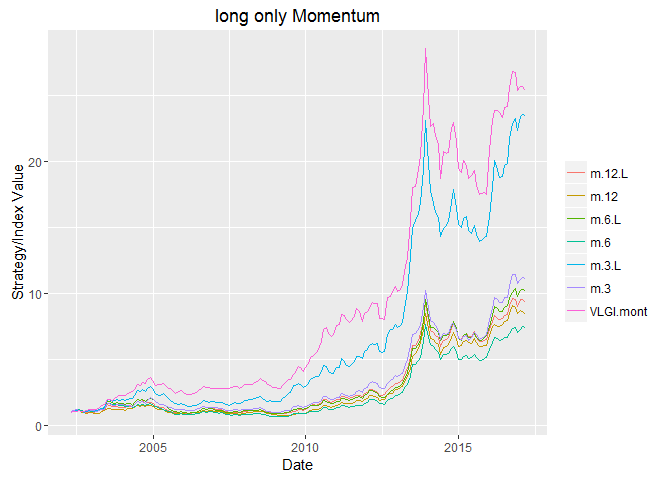

Momentum
--------

Few days ago I read [Fact, Fiction and Momentum
Investing](http://faculty.chicagobooth.edu/tobias.moskowitz/research/FFMOM_JPM_2014.pdf)
and it made me curious to see how momentum investing works in Tehran
Stock Exchange. Considering large inflation rate, I won't imagine that
short side of the momentum works well. Further, short selling is not
possible.

Here I have not splitted stocks by size categories. Monthly data was used
for computing the results. I used the following function for getting the
names of the stocks to be sold and bought. It considers the backward
window to be computed, whether considering the latest month or not,
portion of the stocks to be considered based on volume (for liquidity
reasons) and portion of the stocks to be long or short in portfolio.

    z <- zoo(retDATAw, retDATAw$DATE)
    t <- aggregate(z, as.yearmon, tail, 1)
    retDATAw.mont <- as.data.frame(t)
    retDATAw.mont <-  apply(retDATAw.mont , 2, function(x) 
      as.numeric(coredata(x)))
    retDATAw.mont <- as.data.frame(retDATAw.mont)
    retDATAw.mont$DATE <- as.Date(index(t$DATE))
    rm(z); rm(t)

    names.momentum <- function(data = retDATAw.mont,
                               WDATA. = WDATA,
                               win.back = 12,  # backward window for computing return
                               win.start = 134,  # starting raw for computation
                               last.month = TRUE,  # whether to skip latest month
                               data_NA_rm. = data_NA_rm,
                               portion.mom = 3 / 10,  # portion of stocks to be short or long 
                               n.var = 3 / 4    # portion of stocks to be considered based on volume
                               ) {
      DATE.end <- data$DATE[win.start]
      
      if (last.month == TRUE) {
        WDATA. <- subset(WDATA., WDATA.$DATE <= data$DATE[win.start] &
                           WDATA.$DATE > data$DATE[win.start - win.back])
        data <- subset(data, data$DATE <= data$DATE[win.start] &
                         data$DATE > data$DATE[win.start - win.back])
      } else{
        WDATA. <- subset(WDATA., WDATA.$DATE < data$DATE[win.start] &
                           WDATA.$DATE >= data$DATE[win.start - win.back])
        data <- subset(data, data$DATE < data$DATE[win.start] &
                         data$DATE >= data$DATE[win.start - win.back])
      }
      
      
      WDATA. <- ddply(WDATA., 'sym', .fun = function(x) data_NA_rm.(x),
              .progress = "tk")
      WDATA.$sym <- droplevels(WDATA.$sym)
      
      Ave_year_VOL <- summarise(group_by(WDATA., sym), mean = mean(VOL, na.rm = TRUE))
      Ave_year_VOL <- Ave_year_VOL[order(Ave_year_VOL$mean , decreasing  = TRUE), ]
      Ave_year_VOL <- as.data.frame(Ave_year_VOL)
      Ave_year_VOL[, 1] <- as.character(Ave_year_VOL[, 1])
      
      portion <- floor(n.var * dim(Ave_year_VOL)[1])
      portion <- as.numeric(portion)
      portion.sym <- c(Ave_year_VOL[(1:portion) , 1])
      
      data <- data[, (colnames(data) %in% as.factor(portion.sym))]
      period.ret <- ( data[dim(data)[1], ] - data[1, ]) / data[1, ]
      period.ret <- period.ret[order(period.ret , decreasing  = TRUE)]
      is.na.order <- apply(period.ret, 2, function(x)   sum(is.na(x)))
      period.ret <- period.ret[, which(is.na.order <= 0)]
      period.ret <- as.data.frame(names(period.ret))
      period.ret[, 1] <- as.character(period.ret[, 1])
      
      n.total <- dim(period.ret)[1]
      n.sym <- floor(portion.mom * n.total)
      
      names.long <- period.ret[1:n.sym,]
      names.short <- period.ret[((n.total - n.sym + 1):n.total),]
      
      out <- list( 
          win.start = win.start,
          DATE = DATE.end,
          names.long = names.long,
          names.short = names.short
        )
      return(out)
    }

After getting names of the stocks lets compute the returns:

    SL.ret <- function(res = results,
                       retDATAw.mont. = retDATAw.mont) {
      weigths.long <-  matrix(0,
               ncol = dim(retDATAw.mont.)[2],
               nrow = dim(retDATAw.mont.)[1])
      weigths.short <- matrix(0,
               ncol = dim(retDATAw.mont.)[2],
               nrow = dim(retDATAw.mont.)[1])
      colnames(weigths.long) <- colnames(retDATAw.mont.)
      colnames(weigths.short) <- colnames(retDATAw.mont.)
      
      for (i in 13:191) {
        names.short <- res[[i]]$names.short
        names.long <- res[[i]]$names.long
        weigths.short[(i + 1), (colnames(names.short) %in% as.factor(names.short))] <-
          (1 / length(names.short))
        weigths.long[(i + 1), (colnames(weigths.long) %in% as.factor(names.long))] <-
          (1 / length(names.long))
      }
      weigths.short <- weigths.short[, -1]
      weigths.long <- weigths.long[, -1]
      
      group.data <- apply(retDATAw.mont.[, -1], 2, function(x)
        PerChange((x)))
      group.data[is.na.data.frame(group.data)] <- 0
      group.data <- 1 + group.data
      long.ret <- (diag((group.data[14:192, ]) %*% t(weigths.long[14:192, ])))
      long.ret <- as.xts(long.ret, retDATAw.mont.$DATE[14:192])
      short.ret <- diag((group.data[14:192, ]) %*% t(weigths.short[14:192, ]))
      short.ret <- as.xts(short.ret, retDATAw.mont.$DATE[14:192])
      out <- cbind(long.ret = long.ret, short.ret = -short.ret)
      return(out)
    }

    resoltat <- list()
    for (i in 13:192)
      resoltat[[i]] <-
      names.momentum(
        win.start = i,
        last.month = TRUE,
        win.back = 12,
        n.var = 3 / 4
      )
    momentum.12.L <- SL.ret(res = resoltat)

### Results

I computed the results considering backward windows of 12, 6 or 3
months. For each one of them latest month is either included or excluded
(in charts 'L' means excluded the latest month and the number stand for
backward window period).

Conclusion
----------

As I thought the short part of the momentum investing is not good for
Tehran Stocks, the inflation just make it not reasonable. For the long
part, except momentum with 3 month window that excludes last month
(m.3.L), the rest both fails to catch with GDP deflator and VLGI. Even
m.3.L shows less cumulative return than VLGI. And there exist a long
four year and half draw-down duration in its chart which is not desirable. For
this results I have not partitioned data by small vs. big. Since m.3.L
was not so bad, I would try to consider it in the next post. I would try
to get these data by Selenium when I got time( oh I don't have a job
yet, so I got the time and I'll do it soon. Nowruz holidays
are in few days, lets find some suitable strategies during that :)) ).

###### *Please inform me about your feedback, I will be deeply grateful for that :)*

###### For disclaimer please see about page.
