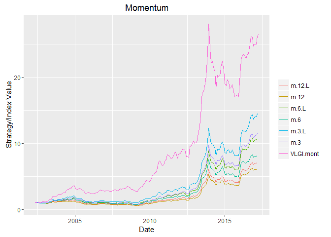
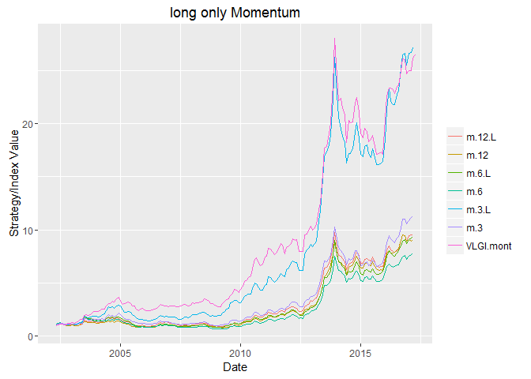

Momentum part 2
---------------

In the previous post on the same subject the results showed momentum
with 3 month window that excludes last month was promising for further
considerations. In this post I try to consider Small vs. big filtration
before making momentum portfolio.
### Data

In the last post we get some fundamental data by RSelenium, lets clean
it and use it. First the "," character that in some Persian websites is
used for separating every 3 number need to be deleted. After that number
of shares need to be multiplied by 1000 to become book value. After
deleting duplicates and matching the data, I use diagonal of outer
product of shares market value and book value to get the Mcap at end of
each month.

    data.TSE.VALUE<- read.csv( "C:/Users/msdeb/Documents/Data analysis table and R results/data TSE VALUE.CSV")
    # deletin ","
    data.TSE.VALUE$MCAP<- as.character( data.TSE.VALUE$MCAP)
    data.TSE.VALUE$MCAP<- gsub( ",", "", as.character( data.TSE.VALUE$MCAP))
    data.TSE.VALUE$MCAP<- as.numeric(data.TSE.VALUE$MCAP)
    data.TSE.VALUE$BookValue<- as.character(data.TSE.VALUE$BookValue)
    data.TSE.VALUE$BookValue<- gsub(",", "", as.character(data.TSE.VALUE$BookValue))
    # number of shares times 1000 
    data.TSE.VALUE$BookValue<- as.numeric(data.TSE.VALUE$BookValue) * 1000

    # selecting matched cases
    Bval <- t ( data.TSE.VALUE[,"BookValue"])
    colnames(Bval)<- data.TSE.VALUE$sym
    match.names<- colnames(Bval)[ colnames(Bval) %in% colnames(retDATAw.mont)]
    match.names<- match.names[ !duplicated(match.names)]
    Bval.sel<- Bval[ , match.names]
    Bval.sel<- rbind(Bval.sel)
    retDATAw.mont.sel<- retDATAw.mont[ ,colnames(retDATAw.mont) %in% colnames(Bval.sel)]
    retDATAw.mont.sel<- retDATAw.mont.sel[ , match(colnames(Bval.sel), colnames(retDATAw.mont.sel))]

    # getting Mcap
    Mcap.sel<- matrix( NA, nrow = nrow(retDATAw.mont.sel), ncol = ncol(retDATAw.mont.sel))

    for ( i in 1 : nrow( retDATAw.mont.sel)){
      Mcap.sel[i,]<- diag (as.numeric(retDATAw.mont.sel[i,]) %o% as.numeric(Bval.sel) ) / 1000
    }
    colnames(Mcap.sel)<- colnames((retDATAw.mont.sel))
    retDATAw.mont.sel$DATE<- retDATAw.mont$DATE

**It should be noted that** *I assumed that number of outstanding shares
are constant, which is not a plausible assumption. Given the problems I
mentioned in last post I decided this manner. Another important matter
is that since I reduced the stocks to listed tradable stocks and not all
the stocks that are tradable, and since some data was discountinious,
the data and analysis severly suffer from survivorship bias.*

A slightly different version of last post function, which now filters
based on small vs big is used for getting the symbol names:

    names.momentum <- function(data = retDATAw.mont.sel,
                               Mcap = Mcap.sel,
                               WDATA. = WDATA,
                               win.back = 12,  # backward window for computing return
                               win.start = 134,  # starting raw for computation
                               last.month = TRUE,  # whether to skip latest month
                               data_NA_rm. = data_NA_rm,
                               portion.mom = 3 / 10,  # portion of stocks to be short or long 
                               n.var = 3 / 4    # portion of stocks to be considered based on volume
    ) {
      DATE.end <- data$DATE[win.start]
      
      if (last.month == TRUE) {
        WDATA. <- subset(WDATA., WDATA.$DATE <= data$DATE[win.start] &
                           WDATA.$DATE > data$DATE[win.start - win.back])
        data <- subset(data, data$DATE <= data$DATE[win.start] &
                         data$DATE > data$DATE[win.start - win.back])
      } else{
        WDATA. <- subset(WDATA., WDATA.$DATE < data$DATE[win.start] &
                           WDATA.$DATE >= data$DATE[win.start - win.back])
        data <- subset(data, data$DATE < data$DATE[win.start] &
                         data$DATE >= data$DATE[win.start - win.back])
      }
      
      
      WDATA. <- ddply(WDATA., 'sym', .fun = function(x) data_NA_rm.(x),
                      .progress = "tk")
      WDATA.$sym <- droplevels(WDATA.$sym)
      
      Ave_year_VOL <- summarise(group_by(WDATA., sym), mean = mean(VOL, na.rm = TRUE))
      Ave_year_VOL <- Ave_year_VOL[order(Ave_year_VOL$mean , decreasing  = TRUE), ]
      Ave_year_VOL <- as.data.frame(Ave_year_VOL)
      Ave_year_VOL[, 1] <- as.character(Ave_year_VOL[, 1])
      
      portion <- floor(n.var * dim(Ave_year_VOL)[1])
      portion <- as.numeric(portion)
      portion.sym <- c(Ave_year_VOL[(1:portion) , 1])
      Mcap.row<- Mcap[win.start,][ !is.na(Mcap[win.start,])]
      Mcap.row<- Mcap.row[ (names(Mcap.row) %in% as.factor(portion.sym))]
      Small.Mcap<- names( Mcap.row[ Mcap.row <= median (Mcap.row)])
      Big.Mcap<- names( Mcap.row[ Mcap.row > median (Mcap.row)])
      
      data <- data[, (colnames(data) %in% as.factor(portion.sym))]
      
      
      period.ret <- ( data[dim(data)[1], ] - data[1, ]) / data[1, ]
      
      period.ret.Small<- period.ret[, (colnames(period.ret) %in% as.factor(Small.Mcap))]
      period.ret.Small <- period.ret.Small[order(period.ret.Small , decreasing  = TRUE)]
      is.na.order <- apply(period.ret.Small, 2, function(x)   sum(is.na(x)))
      period.ret.Small <- period.ret.Small[, which(is.na.order <= 0)]
      period.ret.Small <- as.data.frame(names(period.ret.Small))
      period.ret.Small[, 1] <- as.character(period.ret.Small[, 1])
      
      n.total.Small <- dim(period.ret.Small)[1]
      n.sym.Small <- floor(portion.mom * n.total.Small)

      period.ret.Big<- period.ret[, (colnames(period.ret) %in% as.factor(Big.Mcap))]
      period.ret.Big <- period.ret.Big[order(period.ret.Big , decreasing  = TRUE)]
      is.na.order <- apply(period.ret.Big, 2, function(x)   sum(is.na(x)))
      period.ret.Big <- period.ret.Big[, which(is.na.order <= 0)]
      period.ret.Big <- as.data.frame(names(period.ret.Big))
      period.ret.Big[, 1] <- as.character(period.ret.Big[, 1])
      
      n.total.Big <- dim(period.ret.Big)[1]
      n.sym.Big <- floor(portion.mom * n.total.Big)
      
      names.long <- c( period.ret.Small[1:n.sym.Small,],
                       period.ret.Big[1:n.sym.Big,])
      names.short <- c( period.ret.Small[((n.total.Small - n.sym.Small + 1):n.total.Small),],
                        period.ret.Big[((n.total.Big - n.sym.Big + 1):n.total.Big),])
      
      out <- list( 
        win.start = win.start,
        DATE = DATE.end,
        names.long = names.long,
        names.short = names.short
      )
      return(out)
    }

Using the same functions as before we get the following two charts:

Conclusion
----------

Here we considered filtering to small vs. big before considering
returns. The result for long and short strategy is as before, inflation
rules :) For long only momentum the results of momentum with 3 month
window that excludes last month (m.3.L) are slightly better. Yet it
fails to outperform VLGI except for the last year. Further it suffers
from 2 more than 4 years drawdown. So it is not a reasonable method of
investing in my view.

###### *Please inform me about your feedback, I will be deeply grateful for that :)*
