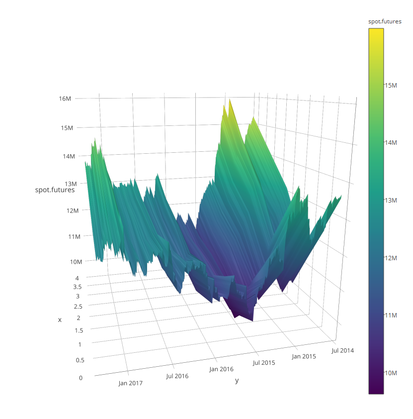

Introduction
------------

I think that one of the most fascinating aspects of markets is term
structure of instruments. I just love to see how highly correlated processes get affected
by time. This property is of utmost beauty in my mind. During the time I
was serving as a lieutenant, I had lots of spare time and I had the
opportunity to read "Term-Structure Models, A Graduate Course" by Damir
Filipovic. Now that I am in active search for a job, I have enough spare
time to see some of the models of this book.

In Tehran, they have introduced futures on gold coins few years ago. I
will try to fit some models on their term structure during next
posts. In this post I try to see the basic properties and whether they
behave as international markets.

About 15 months ago, I saw some obvious arbitrage opportunities in
Tehran gold coin future market, especially in their spreads and
butterflies. I had backtested strategies which yielded about 50 percent
profit per year, yet by the time I wanted to use them, market had an
structural change and the arbitrage get eroded. Being late in noticing
something is not always good :) So in flowing posts I would consider
data after 2016 for computations.

I saw the flowing considering gold coin future market:

-   Latest contract is the most liquid one
-   Nearest contract trading includes big slippage
-   Curvature changes and seems to be mean reverting
-   Before 2016 by having an inventory of cash or coin, arbitrage was
    existed
-   there is no convenience yield on keeping gold coins, they are almost
    useless
-   considering
    contracts, slope is almost always greater than zero . If we consider spot price,
    backwardation occurs.
-   During late 2015 spread reached to zero.

Considering these, it is possible to use models on interest rate term
structure on gold coins. So I will test them to see how well they are.
Since these models are tested on simulations based on interest rate, I
will change the range of the future contract to 1 to 10. Since I will
focus on after 2016, I would not use shadow rates models.

### Continius contracts and data

I got the data on contracts data from MofidTrader. Then I proportionally
backward adjusted them. I used the same source for gold coin spot
prices. for sake of comparability I also adjusted them by the ratios
from the most liquid contract. Since we will use increments here that
would not make a problem, and comparison would be easier.

    library(xts)
    date_t<- paste( coin$DAY, coin$HOURE)
    date_t<- as.POSIXct( date_t)
    xts.coin<- as.xts( coin[,-c( 1:2)], order.by = date_t)

    date_t<- paste( Future_4$DAY, Future_4$HOURE)
    date_t<- as.POSIXct( date_t)
    xts.Future_4<- as.xts( Future_4[,-c( 1:2)], order.by = date_t)

    date_t<- paste( Future_3$DAY, Future_3$HOURE)
    date_t<- as.POSIXct( date_t)
    xts.Future_3<- as.xts( Future_3[,-c( 1:2)], order.by = date_t)

    date_t<- paste( Future_2$DAY, Future_2$HOURE)
    date_t<- as.POSIXct( date_t)
    xts.Future_2<- as.xts(F uture_2[,-c( 1:2)], order.by = date_t)

    date_t<- paste( Future_1$DAY, Future_1$HOURE)
    date_t<- as.POSIXct( date_t)
    xts.Future_1<- as.xts( Future_1[,-c( 1:2)], order.by = date_t)

    spot.futures<- cbind(spot = to.daily( xts.coin$CLOSE)[,4] ,
                         c1 =  to.daily( xts.Future_1$CLOSE)[,4] ,
                         c2 =  to.daily( xts.Future_2$CLOSE)[,4] ,
                         c3 =  to.daily( xts.Future_3$CLOSE)[,4] ,
                         c4 =  to.daily( xts.Future_4$CLOSE)[,4])
    colnames(spot.futures)<- c("spot", "c1", "c2", "c3", "c4")

    spot.futures<- spot.futures[ complete.cases( spot.futures$c1 ),]
    spot.futures<- spot.futures[ complete.cases( spot.futures$c4 ),]
    spot.futures<- spot.futures[ complete.cases( spot.futures$c2 ),]
    spot.futures<- spot.futures[ complete.cases( spot.futures$c3 ),]
    spot.futures<- spot.futures[ complete.cases( spot.futures$spot ),]
    spot.futures<- spot.futures[-( which( spot.futures$c3 == 0)),]

    plot( spot.futures[,1], main = "spread", cex.main = 0.8, ylim = c(9500000, 16000000))
    lines( spot.futures[,2],col=4)
    lines( spot.futures[,3], col = 3)
    lines( spot.futures[,4], col = 2)
    lines( spot.futures[,5], col = 6)
    abline( v = as.POSIXct( beg_days), col = 2, lty = 3 )
    legend( "topright", legend = c("adj. spot", "c1", "c2", "c3", "c4"), col = c(1,4 ,3, 2, 6),
           cex = 0.8, lwd = c( 1, 1, 1, 1, 1))

    library(plotly)
    plot_ly( y = index( spot.futures), z = ~spot.futures) %>% add_surface()

As we see at the end of 2015 there is negative rates and difference
between contracts shows a structural change after 2016.

### PCA and correlation

Lets see whether typical features of term structure occurs here or not.

    path = "C:/Users/msdeb/Documents/Stock and trades/"
    setwd(path)
    load(".RData")

    spot.futures.scaled<- (spot.futures - (min( spot.futures$spot, na.rm = TRUE) + 1) ) / sd(spot.futures$c4)

    log.ret<- apply(as.data.frame(spot.futures.scaled["2016-01-01::"]), 2, function(x)  diff.xts(log(x)))

    T1<- prcomp( log.ret[-1,1:5])
    library(pander)
    panderOptions("digits", 4)
    pander(summary( T1)$importance)

<table style="width:97%;">
<colgroup>
<col width="40%" />
<col width="9%" />
<col width="11%" />
<col width="11%" />
<col width="12%" />
<col width="12%" />
</colgroup>
<thead>
<tr class="header">
<th align="center"> </th>
<th align="center">PC1</th>
<th align="center">PC2</th>
<th align="center">PC3</th>
<th align="center">PC4</th>
<th align="center">PC5</th>
</tr>
</thead>
<tbody>
<tr class="odd">
<td align="center"><strong>Standard deviation</strong></td>
<td align="center">0.1527</td>
<td align="center">0.02887</td>
<td align="center">0.01439</td>
<td align="center">0.008715</td>
<td align="center">0.006069</td>
</tr>
<tr class="even">
<td align="center"><strong>Proportion of Variance</strong></td>
<td align="center">0.9528</td>
<td align="center">0.03408</td>
<td align="center">0.00847</td>
<td align="center">0.0031</td>
<td align="center">0.00151</td>
</tr>
<tr class="odd">
<td align="center"><strong>Cumulative Proportion</strong></td>
<td align="center">0.9528</td>
<td align="center">0.9869</td>
<td align="center">0.9954</td>
<td align="center">0.9985</td>
<td align="center">1</td>
</tr>
</tbody>
</table>

    pander( -T1$rotation)

<table style="width:72%;">
<colgroup>
<col width="15%" />
<col width="9%" />
<col width="11%" />
<col width="11%" />
<col width="12%" />
<col width="12%" />
</colgroup>
<thead>
<tr class="header">
<th align="center"> </th>
<th align="center">PC1</th>
<th align="center">PC2</th>
<th align="center">PC3</th>
<th align="center">PC4</th>
<th align="center">PC5</th>
</tr>
</thead>
<tbody>
<tr class="odd">
<td align="center"><strong>spot</strong></td>
<td align="center">0.3492</td>
<td align="center">0.9037</td>
<td align="center">0.2448</td>
<td align="center">-0.02269</td>
<td align="center">0.02893</td>
</tr>
<tr class="even">
<td align="center"><strong>c1</strong></td>
<td align="center">0.516</td>
<td align="center">0.02142</td>
<td align="center">-0.8206</td>
<td align="center">-0.2121</td>
<td align="center">-0.1221</td>
</tr>
<tr class="odd">
<td align="center"><strong>c2</strong></td>
<td align="center">0.461</td>
<td align="center">-0.1753</td>
<td align="center">0.08519</td>
<td align="center">0.8545</td>
<td align="center">-0.1391</td>
</tr>
<tr class="even">
<td align="center"><strong>c3</strong></td>
<td align="center">0.4746</td>
<td align="center">-0.2757</td>
<td align="center">0.2298</td>
<td align="center">-0.2091</td>
<td align="center">0.776</td>
</tr>
<tr class="odd">
<td align="center"><strong>c4</strong></td>
<td align="center">0.4172</td>
<td align="center">-0.2757</td>
<td align="center">0.4546</td>
<td align="center">-0.425</td>
<td align="center">-0.6022</td>
</tr>
</tbody>
</table>

    plot(-T1$rotation[,1], type = "b", ylim = c(-1,1), ylab ="loadings", main = "PCA")
    lines(-T1$rotation[,2], type = "b", col = 2)
    lines(-T1$rotation[,3], type = "b", col = 4)

    pander(cor(log.ret[-1,1:5]))

<table style="width:64%;">
<colgroup>
<col width="15%" />
<col width="9%" />
<col width="9%" />
<col width="9%" />
<col width="9%" />
<col width="9%" />
</colgroup>
<thead>
<tr class="header">
<th align="center"> </th>
<th align="center">spot</th>
<th align="center">c1</th>
<th align="center">c2</th>
<th align="center">c3</th>
<th align="center">c4</th>
</tr>
</thead>
<tbody>
<tr class="odd">
<td align="center"><strong>spot</strong></td>
<td align="center">1</td>
<td align="center">0.8811</td>
<td align="center">0.8585</td>
<td align="center">0.8434</td>
<td align="center">0.8343</td>
</tr>
<tr class="even">
<td align="center"><strong>c1</strong></td>
<td align="center">0.8811</td>
<td align="center">1</td>
<td align="center">0.975</td>
<td align="center">0.9718</td>
<td align="center">0.9587</td>
</tr>
<tr class="odd">
<td align="center"><strong>c2</strong></td>
<td align="center">0.8585</td>
<td align="center">0.975</td>
<td align="center">1</td>
<td align="center">0.9876</td>
<td align="center">0.981</td>
</tr>
<tr class="even">
<td align="center"><strong>c3</strong></td>
<td align="center">0.8434</td>
<td align="center">0.9718</td>
<td align="center">0.9876</td>
<td align="center">1</td>
<td align="center">0.9905</td>
</tr>
<tr class="odd">
<td align="center"><strong>c4</strong></td>
<td align="center">0.8343</td>
<td align="center">0.9587</td>
<td align="center">0.981</td>
<td align="center">0.9905</td>
<td align="center">1</td>
</tr>
</tbody>
</table>

It seems to me that level slope and curvature exits. Yet level looks a
bit upward at the begining which is not very satisfactory. Also de-correlation occurs
significantly.

Conclusion
----------

Having seen that level and slope exist and considering that convenience
yield is not existed, I would try to see performance of CIR, [affine
process estimation](http://www.nber.org/papers/w17772.pdf) and [affine
arbitrage free nelson sigel term
structure](http://www.frbsf.org/economic-research/files/wp07-20bk.pdf)
in the future posts.

###### *Please inform me about your feedback, I will be deeply grateful for that :)*

###### For disclaimer please see about page.
