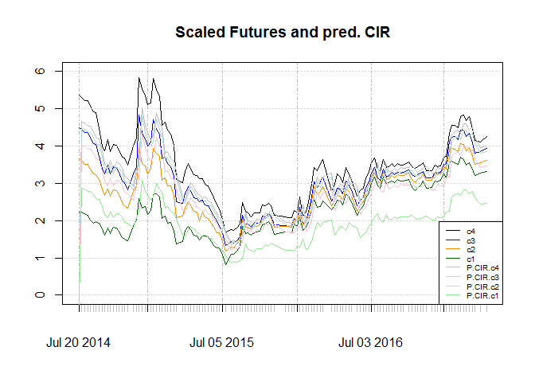
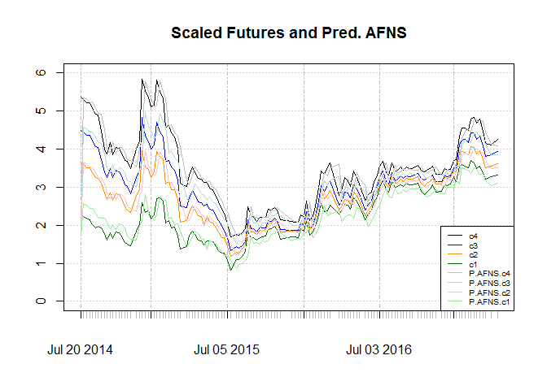
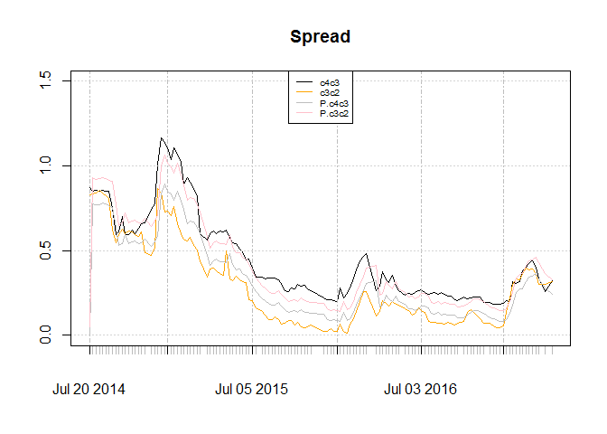
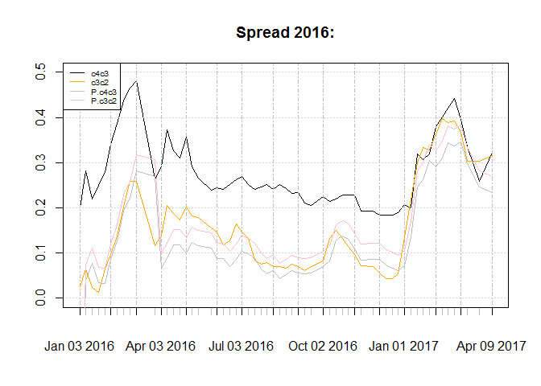

### Why an interest rate model for future?

In last post, we saw that since gold coins are useless, convenience
yield is almost zero for gold coin futures. Furthermore since interest
rates are almost constant in Tehran market and the are treated as
external variables that are determined by central bank. Putting aside
interest rate and convenience yield, the models for future term
structure could reduce to processes like interest rate. Literally using
the same names as the names of the models for the later, is not correct,
because we are using it in a different context, yet I prefer to not
change the names. **So we are using wrong models for right reasons.
It is possible that the results become cat-astropic, like a cat that is
plotting against hooman :)**

### CIR

Given the P dynamics by completely affine
[here](http://www.bracil.net/ccfea/WorkingPapers/2009/wp037-09-ccfea-cp.pdf)
ans
[here](http://www.bankofcanada.ca/wp-content/uploads/2010/02/wp01-15a.pdf),
using Kalman filter for estimation, and by looking at this [matlab
code](https://de.mathworks.com/matlabcentral/fileexchange/27704-kalman-filter-application-cir)
by the later, I used the following function for estimation:

    CIR.fun<- function (p, # parameters
                        Y, # series
                        tau # delta t
                        ){
      theta  = p[1]
      kappa = p[2]
      sigma = p[3]
      lambda = p[4]
      sigmai = p[5:8]
      sigmai2 = sigmai^2
      R <- diag(sigmai2)
      dt <- 1/52
      C <- theta* ( 1 - exp( - kappa*dt))
      H <- exp(-kappa*dt)
      gamma<- sqrt((kappa+lambda)^2+2*sigma^2)
      logAi<- (2 * kappa * theta / ( sigma^2))*log( (2 * gamma*exp(( gamma + kappa + lambda) * tau / 2))/
                                                      (2*gamma + (gamma + kappa + lambda)*
                                                         ( exp( gamma * tau) - 1) ))
      Bi<- 2*(exp(gamma*tau)-1)/(2*gamma + (gamma+kappa+lambda)*
                                   (exp(gamma*tau)-1))
      logAtho<- logAi/ tau
      Btho<- Bi / tau
      initx = theta
      initV = (sigma^2)*theta/(2*kappa)
      AdjS=initx
      VarS=initV
      LL<- rep(0, nrow(Y))
      CIR.pred<- matrix( NA, ncol = ncol(Y), nrow = nrow(Y))
      J<- 0
      for ( i in 1:nrow(Y)){
        PredS=C+H*AdjS
        Q=theta*sigma*sigma*(1-exp(-kappa*dt))^2/(2*kappa)+sigma*sigma/kappa*
          (exp(-kappa*dt)-exp(-2*kappa*dt))*AdjS
        VarS=H*VarS*H+Q
        PredY=logAi+Bi*PredS
        VarY=as.numeric(VarS) * (Bi%*%t(Bi))+R
        if( det( VarY) <= 10^(-14)){
          J <- 1
        } else {
        PredError=Y[i,] -PredY
        KalmanGain=as.numeric(VarS)*Bi%*%solve(VarY)
        AdjS=PredS+KalmanGain%*%t(PredError)
        VarS=VarS*(1-KalmanGain%*%(Bi))
        DetY=det(VarY)
        if (DetY <= 10^(-14)){
          J <- 1
        } else{
          J <- 0
          CIR.pred[ i,]<- PredY
        LL[i]=-(ncol(Y)/2)*log(2*pi)-0.5*log(DetY)-0.5*PredError%*%solve(VarY)%*%t(PredError)
        }
        }
      }
      if( J == 1){
        sumll <- 10^5
      } else {
      sumll=-sum(LL)
      }
      return(list( loglike = sumll, CIR.pred = CIR.pred))
    }

    p=c(0.10,0.05,0.075,-0.4,rep(.1, 4))
    tau1 = c(2/12, 4/12, 6/12, 8/12)

    spot.futures.scaled.2016<- spot.futures.scaled["2016-01-01::"]

    par.CIR<- nmk(p, CIR.fun,
        control = list(maxfeval = 10000),
         Y = spot.futures.scaled[,2:5], tau = tau1, ll = TRUE)
    par.CIR.2016<- nmk(p, CIR.fun,
        control = list(maxfeval = 10000),
         Y = spot.futures.scaled.2016[,2:5], tau = tau1, ll = TRUE)

results and graphs of the optimization for whole sample and the sample
after 2016 are:

    ## [1] "Whole sample"

<table style="width:99%;">
<colgroup>
<col width="11%" />
<col width="13%" />
<col width="11%" />
<col width="12%" />
<col width="12%" />
<col width="12%" />
<col width="12%" />
<col width="12%" />
</colgroup>
<thead>
<tr class="header">
<th align="center">theta</th>
<th align="center">kappa</th>
<th align="center">sigma</th>
<th align="center">lambda</th>
<th align="center">sigma1</th>
<th align="center">sigma2</th>
<th align="center">sigma3</th>
<th align="center">sigma4</th>
</tr>
</thead>
<tbody>
<tr class="odd">
<td align="center">-1.527</td>
<td align="center">-0.005896</td>
<td align="center">2.434</td>
<td align="center">4.775</td>
<td align="center">0.62</td>
<td align="center">0.2043</td>
<td align="center">0.001015</td>
<td align="center">0.4187</td>
</tr>
</tbody>
</table>

    ## [1] "2016 onward"

<table style="width:96%;">
<colgroup>
<col width="11%" />
<col width="11%" />
<col width="11%" />
<col width="12%" />
<col width="12%" />
<col width="12%" />
<col width="12%" />
<col width="12%" />
</colgroup>
<thead>
<tr class="header">
<th align="center">theta</th>
<th align="center">kappa</th>
<th align="center">sigma</th>
<th align="center">lambda</th>
<th align="center">sigma1</th>
<th align="center">sigma2</th>
<th align="center">sigma3</th>
<th align="center">sigma4</th>
</tr>
</thead>
<tbody>
<tr class="odd">
<td align="center">21.98</td>
<td align="center">0.0048</td>
<td align="center">3.155</td>
<td align="center">14.64</td>
<td align="center">0.07389</td>
<td align="center">0.03085</td>
<td align="center">0.1735</td>
<td align="center">0.4474</td>
</tr>
</tbody>
</table>

As charts show, it fails to make account for slope. And structural break
after 2016 is obvious. Since *λ* is positive and as a result market
price of risk is negative, I will not consider CIR for this purpose.

### Affine Arbitrage-Free Nelson-Siegel (AFNS)

Given essentially affine structure the canonical P dynamics are given
[here](http://www.frbsf.org/economic-research/files/wp07-20bk.pdf). I
would consider independent factor model. The code is available
[here](http://cepr.org/sites/default/files/events/Kalman_filter_AFNS_indep_factors.r),
yet some minor changes are needed for our case. The optimization using
nmk is:

    ## [1] "Whole sample"

<table>
<caption>Table continues below</caption>
<colgroup>
<col width="12%" />
<col width="12%" />
<col width="12%" />
<col width="12%" />
<col width="12%" />
<col width="12%" />
<col width="11%" />
<col width="11%" />
</colgroup>
<thead>
<tr class="header">
<th align="center">kappa11</th>
<th align="center">kappa22</th>
<th align="center">kappa23</th>
<th align="center">sigma11</th>
<th align="center">sigma22</th>
<th align="center">sigma33</th>
<th align="center">theta1</th>
<th align="center">theta2</th>
</tr>
</thead>
<tbody>
<tr class="odd">
<td align="center">6.985</td>
<td align="center">0.8552</td>
<td align="center">0.09665</td>
<td align="center">0.8821</td>
<td align="center">0.7551</td>
<td align="center">8.65</td>
<td align="center">2.154</td>
<td align="center">-0.5502</td>
</tr>
</tbody>
</table>

<table style="width:75%;">
<colgroup>
<col width="12%" />
<col width="12%" />
<col width="12%" />
<col width="12%" />
<col width="12%" />
<col width="12%" />
</colgroup>
<thead>
<tr class="header">
<th align="center">theta3</th>
<th align="center">lambda</th>
<th align="center">sigma1</th>
<th align="center">sigma2</th>
<th align="center">sigma3</th>
<th align="center">sigma4</th>
</tr>
</thead>
<tbody>
<tr class="odd">
<td align="center">2.302</td>
<td align="center">0.5419</td>
<td align="center">0.1355</td>
<td align="center">0.01691</td>
<td align="center">0.1362</td>
<td align="center">0.02269</td>
</tr>
</tbody>
</table>

    ## [1] "2016 onward"

<table>
<caption>Table continues below</caption>
<colgroup>
<col width="12%" />
<col width="12%" />
<col width="12%" />
<col width="12%" />
<col width="12%" />
<col width="12%" />
<col width="11%" />
<col width="11%" />
</colgroup>
<thead>
<tr class="header">
<th align="center">kappa11</th>
<th align="center">kappa22</th>
<th align="center">kappa23</th>
<th align="center">sigma11</th>
<th align="center">sigma22</th>
<th align="center">sigma33</th>
<th align="center">theta1</th>
<th align="center">theta2</th>
</tr>
</thead>
<tbody>
<tr class="odd">
<td align="center">73.39</td>
<td align="center">1.941</td>
<td align="center">0.07133</td>
<td align="center">0.4388</td>
<td align="center">1.037</td>
<td align="center">83.95</td>
<td align="center">-47.48</td>
<td align="center">49.99</td>
</tr>
</tbody>
</table>

<table style="width:76%;">
<colgroup>
<col width="12%" />
<col width="12%" />
<col width="13%" />
<col width="12%" />
<col width="12%" />
<col width="12%" />
</colgroup>
<thead>
<tr class="header">
<th align="center">theta3</th>
<th align="center">lambda</th>
<th align="center">sigma1</th>
<th align="center">sigma2</th>
<th align="center">sigma3</th>
<th align="center">sigma4</th>
</tr>
</thead>
<tbody>
<tr class="odd">
<td align="center">-97.41</td>
<td align="center">0.03821</td>
<td align="center">4.179e-06</td>
<td align="center">0.03697</td>
<td align="center">0.002053</td>
<td align="center">0.1554</td>
</tr>
</tbody>
</table>

Graphs and RMSE are:

    ## [1] "Whole sample"

<table style="width:54%;">
<colgroup>
<col width="15%" />
<col width="9%" />
<col width="9%" />
<col width="9%" />
<col width="9%" />
</colgroup>
<thead>
<tr class="header">
<th align="center"> </th>
<th align="center">c1</th>
<th align="center">c2</th>
<th align="center">c3</th>
<th align="center">c4</th>
</tr>
</thead>
<tbody>
<tr class="odd">
<td align="center"><strong>RMSE</strong></td>
<td align="center">0.2464</td>
<td align="center">0.2749</td>
<td align="center">0.3727</td>
<td align="center">0.4246</td>
</tr>
</tbody>
</table>

    ## [1] "2016 onward"

<table style="width:53%;">
<colgroup>
<col width="15%" />
<col width="9%" />
<col width="8%" />
<col width="9%" />
<col width="9%" />
</colgroup>
<thead>
<tr class="header">
<th align="center"> </th>
<th align="center">c1</th>
<th align="center">c2</th>
<th align="center">c3</th>
<th align="center">c4</th>
</tr>
</thead>
<tbody>
<tr class="odd">
<td align="center"><strong>RMSE</strong></td>
<td align="center">0.1672</td>
<td align="center">0.209</td>
<td align="center">0.2496</td>
<td align="center">0.3779</td>
</tr>
</tbody>
</table>

Unlike CIR, AFNS can consider slope. The structural change is less
obvious in the graphs, but looking at RMSE it shows that sub sample
estimation shows an improvement. Considering sub sample there is a
persistent under estimation for fourth contract. Since this contract is
the most liquid one it is not plausible. Looking at graph we see a lag
between shocks to contracts and their prediction, which is as far as I
see before, is typical for this kind of models unless we have an
external variable that can predict the shocks.

RMSE for in-sample four step ahead forecasts are:

    ## [1] "Whole sample"

<table style="width:54%;">
<colgroup>
<col width="15%" />
<col width="9%" />
<col width="9%" />
<col width="9%" />
<col width="9%" />
</colgroup>
<thead>
<tr class="header">
<th align="center"> </th>
<th align="center">c1</th>
<th align="center">c2</th>
<th align="center">c3</th>
<th align="center">c4</th>
</tr>
</thead>
<tbody>
<tr class="odd">
<td align="center"><strong>RMSE</strong></td>
<td align="center">0.4475</td>
<td align="center">0.5045</td>
<td align="center">0.6389</td>
<td align="center">0.7453</td>
</tr>
</tbody>
</table>

    ## [1] "2016 onward"

<table style="width:54%;">
<colgroup>
<col width="15%" />
<col width="9%" />
<col width="9%" />
<col width="9%" />
<col width="9%" />
</colgroup>
<thead>
<tr class="header">
<th align="center"> </th>
<th align="center">c1</th>
<th align="center">c2</th>
<th align="center">c3</th>
<th align="center">c4</th>
</tr>
</thead>
<tbody>
<tr class="odd">
<td align="center"><strong>RMSE</strong></td>
<td align="center">0.3278</td>
<td align="center">0.4253</td>
<td align="center">0.5107</td>
<td align="center">0.6927</td>
</tr>
</tbody>
</table>

#### Spread by AFNS

Lets see how spread and their prediction by ANFS looks like:

The spreads shows consistent over estimation and under estimation for each case. And it fails to
include c3c2 being more than c4c1 which is temporary. Since model
says it is a deviation it could use for trade yet the data is short for supporting this idea and the resulting profit dont seem to be much more than 10% risk free rate in this market. Considering sub sample,
forecasts of c3c2 is better. Forecast of c4c3 shows a bump in middle of
the chart that does not exist for the original series.

###### *Please inform me about your feedback, I will be deeply grateful for that :)*
