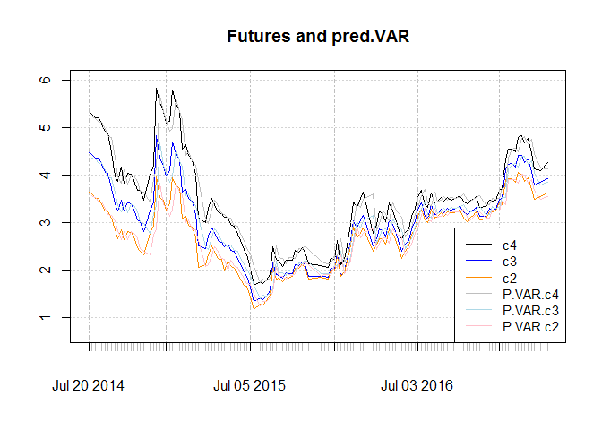
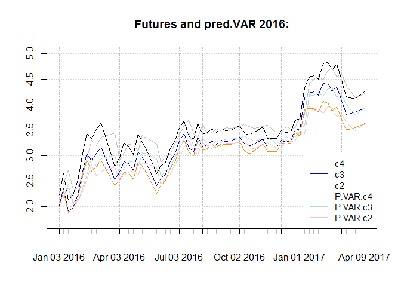
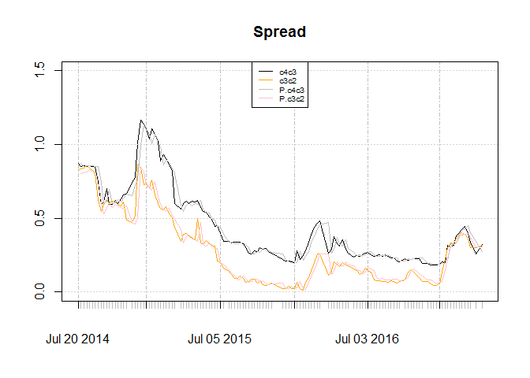
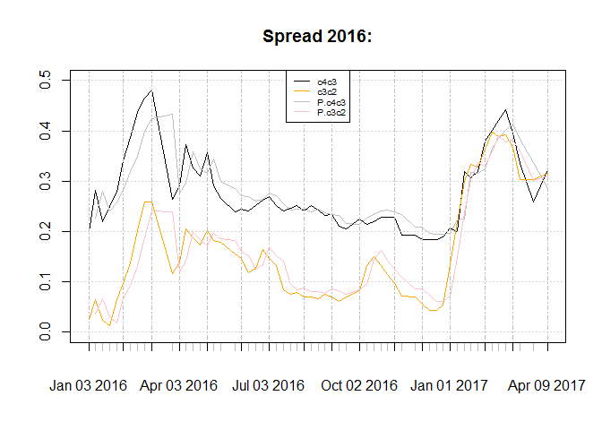

### Minimum-Chi-Square Estimation of Latent Factor Model

In process of fitting wrong models for right reasons, I would try to
estimate latent 3 factor model using minimum-chi-square estimation that
is described [here](http://www.nber.org/papers/w17772.pdf). Again since
interest rate is constant and convenience yield is zero, I chose this
group of models. Literally using the same name is not correct, anyhow I
would call them by their original name.

### OLS extimations

First we estimate the reduced form equation using OLS:

    ols1<- VAR(spot.futures.scaled[,3:5], p = 1,type = "const")

    A1star.hat<- Bcoef(ols1)[,4]
    phi11star.hat<-  Phi(ols1, 1)[,,2]
    omega1.star.hat<- summary(ols1)$covres

    pred.VAR<- fitted(ols1)
    pred.VAR<- as.xts(pred.VAR, order.by = index(spot.futures.scaled)[-1])

    ols2<- lm(spot.futures.scaled[,2]~ spot.futures.scaled[,3:5])
    A2star.hat<- ols2$coefficients[1]
    phi21star.hat<- ols2$coefficients[2:4]
    omega2.star.hat<- (t(ols2$residuals)%*% (ols2$residuals)) / (1 / nrow(spot.futures.scaled))
    sigma_e<- sqrt(omega2.star.hat)

Plot for in-sample one step ahead forecast :

In sample RMSE for the contracts are as below. As we we RMSE is
substantially lower for the sub sample.

    ## [1] "Whole sample"

<table style="width:44%;">
<colgroup>
<col width="15%" />
<col width="9%" />
<col width="9%" />
<col width="9%" />
</colgroup>
<thead>
<tr class="header">
<th align="center"> </th>
<th align="center">c2</th>
<th align="center">c3</th>
<th align="center">c4</th>
</tr>
</thead>
<tbody>
<tr class="odd">
<td align="center"><strong>RMSE</strong></td>
<td align="center">0.2158</td>
<td align="center">0.2457</td>
<td align="center">0.284</td>
</tr>
</tbody>
</table>

    ## [1] "2016 onward"

<table style="width:43%;">
<colgroup>
<col width="15%" />
<col width="8%" />
<col width="9%" />
<col width="9%" />
</colgroup>
<thead>
<tr class="header">
<th align="center"> </th>
<th align="center">c2</th>
<th align="center">c3</th>
<th align="center">c4</th>
</tr>
</thead>
<tbody>
<tr class="odd">
<td align="center"><strong>RMSE</strong></td>
<td align="center">0.179</td>
<td align="center">0.2004</td>
<td align="center">0.2283</td>
</tr>
</tbody>
</table>

The graph for spread of contracts and resulted spread from forecasts:

Unlike AFNS, reduced form follows the data on the fact that c2c3 spread
is more than c4c3 spread. This is plausible :) 

### Step 2

[f1]: http://chart.apis.google.com/chart?cht=tx&chl=\hat{\rho}^Q%20,%20\hat{\delta}_1
For estimating ![f1]  following
function are needed:

    power.mat<- function ( mat = rho , power = 8){
      out<- list()
      out[[1]]<- mat
      for ( i in 2 : power){
        out[[i]] <- out[[i-1]]%*%mat 
      }
      return(out)
    }

    b_n_fun<- function( rho = rho_i, delta_1 = rnorm(3), n = 8){
      delta_1<- abs(delta_1)
      out = list()
      for(i in 1 : n){
        
        sum_rho.power<- diag(3)
        if( i > 1){
          rho_sep<- rho[ c( 1 : (i-1))]
          for( j in 1 : length (rho_sep)){
            sum_rho.power<- sum_rho.power + t(rho_sep[[j]])
          }
        }
        out[[i]]<- (sum_rho.power %*% delta_1) * (1 / (i))
        
      }
      return(out)
    }

Having them in hand we can numerically minimize step 2:

    library(OpenMx)
    pi2.g2.fun<- function (x1 = par, phi21star.hat. = phi21star.hat,
                           omega1.star.hat. = omega1.star.hat){
      
      rhoQ<- matrix( c( x1[1], 0, 0,x1[4] , x1[2], 0, 
                        x1[5:6], x1[3]), ncol = 3, byrow = TRUE)
      delta_1. <- x1[7:9]
      pnlt<- 0
      #if( x1[1] < x1[2] | x1[1] < x1[3] | x1[2] < x1[3]) pnlt<- .001
      
      rho_i<- power.mat(mat = rhoQ , power = 8)
      
      b_i<- b_n_fun(rho = rho_i, delta_1 = delta_1., n = 8)
      
      
      pi.hat_2<- cbind( c( c( phi21star.hat. %*% omega1.star.hat.), vech(omega1.star.hat.)))
      B_1<- rbind( t(b_i[[4]]), t(b_i[[6]]), t(b_i[[8]]))
      B_2<- t(b_i[[2]])
      g_2<- cbind( c( c( B_2 %*% t(B_1)),  vech(B_1 %*% t( B_1))))
      out<- t(pi.hat_2 - g_2) %*% (pi.hat_2 - g_2)
      out<- out + pnlt
      return(out)
    }

    par<- rnorm(9)
    par.pi2.g2<- optim(par , pi2.g2.fun, phi21star.hat. = phi21star.hat, omega1.star.hat. = omega1.star.hat,
          control = list(maxit = 10000))$par

    rhoQhat<- matrix( c( par.pi2.g2[1], 0, 0,par.pi2.g2[4] , par.pi2.g2[2], 0, 
                         par.pi2.g2[5:6], par.pi2.g2[3]), ncol = 3, byrow = TRUE)
    rhoQhat_i<- power.mat(mat = rhoQhat , power = 8)
    deltahat_1<-  par.pi2.g2[7:9]

    b_i<- b_n_fun(rho = rhoQhat_i, delta_1 = deltahat_1, n = 8) 
    Bhat_1<- rbind( t(b_i[[4]]), t(b_i[[6]]), t(b_i[[8]]))
    Bhat_2<- t(b_i[[2]])

Here I used OpenMx package. I had expm package loaded and it wrote the
following message :D :

> "\*\* Holy cannoli! You must be a pretty advanced and awesome user.
> The expm package is loaded. Note that expm defines %^% as repeated
> matrix multiplication (matrix to a power) whereas OpenMx defines the
> same operation as elementwise powering of one matrix by another
> (Kronecker power)."

I feel that they are pretty cool :)

### Step 3
[f2]: http://chart.apis.google.com/chart?cht=tx&chl=\hat{\rho} 

![f2] is simply estimated as follows:

    rhohat<- solve(Bhat_1)%*% phi11star.hat %*% Bhat_1

### Step 4

[f3]: http://chart.apis.google.com/chart?cht=tx&chl=\hat{c}^Q and \hat{\delta}_0$ 

For estimating ![f3]I needed the
following function:

    a_n_fun<- function( b = b_i, delta_0 = rnorm(1), c_Q = rnorm(3), Sigma = diag(3), n = 8){
      
      out = list()
      for(i in 1 : n){
        
        sum_b<- delta_0
        out[[1]]<- sum_b
        sum_2<- 0 
        if( i > 1){
          b_sep<- b[ c( 1 : (i-1))]
          for( j in 1 : length (b_sep)){
            sum_b<- sum_b + t(b_sep[[j]]) * j
            sum_2<- sum_2 + ((i ^ 2) * ( t(b_sep[[j]]) %*% Sigma %*% t(Sigma) %*% b_sep[[j]]) )
          }
          out[[i]]<- ((sum_b %*% c_Q) * (1 / (i))) - (sum_2 / (2*n))
        }
        
        
      }
      return(out)
    }

Then I minimized it to estimate the unknowns:

    A.Ahat<- function( x2 = par, a_n_fun. = a_n_fun, b_i. = b_i, sigma_e. = sigma_e,
                       Bhat_1. = Bhat_1, Bhat_2. = Bhat_2, rhohat. = rhohat){
      
      a_n_l<- a_n_fun.( b = b_i., delta_0 = x2[1], c_Q = x2[2:4],
                        Sigma = diag(3), n = 8)
      A_1<- rbind( a_n_l[[4]], a_n_l[[6]], a_n_l[[8]])
      A_2<- a_n_l[[2]]
      
      LHS1<- (diag(3) - Bhat_1. %*% rhohat. %*% solve(Bhat_1.)) %*% A_1
      
      
      LHS2<- A_2 - Bhat_2. %*% solve(Bhat_1.) %*% A_1
      
      sum.sq.diff<- sum((A1star.hat - LHS1)^2) + ((A2star.hat - LHS2)^2)
      return(sum.sq.diff)
    }

    par<- rnorm(4)
    par.A.Ahat<- optim( par , A.Ahat, b_i. = b_i, sigma_e. = sigma_e,
           Bhat_1. = Bhat_1, Bhat_2. = Bhat_2, a_n_fun. =a_n_fun,
           rhohat. = rhohat
           )$par

    deltahat_0<- par.A.Ahat[1]
    chat_Q<- par.A.Ahat[2:4]

    a_n_l<- a_n_fun( b = b_i, delta_0 = deltahat_0, c_Q = chat_Q,
                      Sigma = diag(3), n = 8)
    Ahat_1<- rbind( a_n_l[[4]], a_n_l[[6]], a_n_l[[8]])
    Ahat_2<- a_n_l[[2]]

### Results

[f5]: http://chart.apis.google.com/chart?cht=tx&chl=\hat{\rho}^Q

The estimations for whole sample and sub sample are:

    ## [1] "Whole sample"

-   ![f5] :

    <table style="width:29%;">
    <colgroup>
    <col width="9%" />
    <col width="9%" />
    <col width="9%" />
    </colgroup>
    <tbody>
    <tr class="odd">
    <td align="left">1.106</td>
    <td align="center">0</td>
    <td align="center">0</td>
    </tr>
    <tr class="even">
    <td align="left">0.0222</td>
    <td align="center">-1.071</td>
    <td align="center">0</td>
    </tr>
    <tr class="odd">
    <td align="left">-1.733</td>
    <td align="center">2.146</td>
    <td align="center">-0.2297</td>
    </tr>
    </tbody>
    </table>

[f6]: http://chart.apis.google.com/chart?cht=tx&chl=\hat{\delta}_1
[f7]: http://chart.apis.google.com/chart?cht=tx&chl=\hat{B}_1

-   ![f6] : *0.0001887*, *-0.9224* and *0.172*
-   ![f7] :

    <table style="width:33%;">
    <colgroup>
    <col width="11%" />
    <col width="11%" />
    <col width="11%" />
    </colgroup>
    <tbody>
    <tr class="odd">
    <td>-0.2029</td>
    <td>0.07062</td>
    <td>0.03488</td>
    </tr>
    <tr class="even">
    <td>-0.246</td>
    <td>0.03973</td>
    <td>0.02331</td>
    </tr>
    <tr class="odd">
    <td>-0.2863</td>
    <td>0.02335</td>
    <td>0.01749</td>
    </tr>
    </tbody>
    </table>
[f8]: http://chart.apis.google.com/chart?cht=tx&chl=\hat{B}_2

-   ![f8] :

    <table style="width:31%;">
    <colgroup>
    <col width="11%" />
    <col width="9%" />
    <col width="9%" />
    </colgroup>
    <tbody>
    <tr class="odd">
    <td>-0.1387</td>
    <td>0.1519</td>
    <td>0.06626</td>
    </tr>
    </tbody>
    </table>
[f9]: http://chart.apis.google.com/chart?cht=tx&chl=\hat{\rho}

-   ![f9] :

    <table style="width:29%;">
    <colgroup>
    <col width="9%" />
    <col width="9%" />
    <col width="9%" />
    </colgroup>
    <tbody>
    <tr class="odd">
    <td align="left">1.106</td>
    <td align="center">0</td>
    <td align="center">0</td>
    </tr>
    <tr class="even">
    <td align="left">0.0222</td>
    <td align="center">-1.071</td>
    <td align="center">0</td>
    </tr>
    <tr class="odd">
    <td align="left">-1.733</td>
    <td align="center">2.146</td>
    <td align="center">-0.2297</td>
    </tr>
    </tbody>
    </table>
[f10]: http://chart.apis.google.com/chart?cht=tx&chl=\hat{\delta}_0
[f11]: http://chart.apis.google.com/chart?cht=tx&chl=\hat{c}^Q
[f12]: http://chart.apis.google.com/chart?cht=tx&chl=\hat{A}_1
[f13]: http://chart.apis.google.com/chart?cht=tx&chl=\hat{A}_2

-   ![f10] : *24.57*
-   ![f11] : *-2.373*, *45.97* and *-45.26*
-   ![f12] :

    <table style="width:7%;">
    <colgroup>
    <col width="6%" />
    </colgroup>
    <tbody>
    <tr class="odd">
    <td>8.423</td>
    </tr>
    <tr class="even">
    <td>11.53</td>
    </tr>
    <tr class="odd">
    <td>11.64</td>
    </tr>
    </tbody>
    </table>

-   ![f13] :

    <table style="width:7%;">
    <colgroup>
    <col width="6%" />
    </colgroup>
    <tbody>
    <tr class="odd">
    <td>-3.28</td>
    </tr>
    </tbody>
    </table>

<!-- end of list -->
    ## [1] " 2016 onward"

-   ![f5] :

    <table style="width:33%;">
    <colgroup>
    <col width="11%" />
    <col width="11%" />
    <col width="11%" />
    </colgroup>
    <tbody>
    <tr class="odd">
    <td>-0.9431</td>
    <td align="center">0</td>
    <td align="center">0</td>
    </tr>
    <tr class="even">
    <td>2.055</td>
    <td align="center">0.2597</td>
    <td align="center">0</td>
    </tr>
    <tr class="odd">
    <td>-0.4237</td>
    <td align="center">-0.3477</td>
    <td align="center">-1.118</td>
    </tr>
    </tbody>
    </table>

-   ![f6] :*-1.367*, *0.4522* and *2.122*
-   ![f7] :

    <table style="width:35%;">
    <colgroup>
    <col width="9%" />
    <col width="12%" />
    <col width="12%" />
    </colgroup>
    <tbody>
    <tr class="odd">
    <td align="center">0.1</td>
    <td>-0.06354</td>
    <td>-0.1409</td>
    </tr>
    <tr class="even">
    <td align="center">0.1218</td>
    <td>-0.0589</td>
    <td>-0.1592</td>
    </tr>
    <tr class="odd">
    <td align="center">0.1378</td>
    <td>-0.05961</td>
    <td>-0.1805</td>
    </tr>
    </tbody>
    </table>

-   ![f8] :

    <table style="width:36%;">
    <colgroup>
    <col width="11%" />
    <col width="12%" />
    <col width="12%" />
    </colgroup>
    <tbody>
    <tr class="odd">
    <td>0.05392</td>
    <td>-0.08404</td>
    <td>-0.1252</td>
    </tr>
    </tbody>
    </table>

-   ![f9] :

    <table style="width:33%;">
    <colgroup>
    <col width="11%" />
    <col width="11%" />
    <col width="11%" />
    </colgroup>
    <tbody>
    <tr class="odd">
    <td>-0.9431</td>
    <td align="center">0</td>
    <td align="center">0</td>
    </tr>
    <tr class="even">
    <td>2.055</td>
    <td align="center">0.2597</td>
    <td align="center">0</td>
    </tr>
    <tr class="odd">
    <td>-0.4237</td>
    <td align="center">-0.3477</td>
    <td align="center">-1.118</td>
    </tr>
    </tbody>
    </table>

-   ![f10] :*-1.802*
-   ![f11] :*42.03*, *18.91* and *147.3*
-   ![f12] :

    <table style="width:8%;">
    <colgroup>
    <col width="8%" />
    </colgroup>
    <tbody>
    <tr class="odd">
    <td>-76.94</td>
    </tr>
    <tr class="even">
    <td>-56.22</td>
    </tr>
    <tr class="odd">
    <td>-55.09</td>
    </tr>
    </tbody>
    </table>

-   ![f13] :

    <table style="width:8%;">
    <colgroup>
    <col width="8%" />
    </colgroup>
    <tbody>
    <tr class="odd">
    <td>-166.4</td>
    </tr>
    </tbody>
    </table>

<!-- end of list -->
### Conclusion

Since gold coin futures have no convenience yield and since interest
rate is constant in Tehran market, I thought that using interest rate
model for term structure of gold coin futures in Tehran market is
reasonable. While the last two models were not satisfactory, it seemed
to me that latent factor model is kinda cool for this matter. Well the
whole interpretation procedure needs to be changed if this model is
going to be used, and since I just do these things for fun, I would not
do it here :)

###### *Please inform me about your feedback, I will be deeply grateful for that :)*

###### For disclaimer please see about page.

