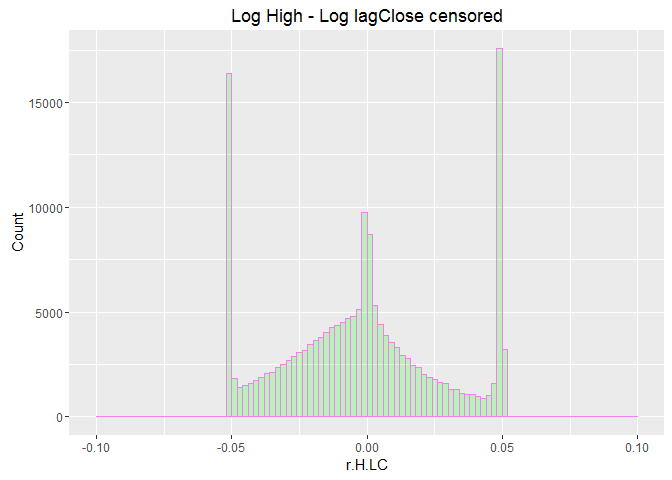

Price limit and Markov Chains
-----------------------------

One of the things that bothers me about Tehran Stocks are is price
limit. It simply distorts market adjusting procedure and causes binomial
changes in liquidity. Since it exist and my retirement portfolio was
subject to it several times, I saw a need for taking a look at it.
Another thing that is tightly related to this is that final price is
weighted average of intraday trades. As a result it is possible that
there is a positive shock and since the effect is perceived by all
participants to be more than the limit, the price would not change and
liquidity becomes zero. Although an extreme case, yet this extremities
give insight about what need to be examined.

I like to see this changes of regimes as Markov chains. Ever since a
professor of mine mentioned that human civilization could follow a
Markov chain, I am somehow obsessed with Markov chains. In this post I
would look whether this obsession has anything useful about it :)

For the distribution of returns, censored normal distribution seems
logical so I proceed with that.

From 28-06-2010 to 23-05-2015 the price limit was symmetric and was 4
percent of the asset prices. Since 23-05-2015 the limit was ameliorated
and changed to 5 percent of asset prices. I first take a glimpse on
first period and then I take a better look at current period.

### High of the day matters

Since the close price is the weighted average of trades, for knowing
whether the process has changed regimes we need to used the information
that exist in high or low of the day. Maybe some time ago I would have
never imagined that high of the day has any such important information
in it, yet after looking more closely, I saw that if the high or low is
equal to last traded price (in my data it is called LCLOSE) and both
equal to extremes of price limit, these could contain some information
about regime changes.

    vars<-c("FIRST", "HIGH", "LOW", "CLOSE",
            "LPRICE","LCLOSE")

    WDATA[,paste0("ln",vars)] <- apply(WDATA[,c("FIRST", "HIGH", "LOW", "CLOSE",
                                                "LPRICE", "LCLOSE" )],2,log)
    WDATA[is.nan.data.frame(WDATA)] <- 0

    WDATA[,13:18]<- apply(WDATA[,13:18],2,function(x) { x[ x == -Inf ] = 0 ; x })

    #returns

    WDATA$r.H.LC<- WDATA$lnLCLOSE -  WDATA$lnLPRICE
    WDATA$retCL<-WDATA$lnCLOSE -  WDATA$lnLPRICE

    WDATA$max4p<- floor(WDATA$LPRICE * 1.04)
    WDATA$min4p<- ceiling(WDATA$LPRICE * .96)
    WDATA$max5p<- floor(WDATA$LPRICE * 1.05)
    WDATA$min5p<- ceiling(WDATA$LPRICE * .95)

    WDATA.4p<- subset( WDATA, WDATA$DATE >= as.Date("2010-06-27") & WDATA$DATE < as.Date("2015-05-23"))

    WDATA.4p$r.H.LC[ WDATA.4p$r.H.LC > .04]<- .04
    WDATA.4p$r.H.LC[ WDATA.4p$r.H.LC < -.04]<- -.04

    WDATA.4p$ind4p<- 0
    WDATA.4p$ind4p[WDATA.4p$max4p <= WDATA.4p$LCLOSE] <- 1
    WDATA.4p$ind4p[WDATA.4p$r.H.LC == .04] <- 1

    WDATA.4p$ind_4p<- 0
    WDATA.4p$ind_4p[WDATA.4p$min4p >= WDATA.4p$LOW] <- -1
    WDATA.4p$ind_4p[WDATA.4p$r.H.LC == -.04] <- -1

    WDATA.4p$Lind4p<- c(NA, WDATA.4p$ind4p[- length(WDATA.4p$ind4p)])

Lets see how the sequences of staying at limit would last:

    path = "C:/Users/msdeb/Documents/Stock and trades/"
    setwd(path)
    load(".Rdata")
    library(pander)
    t<- rle(WDATA.4p$ind4p)
    L1<- t$lengths[t$values == 1]
    pander(summary(as.factor(L1)))

<table style="width:100%;">
<caption>Table continues below</caption>
<colgroup>
<col width="7%" />
<col width="6%" />
<col width="6%" />
<col width="6%" />
<col width="4%" />
<col width="4%" />
<col width="4%" />
<col width="4%" />
<col width="4%" />
<col width="6%" />
<col width="6%" />
<col width="6%" />
<col width="6%" />
<col width="6%" />
<col width="6%" />
<col width="6%" />
<col width="6%" />
</colgroup>
<thead>
<tr class="header">
<th align="center">1</th>
<th align="center">2</th>
<th align="center">3</th>
<th align="center">4</th>
<th align="center">5</th>
<th align="center">6</th>
<th align="center">7</th>
<th align="center">8</th>
<th align="center">9</th>
<th align="center">10</th>
<th align="center">11</th>
<th align="center">12</th>
<th align="center">13</th>
<th align="center">14</th>
<th align="center">15</th>
<th align="center">16</th>
<th align="center">17</th>
</tr>
</thead>
<tbody>
<tr class="odd">
<td align="center">17809</td>
<td align="center">5907</td>
<td align="center">2258</td>
<td align="center">1076</td>
<td align="center">571</td>
<td align="center">324</td>
<td align="center">160</td>
<td align="center">97</td>
<td align="center">59</td>
<td align="center">43</td>
<td align="center">31</td>
<td align="center">25</td>
<td align="center">13</td>
<td align="center">7</td>
<td align="center">11</td>
<td align="center">9</td>
<td align="center">6</td>
</tr>
</tbody>
</table>

<table style="width:62%;">
<colgroup>
<col width="6%" />
<col width="6%" />
<col width="6%" />
<col width="6%" />
<col width="6%" />
<col width="6%" />
<col width="6%" />
<col width="6%" />
<col width="6%" />
</colgroup>
<thead>
<tr class="header">
<th align="center">18</th>
<th align="center">19</th>
<th align="center">20</th>
<th align="center">21</th>
<th align="center">22</th>
<th align="center">24</th>
<th align="center">26</th>
<th align="center">36</th>
<th align="center">38</th>
</tr>
</thead>
<tbody>
<tr class="odd">
<td align="center">4</td>
<td align="center">1</td>
<td align="center">4</td>
<td align="center">1</td>
<td align="center">1</td>
<td align="center">1</td>
<td align="center">1</td>
<td align="center">1</td>
<td align="center">1</td>
</tr>
</tbody>
</table>

    t_ <- rle(WDATA.4p$ind_4p)
    L_1<- t_$lengths[t_$values == -1]
    pander(summary(as.factor(L_1)))

<table>
<caption>Table continues below</caption>
<colgroup>
<col width="7%" />
<col width="6%" />
<col width="6%" />
<col width="6%" />
<col width="6%" />
<col width="5%" />
<col width="5%" />
<col width="5%" />
<col width="5%" />
<col width="6%" />
<col width="6%" />
<col width="6%" />
<col width="6%" />
<col width="6%" />
<col width="6%" />
<col width="6%" />
</colgroup>
<thead>
<tr class="header">
<th align="center">1</th>
<th align="center">2</th>
<th align="center">3</th>
<th align="center">4</th>
<th align="center">5</th>
<th align="center">6</th>
<th align="center">7</th>
<th align="center">8</th>
<th align="center">9</th>
<th align="center">10</th>
<th align="center">11</th>
<th align="center">12</th>
<th align="center">13</th>
<th align="center">14</th>
<th align="center">15</th>
<th align="center">16</th>
</tr>
</thead>
<tbody>
<tr class="odd">
<td align="center">23860</td>
<td align="center">9707</td>
<td align="center">4077</td>
<td align="center">2025</td>
<td align="center">1197</td>
<td align="center">678</td>
<td align="center">404</td>
<td align="center">311</td>
<td align="center">198</td>
<td align="center">133</td>
<td align="center">89</td>
<td align="center">72</td>
<td align="center">46</td>
<td align="center">39</td>
<td align="center">24</td>
<td align="center">24</td>
</tr>
</tbody>
</table>

<table style="width:90%;">
<colgroup>
<col width="6%" />
<col width="6%" />
<col width="6%" />
<col width="6%" />
<col width="6%" />
<col width="6%" />
<col width="6%" />
<col width="6%" />
<col width="6%" />
<col width="6%" />
<col width="6%" />
<col width="6%" />
<col width="6%" />
</colgroup>
<thead>
<tr class="header">
<th align="center">17</th>
<th align="center">18</th>
<th align="center">19</th>
<th align="center">20</th>
<th align="center">21</th>
<th align="center">22</th>
<th align="center">23</th>
<th align="center">24</th>
<th align="center">25</th>
<th align="center">26</th>
<th align="center">27</th>
<th align="center">30</th>
<th align="center">42</th>
</tr>
</thead>
<tbody>
<tr class="odd">
<td align="center">17</td>
<td align="center">14</td>
<td align="center">12</td>
<td align="center">4</td>
<td align="center">2</td>
<td align="center">6</td>
<td align="center">5</td>
<td align="center">2</td>
<td align="center">1</td>
<td align="center">4</td>
<td align="center">3</td>
<td align="center">1</td>
<td align="center">1</td>
</tr>
</tbody>
</table>

The length of sequences shows some persistence lets look more thoroughly
by fitting a Markov chain:

    WDATA.4p$ind.cnsr<- WDATA.4p$ind_4p + WDATA.4p$ind4p

    library(markovchain)

    MC4p<- markovchainFit(as.character(WDATA.4p$ind.cnsr), method="mle")
    # conditional distribution
    mcE <- new("markovchain", states = c("-1", "0", "1"),
               transitionMatrix = MC4p$estimate@transitionMatrix)

    pander(MC4p$estimate@transitionMatrix)

<table style="width:43%;">
<colgroup>
<col width="12%" />
<col width="11%" />
<col width="9%" />
<col width="9%" />
</colgroup>
<thead>
<tr class="header">
<th align="center"> </th>
<th align="center">-1</th>
<th align="center">0</th>
<th align="center">1</th>
</tr>
</thead>
<tbody>
<tr class="odd">
<td align="center"><strong>-1</strong></td>
<td align="center">0.5055</td>
<td align="center">0.4247</td>
<td align="center">0.06988</td>
</tr>
<tr class="even">
<td align="center"><strong>0</strong></td>
<td align="center">0.08733</td>
<td align="center">0.8619</td>
<td align="center">0.05074</td>
</tr>
<tr class="odd">
<td align="center"><strong>1</strong></td>
<td align="center">0.09883</td>
<td align="center">0.4745</td>
<td align="center">0.4267</td>
</tr>
</tbody>
</table>

    assessStationarity(WDATA.4p$ind.cnsr,  floor(length(WDATA.4p$ind.cnsr)/5))

    ## The assessStationarity test statistic is:  77822.36  the Chi-Square d.f. are:  679404  the p-value is:  1

    ## $statistic
    ## [1] 77822.36
    ## 
    ## $p.value
    ## [1] 1

    plot(mcE)

The series are not rejected to be stationary. And we see that there is
some probability that the states recurs. An interesting matter is that
there are small probabilities that the process changes from maximum
limit to minimum limit. If I have had known this, I would have produced
more return on my retirement portfolio.

Now that the analyse seems not futile, let me proceed to the current 5
percent price limit period.

    WDATA.5p<- subset( WDATA, WDATA$DATE > as.Date("2015-05-23"))

    na.omit.WDATA.5p<- WDATA.5p[complete.cases(WDATA.5p$r.H.LC),]

    library( ggplot2)
    ggplot(data=na.omit.WDATA.5p, aes(na.omit.WDATA.5p$r.H.LC)) + 
      geom_histogram(breaks=seq(-.1, 0.1, by = 0.002), 
                     col="violet", 
                     fill="green", 
                     alpha = .2) +
      labs(title="Log High - Log lagClose") +
      labs(x="r.H.LC", y="Count") 

    ggplot(data=na.omit.WDATA.5p, aes(na.omit.WDATA.5p$retCL)) + 
      geom_histogram(breaks=seq(-.1, 0.1, by = 0.002), 
                     col="violet", 
                     fill="green", 
                     alpha = .2) +
      labs(title="Return Based on Close") +
      labs(x="retCL", y="Count") 

The distribution of returns has values more than 5 percent, since the
process is censored, I would make it completely censored by letting
those values to be equal to price limit extremes (these values are
related to the times that an asset being not tradable become tradable
again).

    WDATA.5p$r.H.LC[ which( WDATA.5p$r.H.LC > .05)]<- .05
    WDATA.5p$r.H.LC[ which( WDATA.5p$r.H.LC < -.05)]<- -.05

    WDATA.5p$ind5p<- 0
    WDATA.5p$ind5p[ which( WDATA.5p$max5p == WDATA.5p$LCLOSE)] <- 1
    WDATA.5p$ind5p[ which( WDATA.5p$r.H.LC == .05)] <- 1

    WDATA.5p$ind_5p<- 0
    WDATA.5p$ind_5p[ which( WDATA.5p$min5p == WDATA.5p$LOW)] <- -1
    WDATA.5p$ind_5p[ which( WDATA.5p$r.H.LC == -.05)] <- -1

    na.omit.WDATA.5p<- WDATA.5p[complete.cases(WDATA.5p$r.H.LC),]

    ggplot(data=na.omit.WDATA.5p, aes(na.omit.WDATA.5p$r.H.LC)) + 
      geom_histogram(breaks=seq(-.1, 0.1, by = 0.002), 
                     col="violet", 
                     fill="green", 
                     alpha = .2) +
      labs(title="Log High - Log lagClose censored") +
      labs(x="r.H.LC", y="Count") 

    ggplot(data=na.omit.WDATA.5p, aes(na.omit.WDATA.5p$retCL)) + 
      geom_histogram(breaks=seq(-.1, 0.1, by = 0.002), 
                     col="violet", 
                     fill="green", 
                     alpha = .2) +
      labs(title="Return Based on Close censored") +
      labs(x="retCL", y="Count") 

    WDATA.5p$Lind5p<- c(NA, WDATA.5p$ind5p[- length(WDATA.5p$ind5p)])
    WDATA.5p$Lind_5p<- c(NA, WDATA.5p$ind_5p[- length(WDATA.5p$ind_5p)])

    t<- rle(WDATA.5p$ind5p)
    L1<- t$lengths[t$values == 1]
    pander(summary(as.factor(L1)))

<table style="width:100%;">
<caption>Table continues below</caption>
<colgroup>
<col width="6%" />
<col width="6%" />
<col width="5%" />
<col width="5%" />
<col width="5%" />
<col width="5%" />
<col width="5%" />
<col width="5%" />
<col width="5%" />
<col width="6%" />
<col width="6%" />
<col width="6%" />
<col width="6%" />
<col width="6%" />
<col width="6%" />
<col width="6%" />
<col width="6%" />
</colgroup>
<thead>
<tr class="header">
<th align="center">1</th>
<th align="center">2</th>
<th align="center">3</th>
<th align="center">4</th>
<th align="center">5</th>
<th align="center">6</th>
<th align="center">7</th>
<th align="center">8</th>
<th align="center">9</th>
<th align="center">10</th>
<th align="center">11</th>
<th align="center">12</th>
<th align="center">13</th>
<th align="center">14</th>
<th align="center">15</th>
<th align="center">16</th>
<th align="center">17</th>
</tr>
</thead>
<tbody>
<tr class="odd">
<td align="center">4700</td>
<td align="center">1239</td>
<td align="center">499</td>
<td align="center">210</td>
<td align="center">83</td>
<td align="center">70</td>
<td align="center">37</td>
<td align="center">23</td>
<td align="center">20</td>
<td align="center">7</td>
<td align="center">7</td>
<td align="center">9</td>
<td align="center">6</td>
<td align="center">5</td>
<td align="center">5</td>
<td align="center">4</td>
<td align="center">2</td>
</tr>
</tbody>
</table>

<table style="width:76%;">
<colgroup>
<col width="6%" />
<col width="6%" />
<col width="6%" />
<col width="6%" />
<col width="6%" />
<col width="6%" />
<col width="6%" />
<col width="6%" />
<col width="6%" />
<col width="6%" />
<col width="6%" />
</colgroup>
<thead>
<tr class="header">
<th align="center">18</th>
<th align="center">19</th>
<th align="center">20</th>
<th align="center">22</th>
<th align="center">24</th>
<th align="center">26</th>
<th align="center">28</th>
<th align="center">31</th>
<th align="center">35</th>
<th align="center">40</th>
<th align="center">53</th>
</tr>
</thead>
<tbody>
<tr class="odd">
<td align="center">3</td>
<td align="center">1</td>
<td align="center">2</td>
<td align="center">2</td>
<td align="center">1</td>
<td align="center">1</td>
<td align="center">1</td>
<td align="center">1</td>
<td align="center">3</td>
<td align="center">1</td>
<td align="center">1</td>
</tr>
</tbody>
</table>

    t_<- rle(WDATA.5p$ind_5p)
    L_1<- t_$lengths[t_$values == -1]
    pander(summary(as.factor(L_1)))

<table style="width:100%;">
<caption>Table continues below</caption>
<colgroup>
<col width="6%" />
<col width="6%" />
<col width="5%" />
<col width="5%" />
<col width="5%" />
<col width="5%" />
<col width="5%" />
<col width="5%" />
<col width="5%" />
<col width="6%" />
<col width="6%" />
<col width="6%" />
<col width="6%" />
<col width="6%" />
<col width="6%" />
<col width="6%" />
<col width="6%" />
</colgroup>
<thead>
<tr class="header">
<th align="center">1</th>
<th align="center">2</th>
<th align="center">3</th>
<th align="center">4</th>
<th align="center">5</th>
<th align="center">6</th>
<th align="center">7</th>
<th align="center">8</th>
<th align="center">9</th>
<th align="center">10</th>
<th align="center">11</th>
<th align="center">12</th>
<th align="center">13</th>
<th align="center">14</th>
<th align="center">15</th>
<th align="center">16</th>
<th align="center">17</th>
</tr>
</thead>
<tbody>
<tr class="odd">
<td align="center">9745</td>
<td align="center">2652</td>
<td align="center">913</td>
<td align="center">430</td>
<td align="center">149</td>
<td align="center">94</td>
<td align="center">47</td>
<td align="center">40</td>
<td align="center">31</td>
<td align="center">21</td>
<td align="center">15</td>
<td align="center">11</td>
<td align="center">5</td>
<td align="center">5</td>
<td align="center">10</td>
<td align="center">4</td>
<td align="center">1</td>
</tr>
</tbody>
</table>

<table style="width:42%;">
<colgroup>
<col width="6%" />
<col width="6%" />
<col width="6%" />
<col width="6%" />
<col width="6%" />
<col width="6%" />
</colgroup>
<thead>
<tr class="header">
<th align="center">21</th>
<th align="center">22</th>
<th align="center">23</th>
<th align="center">26</th>
<th align="center">28</th>
<th align="center">30</th>
</tr>
</thead>
<tbody>
<tr class="odd">
<td align="center">1</td>
<td align="center">6</td>
<td align="center">2</td>
<td align="center">1</td>
<td align="center">3</td>
<td align="center">2</td>
</tr>
</tbody>
</table>

Length of being at the extremes sequence seems to behave like previous
sequences. So I proceed with the Markov chain estimation.

    WDATA.5p$ind.cnsr<- WDATA.5p$ind_5p + WDATA.5p$ind5p
    MC5p<- markovchainFit(as.character(WDATA.5p$ind.cnsr), method="mle")
    mcE <- new("markovchain", states = c("-1", "0", "1"),
               transitionMatrix = MC5p$estimate@transitionMatrix)

    steadyStates(mcE)

    ##              -1         0          1
    ## [1,] 0.09752502 0.8517057 0.05076925

    assessStationarity(WDATA.5p$ind.cnsr,   floor(length(WDATA.5p$ind.cnsr)/5))

    ## The assessStationarity test statistic is:  22856.07  the Chi-Square d.f. are:  281646  the p-value is:  1

    ## $statistic
    ## [1] 22856.07
    ## 
    ## $p.value
    ## [1] 1

    plot(mcE)

Lets see how the histogram looks like if the previous state was an
extreme price state:

    na.omit.WDATA.5p<- WDATA.5p[complete.cases(WDATA.5p$r.H.LC),]
    na.omit.WDATA.5p<- na.omit.WDATA.5p[ which( na.omit.WDATA.5p$Lind5p == 1) ,]

    ggplot(data=na.omit.WDATA.5p, aes(na.omit.WDATA.5p$r.H.LC)) + 
      geom_histogram(breaks=seq(-.1, 0.1, by = 0.002), 
                     col="violet", 
                     fill="green", 
                     alpha = .2) +
      labs(title="Log High - Log lagClose conditional on being at positive extreme at previous state") +
      labs(x="r.H.LC", y="Count") 

    na.omit.WDATA.5p<- WDATA.5p[complete.cases(WDATA.5p$r.H.LC),]
    na.omit.WDATA.5p<- na.omit.WDATA.5p[ which( na.omit.WDATA.5p$Lind_5p == -1) ,]

    ggplot(data=na.omit.WDATA.5p, aes(na.omit.WDATA.5p$r.H.LC)) + 
      geom_histogram(breaks=seq(-.1, 0.1, by = 0.002), 
                     col="violet", 
                     fill="green", 
                     alpha = .2) +
      labs(title="Log High - Log lagClose conditional on being at negative extreme at previous state") +
      labs(x="r.H.LC", y="Count") 

### Censored Normal Distribution

By following function we could estimate the censored normal distribution
parameters:

    para = c(0, 1)
    ll<-function(para =para , x =WDATA.5p$r.H.LC[!WDATA.5p$Lind5p == 1 ],   censor = .047){
      mu<- para[1]
      sigma<- para[2]
      pnlt<- 0
      if (sigma < 0) {LL<-  10^5}
      else{
      part1<-  pnorm( -censor, mean = mu, sd = sigma, log = TRUE)*(x <= -censor )
      part2<-  dnorm(x, mean = mu, sd = sigma, log = TRUE)*(x > -censor & x < censor )
      part3<-  pnorm(censor, mean = mu, sd = sigma, log = TRUE, lower.tail = FALSE)*(x >= censor )
      LL = -sum( part1 + part2 + part3 + pnlt, na.rm = TRUE)
      }
      return(LL)
    }

    par.norm<- optim( par = c(0,1), ll, 
                      x =WDATA.5p$r.H.LC[( !WDATA.5p$Lind5p == 1) | ( !WDATA.5p$Lind_5p == -1)], 
                      censor = .047)$par

    par.norm_pc<- optim( par = c(0,1), ll,  x = WDATA.5p$r.H.LC[WDATA.5p$Lind5p == 1 ],   censor = .047)$par

    par.norm_nc<- optim( par = c(0,1), ll,  x = WDATA.5p$r.H.LC[WDATA.5p$Lind_5p == -1 ],   censor = .047)$par

    pander( par.norm)

*-0.002031* and *0.03636*

    pander( par.norm_pc)

*0.04286* and *0.05999*

    pander( par.norm_nc)

*-0.02819* and *0.05349*

### Return series

Since the liquidity reduces when the price touches its extreme limits,
and since the final price is related to the quantity traded, close
prices could be different from limits when the process is at the extreme
limit states. Let see how the histogram of ratio of return based on
close to extreme limits looks like:

    deflat<- (WDATA.5p$retCL[which( WDATA.5p$ind5p == 1) ]) /
      (WDATA.5p$r.H.LC[which( WDATA.5p$ind5p == 1) ])
    deflat[ deflat > 1]<- 1
    deflat[ deflat < 0]<- 0

    deflat<- cbind.data.frame(deflat, as.factor("p"))
    colnames(deflat)<- c("ratio", "sign")

    deflat.n<- ( WDATA.5p$retCL[ which( WDATA.5p$ind_5p == -1) ]) /
      (WDATA.5p$r.H.LC[which( WDATA.5p$ind_5p == -1) ])
    deflat.n[ deflat.n > 1]<- 1
    deflat.n[ deflat.n < 0]<- 0
    deflat.n<- cbind.data.frame( deflat.n, as.factor("n"))
    colnames(deflat.n)<- c("ratio", "sign")

    deflat<- as.data.frame( rbind( deflat, deflat.n))

    deflat[,1]<- as.numeric( deflat[,1])

    ggplot( data = deflat, aes(x = ratio , color = sign, fill = sign)) + 
      geom_histogram(breaks=seq(-.02, 1, by = 0.02), 
                    #color=sign, fill = sign,
                    #fill=c("green"), 
                     alpha = .2) +

      labs(title = "ret Close to ret High Ratio conditional on extreme states") +
      labs(x = "", y = "Count") +
      scale_color_brewer(palette = "Accent") + 
      theme_minimal() + theme( legend.position = "top")

It seems that these are not coming from formal distributions. Computing
analytical distribution seems to be not useful for future work so I skip
it for now. In case needed I just sample from empirical distribution.

### Simulation

Lets simulate and see how the histograms look like:

    sim.H.rCl<- function(n = 20000, censor = 0.05, deflat. = deflat, mcE. = mcE){

    deflat_p<-deflat.[ deflat.$sign == "p",][,1]
    deflat_n<-deflat.[ deflat.$sign == "n",][,1]

    x<- rnorm(3*n, mean = par.norm[1], sd = par.norm[2])[200:(3*n)]
    x2<- x[ x < censor & x > -censor][1:(n-200)]
    x1<- x

    mcs<- rmarkovchain(n = n, object = mcE., t0 = "0")[200:n]
    x<- rep(NA, length(mcs))
    x1<- rep(NA, length(mcs))

    x[which(mcs == "1")]<- censor
    x[which(mcs == "-1")]<- -censor
    x[which(mcs == "0")]<- x2[1: sum( mcs == "0")]

    x1[mcs == "1"]<- censor * sample( deflat_p, size = sum(mcs == "1"),  replace = TRUE)
    x1[mcs == "-1"]<- -censor  * sample( deflat_n, size = sum(mcs == "-1"),  replace = TRUE)
    x1[mcs == "0"]<- x2[1: sum( mcs == "0")]

    return(list( sim.r.H.LC = x , sim.retCL = x1))
    }

    sim <- sim.H.rCl()

    sim.r.H.LC <- as.data.frame(sim$sim.r.H.LC)
    sim.retCL <- as.data.frame(sim$sim.retCL)

Histograms looks similar to what we saw above yet it put more weigth on negative price limit extreme.

### Conclusion

It seemed to me that using Markov chains with censored normal
distribution could be helpful and let me to understand the process
better. The fact that going from positive limit to negative limit is
possible seems to be useful in my future decision making about my
retirement portfolio.

###### *Please inform me about your feedback, I will be deeply grateful for that :)*

###### For disclaimer please see about page.
