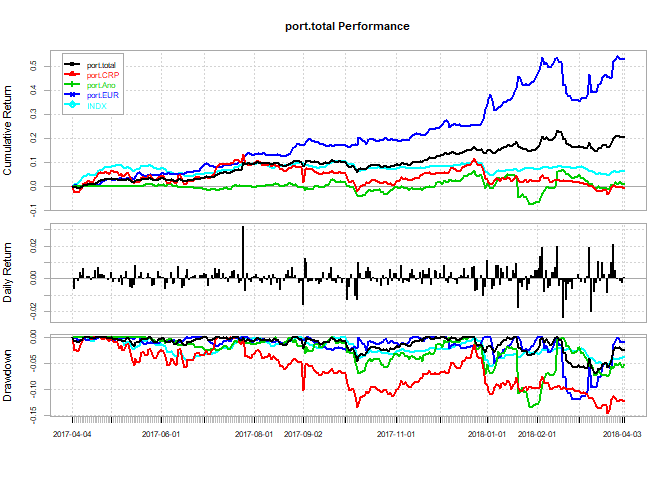
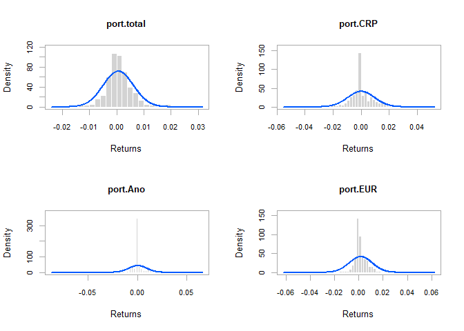

Intro
-----

I was trading for a friend during last year, so I decided to measure the
performance, find my mistakes and see whether the ideas and strategies
were correct. I had 3 group of assets. One was a constantly rebalanced
portfolio, another was a portfolio based on anomalies in trade data, and
lastly a hedge portfolio. I use equal weighted total index of Tehran Stock Exchange instead of my own made VLGI. Better to compare things with widely accepted benchmarks than abstract individual one :D

### Charts and measurements

Let first see charts and measurements. The charts are based on daily
data. measurements are based on weekly data( PerformanceAnalytics
package had problem computing annualized return based on daily data,
maybe it is because weekdays in Tehran)

The chart shows that CRP portfolio was doing fine before end July. At
that time international political risks increased due to nuclear accord.
We also see that hedge portfolio acts as perceived, it has negative beta
with equally weighted total index, light blue line. So on overall, the
decrease due to international risks was offset. The Anomalies portfolio
looks like a random walk.

Except hedge portfolio, the rest look like a normal distribution. I
would skip the normality tests.

    ## [1] "Measures based on weekly data"

<table style="width:42%;">
<colgroup>
<col width="16%" />
<col width="12%" />
<col width="12%" />
</colgroup>
<thead>
<tr class="header">
<th align="center"> </th>
<th align="center">ret</th>
<th align="center">sd</th>
</tr>
</thead>
<tbody>
<tr class="odd">
<td align="center"><strong>Hedge</strong></td>
<td align="center">0.5305</td>
<td align="center">0.157</td>
</tr>
<tr class="even">
<td align="center"><strong>Ano</strong></td>
<td align="center">0.00537</td>
<td align="center">0.1866</td>
</tr>
<tr class="odd">
<td align="center"><strong>CRP</strong></td>
<td align="center">0.005045</td>
<td align="center">0.1635</td>
</tr>
<tr class="even">
<td align="center"><strong>total</strong></td>
<td align="center">0.2082</td>
<td align="center">0.09931</td>
</tr>
</tbody>
</table>

<table style="width:97%;">
<colgroup>
<col width="16%" />
<col width="19%" />
<col width="34%" />
<col width="26%" />
</colgroup>
<thead>
<tr class="header">
<th align="center"> </th>
<th align="center">Sharp Ratio</th>
<th align="center">Upside Potential Ratio</th>
<th align="center">Information Ratio</th>
</tr>
</thead>
<tbody>
<tr class="odd">
<td align="center"><strong>Hedge</strong></td>
<td align="center">3.25</td>
<td align="center">0.8817</td>
<td align="center">2.579</td>
</tr>
<tr class="even">
<td align="center"><strong>Ano</strong></td>
<td align="center">-0.04391</td>
<td align="center">0.4641</td>
<td align="center">-0.1752</td>
</tr>
<tr class="odd">
<td align="center"><strong>CRP</strong></td>
<td align="center">-0.05207</td>
<td align="center">0.642</td>
<td align="center">-0.2801</td>
</tr>
<tr class="even">
<td align="center"><strong>total</strong></td>
<td align="center">1.933</td>
<td align="center">0.8027</td>
<td align="center">2.168</td>
</tr>
</tbody>
</table>

<table style="width:92%;">
<colgroup>
<col width="16%" />
<col width="20%" />
<col width="29%" />
<col width="12%" />
<col width="12%" />
</colgroup>
<thead>
<tr class="header">
<th align="center"> </th>
<th align="center">max Drawdown</th>
<th align="center">Downside Deviation</th>
<th align="center">VaR</th>
<th align="center">ES</th>
</tr>
</thead>
<tbody>
<tr class="odd">
<td align="center"><strong>Hedge</strong></td>
<td align="center">0.1009</td>
<td align="center">0.01111</td>
<td align="center">-0.02701</td>
<td align="center">-0.03601</td>
</tr>
<tr class="even">
<td align="center"><strong>Ano</strong></td>
<td align="center">0.1344</td>
<td align="center">0.02004</td>
<td align="center">-0.04172</td>
<td align="center">-0.05243</td>
</tr>
<tr class="odd">
<td align="center"><strong>CRP</strong></td>
<td align="center">0.1291</td>
<td align="center">0.0173</td>
<td align="center">-0.03658</td>
<td align="center">-0.04596</td>
</tr>
<tr class="even">
<td align="center"><strong>total</strong></td>
<td align="center">0.04091</td>
<td align="center">0.008608</td>
<td align="center">-0.0187</td>
<td align="center">-0.0244</td>
</tr>
</tbody>
</table>

The number above are calculated based on risk free rate of 10%, as the
interest rate on saving deposits with debit card. This is the best proxy
that I found for risk free interest rate in Tehran.

Overall Sharp ratio is slightly below 2, which is not plausible.

And wee see that introduction of hedge portfolio made risk measures at
least and/or about half what they would be.

Mistakes
--------

By now, I figured out the following mistakes:

-   The CRP portfolio was completely based on clustering the data
    and back-testing. Although it behaved exactly as I wanted, it lakes
    inclusion of raw minerals and steel companies. Due to their return
    and behavior the probability that they show themselves in big
    clusters are not high. Their inclusion could improve
    CRP performance.

-   At beginning of January I wanted to cash out CRP portfolio. This was
    based on two reasons. First, my macro models where not indicating
    any positive move in the market. Second the international risk
    elevated substantially. Due to my friend request I have not done
    that, and I said that my hedge portfolio had done well so maybe I
    could continue. Well this decision eroded some of profits.

-   At December I wanted to change the hedge portfolio from EUR to Yen.
    Yet since I found no bank in Tehran that accepts deposits in Yen, I
    discarded it. It was better if I made the money to cash form and
    keep it in a friends safe box.

-   The anomaly portfolio was almost a random walk. Last year when I was
    in military service, it made 50% return in 9 months. I had bad
    selection criteria for hosing stocks that have data point
    significantly different than others.

Conclusion
----------

On overall, hedge portfolio done its part exactly as I perceived
[here](https://phoebuslyubil.github.io/2017-02-12-Hedging-Against-External-Factors/).
CRP portfolio could be improved by what I said above. Anomalies
portfolio still need more time to be considered as failure.

Road ahead
----------

#### situation

During last to week, USD/IRR in market reached to more than 60000. While
government dollar for strategic needs were 37700. This increase in price
was due to two major things. First capital flights of around 30bn USD in
winter and secondly, based on latest central bank statement report an
increase of 17bn USD foreign assets of central bank. So in other words
demand increased and supply decreased. ( Central bank has not even
accepted its part, but numbers do not lie :D ). As a result of this
increase, government made single rate proposal at 42000 IRR per USD.
Measure included on ban of selling foreign cash, being considered as
smuggler for having more than 10K EUR in cash. These measure has
following important results in my mind:

-   The companies who used government rate would face an increase
    in costs. Although there would be subsidies, but we all know that
    their payment timing would not be accurate and during time those
    payment would be eroded :D As a result some companies share price
    would go down.

-   The export oriented companies which on average have sold USD at
    market, would see a decrease in their revenue. As a result their
    share price would also go down. By law they need to sell all their
    foreign income to banks at the new rate. ( I think that part of that
    capital flight that I mentioned is because petrochemical companies
    refused to sell their USD cash in market and they kept it overseas.
    by this law they are forced to sell their money inside the country.)

-   Not regulated market which is heavily depended on cash foreign
    exchange for bringing commodities to their small shops, would see a
    high added cost. As a result demand reduces.

-   due to ban of capital flight and ban on selling foreign cash, a
    strong, structured black market would exist in next six months.

#### Problems

As a result I cannot hedge the portfolio based on Foreign exchange. I
see the following solution:

-   Buying gold coin futures from future exchange of Tehran. The prices
    are closely correlated to international gold price and IRR per USD
    in market.

The problem is that central bank already presold more than 2m of gold
coin. So their price would be equals to their 8.5 gram gold. There is a
rumor that central bank would pay them in electronic format :D I mean a
look at their latest statement and increase in foreign assets shows that
they are making themselves ready for hard days, and they would not let
go of their gold :D As a result I am undecided.

###### *Please inform me about your feedback, I will be deeply grateful for that :)*

###### For disclaimer please see about page.
