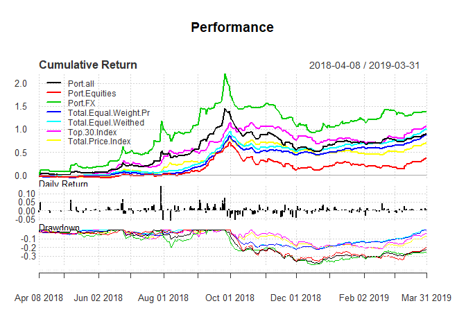
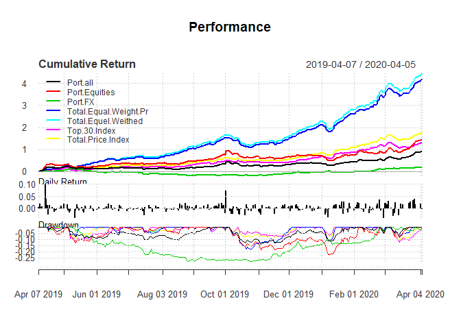

Intro
-----

In what follows I try to look at performance metrics of last couple of
years. During this time geopolitical risks increased. Price level
surged, massive capital outflow made frequent changes in capital outflow
controls more than prevalent. Decrease in export of raw materials and
sanctions made importing luxury items a luxury. Social security fund got
liquidity problems, and the same happened for three main public sector
pension funds. M1 and M2 were increasing at high rate, and central bank
of Iran said this is necessary for "continuation of banking system
activities". In my idea this is equal to saying that a few banks were
more of a Ponzi scheme than bank.In short, sever negative growth coupled
with hot money happened. And most interestingly, stock market saw
unprecedented nominal values. I decided to move my domicile as
geopolitical risk escalated. From about last June/July I had much less
time for trading. Due to that the portfolio was mainly consisted of 2-4
blue chip stocks. And well, this new infection was not part of the plan
:) After canceled plans for relocating- I already changed my city from
near a Gulf to mountainous Tehran- to my utmost surprise, those blue
chip stocks prices surged. All things considered, it is likely that a
structural change bell is ringing.

Given the situation, I decided to work more than before.Different
possible situations need to be considered. First thing is to take a look
at performance metrics. Later I will think about whether we will
experience three digit inflation or not. Are changes in the way people
save for retirement permanent? will reviving banks or pension funds have
fewer financial problems? And a lot more.

### Charts and measurements

For comparison I used four of the indexes that are provided by Tehran
Stock Exchange. Concise definition of them are:

-   Total Equal weight Pr: Based on prices of listed stocks. Equal
    weight is given to prices.

-   Total Equal weight: Like above, dividends are included.

-   Total Price Index: Based on weighted average of prices of listed
    stocks.

-   Top 30 Index: Only includes 30 biggest companies.

Last index has survivorship bias. Due to some market rules, some stocks
are closed for trading for specific predefined or unspecific predefined
time :) For example after disclosing information, or a fifty percent
increase/ decrease in stock price, or reevaluations, they are closed for
trading. Being closed for trading could last from several days to a more
than a year. Since these indexes are calculated using latest available
price, Indexes have slightly undervalued variance compared to [VLGI](<https://phoebuslyubil.github.io/2017-02-05-Benchmark-and-Prediction-Part-I/>).

Charts suggest that during second period drift terms of small and big
stocks diverged. Further after first nine months, [negative
correlation](<https://phoebuslyubil.github.io/2017-02-12-Hedging-Against-External-Factors/>)
between foreign exchange portfolio and indexes conditional external
risks has changed. New economic sanctions, imposing sever strains on
foreign exchange markets, and substitution of IRR for USD for prudent
savings, made changes to mentioned correlation. As an example, more than
1200 goods are not allowed to be imported. For the rest of goods, if
they are not "strategic or essential goods", more than 20-40 percent
tariffs are levied. Permissions for importing goods require an extensive
bureaucracy too.

### Geometric Vs Arthematic

On average stocks growth were higher than average during second twelve
months. So for having a little fun the performance charts using both
arthematic and geometric methods are calculated. Difference is
considerable and cool :)

An interesting thing about drawdowns is difference between small and big
companies. several alternative explanations could account for this
change.

-   Closing price of a stock is based on Volume Weighted Average Price
    (VWAP) times a ratio less than or equal to one. This ratio is
    derived by maximum of dividing each day's volume by a percentage of
    total number of shares of the company and/or one. In other words,
    higher daily volume is needed to achieve the same ratio for big-cap
    companies.

-   very high tariffs on imports and other import restrictions, small
    firms faced less competition and their profits increased and/or they
    escaped bankruptcy. Bigger companies are usually in mining,
    petrochemicals, refineries and metals. All of them face
    international competitions and have no pricing power.

-   Several banks are among big-cap. Since interest rates are fixed, and
    because of an increase in velocity of money, their profit may have
    increased. After I decided to shift to blue chips, I chose them as
    blue chip stocks .

-   Due to changes of reevaluation of book value laws, companies began
    to do it. Subsequently, change in book-to-market ratio happened. For
    some firms, fixed asset values became twenty fold higher. Most
    companies in top30 index still had not done it.

#### Metrics

#### 2018-04-05 : 2019-04-05

Performance metrics for the first period shows a Sharp ratio of 2.4.
About 40 percent of portfolio stocks were closed for trading at latest
date. last available price on the stock were used to calculate metrics.
Standard errors are as I wanted and combining foreign exchange and
equities reduced SE. Return was around a forth larger than return of
main market index.

<table style="width:64%;">
<colgroup>
<col width="38%" />
<col width="12%" />
<col width="12%" />
</colgroup>
<thead>
<tr class="header">
<th align="center"> </th>
<th align="center">ret</th>
<th align="center">sd</th>
</tr>
</thead>
<tbody>
<tr class="odd">
<td align="center"><strong>Total Price Index</strong></td>
<td align="center">0.6987</td>
<td align="center">0.2203</td>
</tr>
<tr class="even">
<td align="center"><strong>Top 30 Index</strong></td>
<td align="center">1.058</td>
<td align="center">0.2639</td>
</tr>
<tr class="odd">
<td align="center"><strong>Total Equel Weithed</strong></td>
<td align="center">1.015</td>
<td align="center">0.1745</td>
</tr>
<tr class="even">
<td align="center"><strong>Total Equal Weight Pr</strong></td>
<td align="center">0.8897</td>
<td align="center">0.175</td>
</tr>
<tr class="odd">
<td align="center"><strong>FX</strong></td>
<td align="center">1.381</td>
<td align="center">0.4876</td>
</tr>
<tr class="even">
<td align="center"><strong>Equity</strong></td>
<td align="center">0.3733</td>
<td align="center">0.291</td>
</tr>
<tr class="odd">
<td align="center"><strong>Total</strong></td>
<td align="center">0.9001</td>
<td align="center">0.3265</td>
</tr>
</tbody>
</table>

<table style="width:92%;">
<caption>Table continues below</caption>
<colgroup>
<col width="38%" />
<col width="19%" />
<col width="33%" />
</colgroup>
<thead>
<tr class="header">
<th align="center"> </th>
<th align="center">Sharp Ratio</th>
<th align="center">Upside Potential Ratio</th>
</tr>
</thead>
<tbody>
<tr class="odd">
<td align="center"><strong>Total Price Index</strong></td>
<td align="center">2.706</td>
<td align="center">0.8663</td>
</tr>
<tr class="even">
<td align="center"><strong>Top 30 Index</strong></td>
<td align="center">3.538</td>
<td align="center">0.9021</td>
</tr>
<tr class="odd">
<td align="center"><strong>Total Equel Weithed</strong></td>
<td align="center">5.12</td>
<td align="center">0.8788</td>
</tr>
<tr class="even">
<td align="center"><strong>Total Equal Weight Pr</strong></td>
<td align="center">4.432</td>
<td align="center">0.8865</td>
</tr>
<tr class="odd">
<td align="center"><strong>FX</strong></td>
<td align="center">2.538</td>
<td align="center">0.6242</td>
</tr>
<tr class="even">
<td align="center"><strong>Equity</strong></td>
<td align="center">0.9978</td>
<td align="center">0.6732</td>
</tr>
<tr class="odd">
<td align="center"><strong>Total</strong></td>
<td align="center">2.405</td>
<td align="center">0.8111</td>
</tr>
</tbody>
</table>

<table style="width:65%;">
<colgroup>
<col width="38%" />
<col width="26%" />
</colgroup>
<thead>
<tr class="header">
<th align="center"> </th>
<th align="center">Information Ratio</th>
</tr>
</thead>
<tbody>
<tr class="odd">
<td align="center"><strong>Total Price Index</strong></td>
<td align="center">NA</td>
</tr>
<tr class="even">
<td align="center"><strong>Top 30 Index</strong></td>
<td align="center">4.474</td>
</tr>
<tr class="odd">
<td align="center"><strong>Total Equel Weithed</strong></td>
<td align="center">2.222</td>
</tr>
<tr class="even">
<td align="center"><strong>Total Equal Weight Pr</strong></td>
<td align="center">1.342</td>
</tr>
<tr class="odd">
<td align="center"><strong>FX</strong></td>
<td align="center">1.327</td>
</tr>
<tr class="even">
<td align="center"><strong>Equity</strong></td>
<td align="center">-1.351</td>
</tr>
<tr class="odd">
<td align="center"><strong>Total</strong></td>
<td align="center">0.6268</td>
</tr>
</tbody>
</table>

<table>
<caption>Table continues below</caption>
<colgroup>
<col width="37%" />
<col width="20%" />
<col width="28%" />
<col width="13%" />
</colgroup>
<thead>
<tr class="header">
<th align="center"> </th>
<th align="center">max Drawdown</th>
<th align="center">Downside Deviation</th>
<th align="center">VaR</th>
</tr>
</thead>
<tbody>
<tr class="odd">
<td align="center"><strong>Total Price Index</strong></td>
<td align="center">0.2197</td>
<td align="center">0.008441</td>
<td align="center">-0.02107</td>
</tr>
<tr class="even">
<td align="center"><strong>Top 30 Index</strong></td>
<td align="center">0.2166</td>
<td align="center">0.009803</td>
<td align="center">-0.02486</td>
</tr>
<tr class="odd">
<td align="center"><strong>Total Equel Weithed</strong></td>
<td align="center">0.2212</td>
<td align="center">0.006344</td>
<td align="center">-0.01553</td>
</tr>
<tr class="even">
<td align="center"><strong>Total Equal Weight Pr</strong></td>
<td align="center">0.2239</td>
<td align="center">0.006437</td>
<td align="center">-0.01585</td>
</tr>
<tr class="odd">
<td align="center"><strong>FX</strong></td>
<td align="center">0.3984</td>
<td align="center">0.01631</td>
<td align="center">-0.04766</td>
</tr>
<tr class="even">
<td align="center"><strong>Equity</strong></td>
<td align="center">0.3561</td>
<td align="center">0.0129</td>
<td align="center">-0.02939</td>
</tr>
<tr class="odd">
<td align="center"><strong>Total</strong></td>
<td align="center">0.382</td>
<td align="center">0.01202</td>
<td align="center">-0.03176</td>
</tr>
</tbody>
</table>

<table style="width:53%;">
<colgroup>
<col width="38%" />
<col width="13%" />
</colgroup>
<thead>
<tr class="header">
<th align="center"> </th>
<th align="center">ES</th>
</tr>
</thead>
<tbody>
<tr class="odd">
<td align="center"><strong>Total Price Index</strong></td>
<td align="center">-0.02701</td>
</tr>
<tr class="even">
<td align="center"><strong>Top 30 Index</strong></td>
<td align="center">-0.03197</td>
</tr>
<tr class="odd">
<td align="center"><strong>Total Equel Weithed</strong></td>
<td align="center">-0.02023</td>
</tr>
<tr class="even">
<td align="center"><strong>Total Equal Weight Pr</strong></td>
<td align="center">-0.02057</td>
</tr>
<tr class="odd">
<td align="center"><strong>FX</strong></td>
<td align="center">-0.06081</td>
</tr>
<tr class="even">
<td align="center"><strong>Equity</strong></td>
<td align="center">-0.03724</td>
</tr>
<tr class="odd">
<td align="center"><strong>Total</strong></td>
<td align="center">-0.04057</td>
</tr>
</tbody>
</table>

#### 2019-04-06 : 2020-04-05

Sharp ratio for this period is 3.2. Yet compared to Sharpe ratio of
index it is not satisfactory. As said above, after about first third of
this time I shift to blue chip stocks to reduce risks. Due to increased
tension, I did not wanted to be exposed to less liquidity as I mentioned
in this [post](<https://phoebuslyubil.github.io/2017-05-30-A-Look-at-Price-Limit/>).

<table style="width:64%;">
<colgroup>
<col width="38%" />
<col width="12%" />
<col width="12%" />
</colgroup>
<thead>
<tr class="header">
<th align="center"> </th>
<th align="center">ret</th>
<th align="center">sd</th>
</tr>
</thead>
<tbody>
<tr class="odd">
<td align="center"><strong>Total Price Index</strong></td>
<td align="center">1.771</td>
<td align="center">0.2178</td>
</tr>
<tr class="even">
<td align="center"><strong>Top 30 Index</strong></td>
<td align="center">1.31</td>
<td align="center">0.2377</td>
</tr>
<tr class="odd">
<td align="center"><strong>Total Equel Weithed</strong></td>
<td align="center">4.483</td>
<td align="center">0.2368</td>
</tr>
<tr class="even">
<td align="center"><strong>Total Equal Weight Pr</strong></td>
<td align="center">4.227</td>
<td align="center">0.2369</td>
</tr>
<tr class="odd">
<td align="center"><strong>FX</strong></td>
<td align="center">0.1733</td>
<td align="center">0.2116</td>
</tr>
<tr class="even">
<td align="center"><strong>Equity</strong></td>
<td align="center">1.42</td>
<td align="center">0.3547</td>
</tr>
<tr class="odd">
<td align="center"><strong>Total</strong></td>
<td align="center">0.9124</td>
<td align="center">0.2462</td>
</tr>
</tbody>
</table>

<table style="width:92%;">
<caption>Table continues below</caption>
<colgroup>
<col width="38%" />
<col width="19%" />
<col width="33%" />
</colgroup>
<thead>
<tr class="header">
<th align="center"> </th>
<th align="center">Sharp Ratio</th>
<th align="center">Upside Potential Ratio</th>
</tr>
</thead>
<tbody>
<tr class="odd">
<td align="center"><strong>Total Price Index</strong></td>
<td align="center">7.366</td>
<td align="center">0.6757</td>
</tr>
<tr class="even">
<td align="center"><strong>Top 30 Index</strong></td>
<td align="center">4.925</td>
<td align="center">0.7146</td>
</tr>
<tr class="odd">
<td align="center"><strong>Total Equel Weithed</strong></td>
<td align="center">17.54</td>
<td align="center">0.8003</td>
</tr>
<tr class="even">
<td align="center"><strong>Total Equal Weight Pr</strong></td>
<td align="center">16.51</td>
<td align="center">0.7829</td>
</tr>
<tr class="odd">
<td align="center"><strong>FX</strong></td>
<td align="center">0.4837</td>
<td align="center">0.5726</td>
</tr>
<tr class="even">
<td align="center"><strong>Equity</strong></td>
<td align="center">3.591</td>
<td align="center">0.9128</td>
</tr>
<tr class="odd">
<td align="center"><strong>Total</strong></td>
<td align="center">3.237</td>
<td align="center">0.8949</td>
</tr>
</tbody>
</table>

<table style="width:65%;">
<colgroup>
<col width="38%" />
<col width="26%" />
</colgroup>
<thead>
<tr class="header">
<th align="center"> </th>
<th align="center">Information Ratio</th>
</tr>
</thead>
<tbody>
<tr class="odd">
<td align="center"><strong>Total Price Index</strong></td>
<td align="center">NA</td>
</tr>
<tr class="even">
<td align="center"><strong>Top 30 Index</strong></td>
<td align="center">-6.616</td>
</tr>
<tr class="odd">
<td align="center"><strong>Total Equel Weithed</strong></td>
<td align="center">22.51</td>
</tr>
<tr class="even">
<td align="center"><strong>Total Equal Weight Pr</strong></td>
<td align="center">20.47</td>
</tr>
<tr class="odd">
<td align="center"><strong>FX</strong></td>
<td align="center">-5.398</td>
</tr>
<tr class="even">
<td align="center"><strong>Equity</strong></td>
<td align="center">-1.15</td>
</tr>
<tr class="odd">
<td align="center"><strong>Total</strong></td>
<td align="center">-3.842</td>
</tr>
</tbody>
</table>

<table>
<caption>Table continues below</caption>
<colgroup>
<col width="37%" />
<col width="20%" />
<col width="28%" />
<col width="13%" />
</colgroup>
<thead>
<tr class="header">
<th align="center"> </th>
<th align="center">max Drawdown</th>
<th align="center">Downside Deviation</th>
<th align="center">VaR</th>
</tr>
</thead>
<tbody>
<tr class="odd">
<td align="center"><strong>Total Price Index</strong></td>
<td align="center">0.111</td>
<td align="center">0.008734</td>
<td align="center">-0.01875</td>
</tr>
<tr class="even">
<td align="center"><strong>Top 30 Index</strong></td>
<td align="center">0.123</td>
<td align="center">0.009815</td>
<td align="center">-0.02161</td>
</tr>
<tr class="odd">
<td align="center"><strong>Total Equel Weithed</strong></td>
<td align="center">0.1795</td>
<td align="center">0.008851</td>
<td align="center">-0.01788</td>
</tr>
<tr class="even">
<td align="center"><strong>Total Equal Weight Pr</strong></td>
<td align="center">0.1801</td>
<td align="center">0.008922</td>
<td align="center">-0.0181</td>
</tr>
<tr class="odd">
<td align="center"><strong>FX</strong></td>
<td align="center">0.2778</td>
<td align="center">0.009275</td>
<td align="center">-0.0217</td>
</tr>
<tr class="even">
<td align="center"><strong>Equity</strong></td>
<td align="center">0.2211</td>
<td align="center">0.01251</td>
<td align="center">-0.0337</td>
</tr>
<tr class="odd">
<td align="center"><strong>Total</strong></td>
<td align="center">0.1412</td>
<td align="center">0.009057</td>
<td align="center">-0.0233</td>
</tr>
</tbody>
</table>

<table style="width:53%;">
<colgroup>
<col width="38%" />
<col width="13%" />
</colgroup>
<thead>
<tr class="header">
<th align="center"> </th>
<th align="center">ES</th>
</tr>
</thead>
<tbody>
<tr class="odd">
<td align="center"><strong>Total Price Index</strong></td>
<td align="center">-0.02462</td>
</tr>
<tr class="even">
<td align="center"><strong>Top 30 Index</strong></td>
<td align="center">-0.02803</td>
</tr>
<tr class="odd">
<td align="center"><strong>Total Equel Weithed</strong></td>
<td align="center">-0.02426</td>
</tr>
<tr class="even">
<td align="center"><strong>Total Equal Weight Pr</strong></td>
<td align="center">-0.02449</td>
</tr>
<tr class="odd">
<td align="center"><strong>FX</strong></td>
<td align="center">-0.02741</td>
</tr>
<tr class="even">
<td align="center"><strong>Equity</strong></td>
<td align="center">-0.04327</td>
</tr>
<tr class="odd">
<td align="center"><strong>Total</strong></td>
<td align="center">-0.02994</td>
</tr>
</tbody>
</table>

Conclusion
----------

I usually have an eye on portfolio's Sharpe ratio. If it was around two,
I have the luxury for extra time: extra sports, road trips and oil
painting. Above performance suggest that I need at least another metric
that could tell me more about the portfolio during bull market coupled
with inflation. This metrics require to take into account Tehran stock
exchange regulations and structure. Being closed for trading, slightly
better real-time comparison without loosing flexibility, and regard for
effects of accounting time period, need to be adressed. I will make some
random portfolios, read a little and see whether I can find a measure
for future use.

###### *Please inform me about your feedback, I will be deeply grateful for that :)*

###### For disclaimer please see about page.
