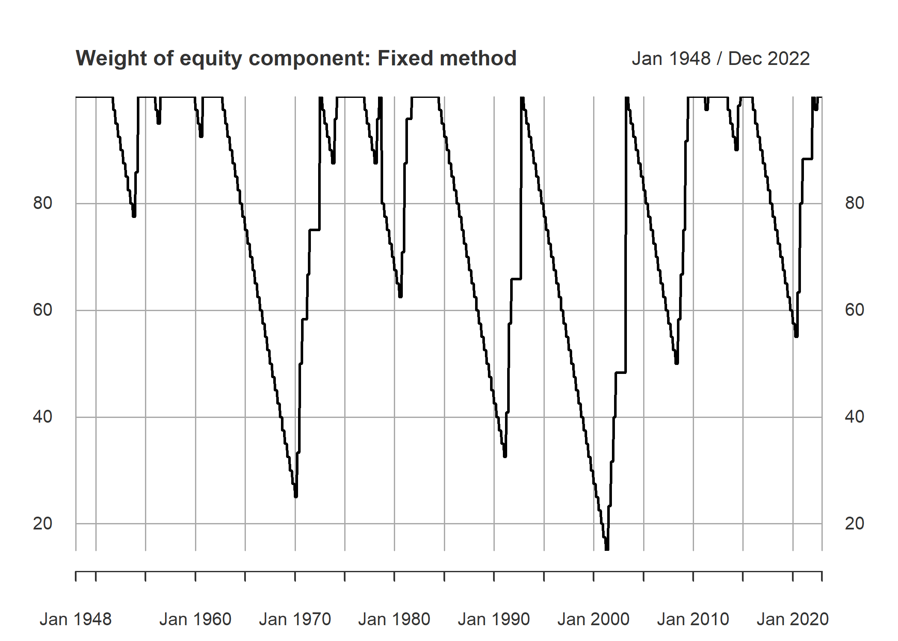
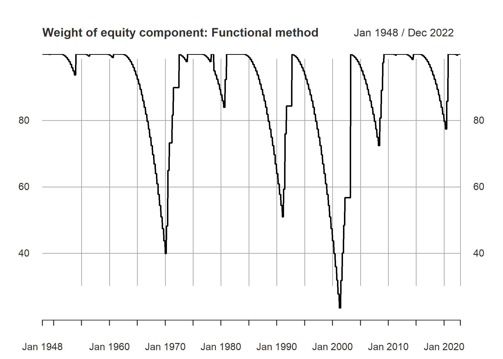

## Incentive

Given variations in geometric returns as a source of variations in final
portfolio return, variations timing and selection a subset of assets
universe for forming different portfolios with desired properties seems
to be an amusing question with interesting results. Usage of portfolio
rebalancing strategies or so called ‘volatility harvesting’ is an
important factor in making a portfolio. Multiplicative growth processes
that are subject to random shocks often have an asymmetric distribution
of outcomes. I considered some of the [CRP portfolios](https://phoebuslyubil.github.io/2017-02-19-Benchmark-and-Prediction-Part-2/).
Here the I try to assess effects of cash on CRP portfolios.

**The text and codes are boring and long :D, the charts shows the
weights over time and latest tables are the quantitative results :D**

-   *I did not consider delisted stocks and survivorship bias, they
    change the backtesting results but not the general logic. If I have
    time I will add them later. Also a comparision to 40-60 portfolio is most needed.
	Further, the effects on a index fund and
    cash and full historical analysis are not reported here.*

## Data

For the purpose of assessing empirical properties of the constructed
portfolios, CRSP/ Compustat merged database (CCM) data from December of
1969 to April of 2022 is used. Data cleaning can be seen in detail in
the code. Equities GVKEYs that have less than 12 observations are
omitted. duplicate are omitted. At this stage the number of assets that
remain in the dataset is 16789. After this stage we separate one
thousand stocks with biggest market equity in each month. Since market
equity of stocks change over time, 5863 unique asset remains in the
data. Finally, for having a smoother set, if an asset is not among the
top thousand market equity ones, and it become cheaper and not be in the
biggest 1000 anymore, a 6-period delay is considered before dropping the
asset from the portfolio.

Data for 4 week treasury bill yields, and 3 month treasury bill yields
are taken from the Saint Louise Fed website. Since 4-weekly data begins
in 2001, monthly yields for before mentioned date is derived from 3
months bills. Real seasonally adjusted GDP growth is taken from the same
source. S&P 500 index values, and 10 years interest rates as risk free
rate is acquired from [Robert Shiller
website](http://www.econ.yale.edu/~shiller/data.htm) . Data for factors
are taken from [Keneth French
website](https://mba.tuck.dartmouth.edu/pages/faculty/ken.french/Data_Library/f-f_factors.html).
If an asset does not meet the market equity criteria anymore, we drop it
and replace it with another random asset that meets the criteria.

    ## Libraries
    library(plyr)
    library(openxlsx)
    library(xts)

    ## Loading required package: zoo

    ## 
    ## Attaching package: 'zoo'

    ## The following objects are masked from 'package:base':
    ## 
    ##     as.Date, as.Date.numeric

    library(quantmod)

    ## Warning: package 'quantmod' was built under R version 4.1.3

    ## Loading required package: TTR

    ## Registered S3 method overwritten by 'quantmod':
    ##   method            from
    ##   as.zoo.data.frame zoo

    library(plyr)
    library(openxlsx)
    library(xts)
    library(quantmod)
    library(lubridate)

    ## Warning: package 'lubridate' was built under R version 4.1.3

    ## 
    ## Attaching package: 'lubridate'

    ## The following objects are masked from 'package:base':
    ## 
    ##     date, intersect, setdiff, union

    library(PerformanceAnalytics)

    ## Warning: package 'PerformanceAnalytics' was built under R version 4.1.3

    ## 
    ## Attaching package: 'PerformanceAnalytics'

    ## The following object is masked from 'package:graphics':
    ## 
    ##     legend

    library(pander)

    ## Warning: package 'pander' was built under R version 4.1.3

    ## Data

    # importing and subsetting data
    Data_whole<- read.csv("D:/data crp cp/data full.csv")
    Data_whole <- Data_whole[Data_whole$LINKTYPE %in% c( "LC", "LU"),]
    Data_whole <- Data_whole[Data_whole$LINKPRIM %in% c("P", "C", "J"),]
    Data_whole <- Data_whole[Data_whole$exchg %in% c(11,12,14),]

    # data description
    summary(Data_whole)
    summary(as.factor(Data_whole$exchg))
    length(levels(as.factor(Data_whole$GVKEY)))

    # Sorting data
    Data_whole <- Data_whole[order(Data_whole$GVKEY,Data_whole$datadate),]
    Data_whole$datadate<- as.Date(as.character( Data_whole$datadate), "%Y%m%d")

    # function for repeating last observation used for number of shares outstanding
    data_na.locf<- function( data = data){
      cshoq<- data$cshoq
      cshoq<- as.xts(cshoq, order.by = data$datadate)
      cshoq<- na.locf( cshoq, na.rm = FALSE )
      
      #prccm<- data$prccm
      #prccm<- as.xts(prccm, order.by = data$datadate)
      #prccm<- na.locf( prccm, na.rm = FALSE )
      
      temp<- data
      temp$cshoq<- as.numeric( cshoq)
      #temp$prccm<- as.numeric( prccm)
      return(temp)
    }

    data<- ddply(.data = Data_whole, .(GVKEY), .progress= "tk",
                 .parallel = FALSE,
                 .fun =function(x) data_na.locf(data = x))

    # Calculating market equity
    data$ME <- (data$prccm * data$cshoq)/1000

    summary(data)

    class(data$GVKEY)
    length(levels(as.factor(data$GVKEY)))
    sym_list<- unique(data$GVKEY)

    # subsetting data
    data<- subset( data, data$datadate >= as.Date( "1969-12-31"))

    # function summarising number of observations and trade volume
    data_basic_info<- function( data = data1, avr_tv_period_ = 3,
                                min_tv_val_ = 5000){
      avr_tv_period<- avr_tv_period_
      min_tv_val<- min_tv_val_
      sym_LPERMNO<- data$LPERMNO[1] 
      n_obs<- nrow(data)
      tv_EOMp<- data$cshtrm * data$prccm 
      avr_1st_3m_tv_p<- mean(tv_EOMp[1:avr_tv_period_])
      min_tv<- 0
      min_tv<- sum( tv_EOMp>= min_tv_val, na.rm = TRUE)
      temp<- cbind.data.frame( n_obs, avr_1st_3m_tv_p, min_tv)
      return(temp)
    }
    data_nobs<- ddply(.data = data, .(GVKEY), .progress= "tk",
                 .parallel = FALSE,
                 .fun =function(x) data_basic_info(data = x,
                                                   avr_tv_period_ = 3,
                                                   min_tv_val_ = 5000))

    # keeping symbols with at least 12+1 observation
    filtered_sym<- which( data_nobs$n_obs > 12)
    Sym_nobsmin<- data_nobs[ filtered_sym, 1]

    data<- subset( data, data$GVKEY %in% Sym_nobsmin)
    length(levels(as.factor(data$GVKEY)))

    # FUnction finding duplicate dates in data
    dup_date_fun<- function( data = x ){
      temp_data<- data$datadate
      dup_date<- length(temp_data) != length(unique(temp_data))
      temp<- 0
      if(dup_date == TRUE ) temp = 1
      return(temp)
    }
    dupersuperones<- ddply(.data = data, .(GVKEY), .progress= "tk",
                       .parallel = FALSE,
                       .fun =function(x) dup_date_fun( data = x))
    dupersuperones<- dupersuperones[which(dupersuperones[,2]==1),1]
    length(levels(as.factor(data$GVKEY)))

    # removing duplicate observations
    data<- subset(data, !(data$GVKEY %in% dupersuperones))
    length(levels(as.factor(data$GVKEY)))

    # function for sorting data based on period and market equity
    data_bigest_sym<- function( data = data1, 
                                N_sym. = 1000){
      N_sym<- N_sym.
      data_sort <- data[order(data$ME, decreasing = TRUE),]
      sym_list<- data_sort$GVKEY[ 1: N_sym]
      return(sym_list)
    }

    data_ME_1000<-ddply(.data = data, .(datadate), .progress= "tk",
                           .parallel = FALSE,
                           .fun =function(x) data_bigest_sym(data = x,
                                                             N_sym. = 1000))

    # Jafar<- subset(data, data$GVKEY == 6066)
    # Jafar<- subset( data, data$datadate == data$datadate[10])

    # function indicating 1 for biggiest ME symbols
    eligible_finder2<- function( date_data = Jafar, data_ME = data_ME_1000){
      
      #for( j in 1 : length(unique(data$GVKEY))){
      eligible<- rep( 0 , nrow(date_data))
      date_current<- date_data$datadate[1]
      data_ME_date<- subset(data_ME, data_ME$datadate == date_current )[ ,-1]
      indx_ME<- which( date_data$GVKEY %in% data_ME_date)
      eligible[indx_ME]<- 1
      date_data$eligible<- eligible
      return(date_data)
    }

    data_s<- data[ , c(1,6)]
    data_ME_indcator<-ddply(.data = data_s, .(datadate), .progress= "tk",
                        .parallel = FALSE,
                        .fun =function(x) eligible_finder2(date_data = x,
                                                          data_ME = data_ME_1000))
    data_ME_indcator <- data_ME_indcator[order(data_ME_indcator$GVKEY,
                                               data_ME_indcator$datadate),]
    data$eligible<- data_ME_indcator$eligible
    #subset(data_ME_indcator, data_ME_indcator$GVKEY == 9563  )

    ## Subseting data to ALL the observation that were at least once in biggest
    ## ME symbols at one point in time
    data_size_inclusion<- function(data = x){
      temp<- sum( data$eligible==1, na.rm = TRUE)
      inclusion<- 0
      if( temp >=1) inclusion <- 1
      return( inclusion)
    }

    INDX_included<-ddply(.data = data, .(GVKEY), .progress= "tk",
                         .parallel = FALSE,
                         .fun =function(x) data_size_inclusion(data = x))

    INDX_included_sym<- INDX_included[ which( INDX_included[, 2] == 1), 1]

    data_bigsym<- subset( data, data$GVKEY %in% INDX_included_sym )
    # test N should be 805
    length(unique( data_bigsym$GVKEY))

    col_need<- c("GVKEY", "LPERMNO", "datadate", "cshtrm", "navm",
                 "prccm", "prchm", "prclm", "ME",
                 "trfm", "trt1m", "rawpm",
                 "sphmid", "sphvg",
                 "cshoq", "secstat", "gsector",
                 "naics", "dlrsn", "dldte", "eligible" ) 

    data_bigsym<- data_bigsym[ , col_need]
    summary((as.factor( data_bigsym$dlrsn)))

    # writing final file on disk
    setwd( "D:/data crp cp/")

    ##
    ## setting seed value for reproducibility
    seed_value<-19880622

    # begin and end of portfolio
    begin_date<- "1970-11-30"
    end_date<- "2022-04-30"

    # Number of asset per portfolio
    N_sym_portfolio = 30

    # number of simulations
    n.sim = 500
    ## Data

    # setting current directory
    setwd( "D:/data crp cp/")

    # Loading data
    data_INDX_s<- read.csv("data_size_ret.csv")
    data_INDX_s$datadate<- as.Date(as.character( data_INDX_s$datadate))

    rm(Data_whole)
    rm(data_INDX)
    gc()

    # function for keeping a symbol in considered symbols for portfolio 
    # if the symbols are not among 1000 biggest ME symbols up to maximum 6 period
    data<- data_INDX_s
    data_na.locf<- function( data = data){
      data$eligible[ is.na(data$ME)]<- 0
      ser_eligible<- data$eligible
      ser_eligible<- as.xts(ser_eligible, order.by = data$datadate)
      ser_eligible[ ser_eligible == 0]<- NA
      temp<- na.locf( ser_eligible, na.rm = FALSE, maxgap = 6 )
      temp[is.na(temp)]<- 0
      data$eligible<- as.integer(temp)
      return(data)
    }

    data<- ddply(.data = data, .(GVKEY), .progress= "tk",
                 .parallel = FALSE,
                 .fun =function(x) data_na.locf(data = x))

    ### Creating a new variable for biggest ME syms
    data$MEok<- data$eligible
    sum(data$MEok[ is.na(data$ME)])

    setwd( "D:/data crp cp/")
    ##Getting data from FRED

    # 3 month treasury bills
    getSymbols('TB3MS', return.class = "xts", src = 'FRED')

    ## [1] "TB3MS"

    # 4 weeks treasury bills
    getSymbols('TB4WK', return.class = "xts", src = 'FRED')

    ## [1] "TB4WK"

    # Nominal gdp grwoth
    getSymbols('A191RP1Q027SBEA', return.class = "xts", src = 'FRED')

    ## [1] "A191RP1Q027SBEA"

    gGDP<- A191RP1Q027SBEA

    # real GDP growth
    getSymbols('A191RL1Q225SBEA', return.class = "xts", src = 'FRED')

    ## [1] "A191RL1Q225SBEA"

    gGDPreal<- A191RL1Q225SBEA

    # Loading Schiller data
    Schiller_data<- read.xlsx("Shiller Data.xlsx", 
                              sheet=1, detectDates = TRUE,
                              colNames = FALSE,
                              startRow =  9)[, 1:12]

    # names of this dataset variables are as follows
    # Date,SP500 SP500 Dividend, SP500 Earning, CPI, DateFraction, 
    # Long Interest Rate GS10, SP500 Real Price, SP500 Real Dividend, 
    # SP500 Real Total Return Prices_sym
    # SP500 Real Earnings, SP500 Real TR Scaled Earnings
    # Date, SP500, SP500_D, SP500_E, CPI, DateFraction, rf_10, SP500_real,
    # SP500_Dreal, SP500TRP_real, SP500_TR_E

    names_schiller<- c( "Date", "SP500", "SP500_D", "SP500_E", "CPI",
                        "DateFraction", "rf_10", "SP500_real",
                        "SP500_Dreal", "SP500TRP_real",
                        "SP500_Dreal", "SP500_TR_E")

    # changing format of Schiller_data
    for( i in 1: ncol(Schiller_data)){
      Schiller_data[ , i]<- as.numeric(Schiller_data [ , i])
    }

    ## Warning: NAs introduced by coercion

    ## Warning: NAs introduced by coercion

    ## Warning: NAs introduced by coercion

    ## Warning: NAs introduced by coercion

    Schiller_data<- Schiller_data[ -nrow( Schiller_data),]
    colnames(Schiller_data)<- names_schiller

    # Indexing by date
    Schiller_data_indx<- as.yearmon(seq( from = as.Date("1871-01-01"),
                               to = as.Date("2022-05-01"), by = 'm'))
    Schiller_data<-as.xts(Schiller_data, order.by = Schiller_data_indx)

    # S&P 500 values
    SP500<- Schiller_data$SP500

    # 10 years risk free rate value
    rf_10<- Schiller_data$rf_10

    # CPI
    CPI<- Schiller_data$CPI

    # growth of GDP
    gSP500<- diff(log( SP500))

    # getting FF 3 factor data
    FFFactor_3<- read.csv("F-F_Research_Data_Factors.csv")[1:1150,]
    FFFactor_3[,2]<- as.numeric(FFFactor_3[,2])
    FFFactor_3[,3]<- as.numeric(FFFactor_3[,3])
    FFFactor_3[,4]<- as.numeric(FFFactor_3[,4])
    FFFactor_3[,5]<- as.numeric(FFFactor_3[,5])
    FFFactor_3_data_indx<- as.yearmon(seq( from = as.Date("1926-07-01"),
                                           to = as.Date("2022-04-01"), by = 'm'))
    FFFactor_3<- as.xts(FFFactor_3[,-1], order.by = FFFactor_3_data_indx)

    load("ret_30_500.R")
    # changing 3 months returns to 1 month return
    TB1MS<- (1+TB3MS/100)^(1/12)-1
    #class(TB1MS)
    TB1MS<- TB1MS[ index(ret_matrix)]
    #print(TB1MS)
    TB4WK<- TB4WK[ index(ret_matrix)]
    TB1MS[ index(TB4WK)]<- (1+TB4WK/100)^(1/12)-1
    setwd( "D:/data crp cp/")
    #save(TB1MS, A191RP1Q027SBEA, A191RL1Q225SBEA, gGDP, gGDPreal, Schiller_data, SP500, rf_10, CPI, gSP500, FFFactor_3, file = "gen_data.Rdata")

    ###

    # function that is equal to 1 if data was in biggest ME symbols
    # for at least 12 sequentive preiod
    # function is backward looking
    The_ones_test_past<- function( data = x){
      check<- rle( data$MEok)
      orig_vals<- check$values
      for( i in 1 : length (check$values)){
        if( check$values[ i] == 1){
          if( check$lengths[ i] < 12){
            orig_vals[i] <- 0
          }
        }
      }
      end <- cumsum(check$lengths)
      start <- c(1, c(end[- length(end)] +1))
      start_12<- start+11
      temp<- rep(0, length(data$MEok))
      for( i in 1 : length(orig_vals)){
        if( orig_vals[i] == 1)
          temp[ start_12[i]: end[i]] <- 1
      }
      data$eligible<- temp
      return(data)

    }

    ## test sum per date
    #for ( i  in 1 : length( unique ( KKK$GVKEY))){
    #  Somal<- subset( KKK, KKK$GVKEY == unique ( KKK$GVKEY)[i])
    #  temp<- The_ones_test_past( data = Somal)
    #}

    ones_gather<- ddply(.data = data, .(GVKEY), .progress= "tk",
                        .parallel = FALSE,
                        .fun =function(x) The_ones_test_past(data = x))
    data<- ones_gather

    # getting number of time that a GVKEy is considered
    ones_per_number<- ddply(.data = data, .(GVKEY), .progress= "tk",
                        .parallel = FALSE,
                        .fun =function(x) sum(x$eligible))
    plot(ones_per_number)

    # getting number of syms that have the required criteria by each DATE
    ones_date_number<- ddply(.data = data, .(datadate), .progress= "tk",
                        .parallel = FALSE,
                        .fun =function(x) sum(x$eligible))
    plot(ones_date_number)
    sum(data$eligible)
    ## base 

    ## list of stocks that can be traded at each point
    max_n = max(ones_date_number[,2])
    The_chosen_ones<- function( data = x, max_n. =  max_n){
      temp<- rep(NA, max_n.)
      indx<- which ( data$eligible == 1)
      sym.list<- data$GVKEY[ indx]
      sym.list<- unique( sym.list)
      if( length( sym.list)>0){
        temp[1:length(sym.list)]<- sym.list
      }
      return(temp)
    }

    #data<- subset( KKK, KKK$datadate == unique(KKK$datadate)[380])
    # data1<- subset(data, data$datadate >= as.Date("1992-01-01") &
    #                  data$datadate <= as.Date("2001-01-01"))
    tradables_ones<- ddply(.data = data, .(datadate), .progress= "tk",
                  .parallel = FALSE,
                  .fun =function(x) The_chosen_ones( data = x, max_n. =  max_n))

    # subsetting data to symbols we consider
    tradables_ones<- subset(tradables_ones, tradables_ones$datadate >= begin_date &
                              tradables_ones$datadate <= end_date)
    #tradables_ones<- tradables_ones[ , 1:300]
    begin_eligible<- tradables_ones[ which( tradables_ones$datadate == begin_date),]

    # index of begining date
    n_begin<- which(tradables_ones$datadate == begin_date)
    begin_eligible<- begin_eligible[ -1]
    begin_eligible <-  as.integer( begin_eligible[ !is.na( begin_eligible)])

    Begin_syms <- sample(begin_eligible, N_sym_portfolio)

    # function giving value 1 if the symbol exist in the portfolio at given data
    sym_ind_maker.<- function( sym_set. = x,
                               sym_universe = port_sym_universe){
      sym_in_current<- NULL
      sym_set.<- sym_set.[,-ncol(sym_set.)]
      for ( i in 1 : length ( sym_universe)){
        sym_i<- sym_universe[ i]
        temp<- as.integer(sum( sym_i %in% sym_set.) > 0)
        sym_in_current<- c( sym_in_current, temp)
      }
      return(sym_in_current)
    }

## Rebalancing weigths

For getting the weights, I used a definition of recessions. That is 2
consequential negative real seasonal growth. begging from a full equity
portfolio, each period we reduce equity weigh. And when a recession
happens, we buy as much as we can. For the timing and amounts of change
per period, I used following two:

-   If the sign of real GDP growth negatives for 2 consecutive time, we
    increase equity share by 50/3 percent per season. If it is 0, 1 or
    -1, we increase it by half of this amount, 50/6 percent. When real
    GDP growth has positive signs, a couple of predefined series been
    will be considered. One is a sequence series from 100 to zero that
    reduced 2.5 percent per month and stays at zero after reaching to
    that amount.
-   A second series is made by following function at 1-unit intervals
    from 1 to 40: 
	

Where i denote time elapsed from latest 2 consecutive negative sign.
This function implies that the amount of cash will increase as time
passes and after 40 season or 10 years, the portfolio only consists of
cash. We take 3 season as resting period after a 2 negative sign reset
occurrence. That is 3 season after series of good economic growth data
happened, the weight of equities, W\_eq, in the portfolio will begin to
decrease.

A final matter is that third announcement of real GDP growth by Bureau
of Economic Analysis is announced almost 3 months after end of season.
We take this revised number and date, as the basis for the periods. In
other words, since the information about real GDP growth is available
with a season lag, the series are calculated by a season lag too. A
visual chart for the two series from 1948 are as follows.

    # Functions resulting weight of equity in the portfolio

    GDP.trigger<- function( x =  gGDPreal, treshold = 0,
                            n.negative = 2, 
                            functional.change = TRUE, n.rebalance.pos = 3,
                            n.rebalance.neg = 3,
                            T.addition= 3,
                            v.change.pos = -10, v.change.neg = 50){
      sign_x<-  sign (x - treshold)
      trigger_x<- lag( sign_x, 1) + lag( sign_x, 0) 
      trigger_x<- trigger_x[ -1,]
      weight_eq<- NULL
      rec.ind<- 0
      w.e<- 100
      change.pos.fun<- NULL
      for(j in 1 : 40){
        temp<- ( 1- (1-( j/40)^2))
        temp<- 1 - temp
        change.pos.fun<- c( change.pos.fun, temp)
      }
      change.pos.fun<- change.pos.fun*100
      change.pos.fix<- seq( from = 100 , 0, by = v.change.pos/4)
      change.pos.fix[is.na(change.pos.fix)]<-0
      #change.pos.fun<- c( rep( 100, 12), change.pos.fun)
      for ( i in 1 : length( trigger_x)){
        trigger<- trigger_x[i]
        
        if( trigger <= 0)  rec.ind<- i
        elapsed<- i - rec.ind 
        
        
        if( functional.change == FALSE){
          if( trigger <= -2 ) w.e<- min( w.e + v.change.neg/n.rebalance.neg , 100)
          if( trigger > -2 & trigger < 2) w.e<- min( w.e + v.change.neg/(n.rebalance.neg*2) , 100)
          if( elapsed > T.addition){
            if( trigger >= 2) w.e<- max( change.pos.fix[elapsed - T.addition] , 0)
          }
        }
        if( functional.change == TRUE){
          #list.change.pos<- change.pos.fun[ c( rep(FALSE, 11), TRUE ) ]
          
          if( trigger<= -2 ) w.e<- min( w.e + v.change.neg/n.rebalance.neg , 100)
          if( trigger> -2 & trigger< 2) w.e<- min( w.e + v.change.neg/(n.rebalance.neg*2) , 100)
          if( elapsed > T.addition){
            if( trigger>= 2) w.e<- max( change.pos.fun[elapsed - T.addition] , 0)
          }
        }
        weight_eq<- c( weight_eq, w.e)
        
      }
      return(weight_eq)
    }

    s_GDP_trig<- GDP.trigger(x =  gGDPreal, treshold = 0,
                             n.negative = 2, 
                             functional.change = FALSE, n.rebalance.pos = 3,
                             n.rebalance.neg = 3,
                             T.addition= 3,
                             v.change.pos = -10, v.change.neg = 50)

    # making index monthly instead of seasonally
    m_GDP_trig<- rep(s_GDP_trig, each =3)
    gdp_date<- index(gGDPreal)
    gdp_date<- c( gdp_date, gdp_date[ length(gdp_date)]+30)
    gdp_date<- c( gdp_date, gdp_date[ length(gdp_date)]+31)

    # Changing index to release date of data 
    releasedate<- gdp_date %m+% months(6)
    gdp_indx<- as.yearmon(seq( from = releasedate[2],
                               to = releasedate[ length(releasedate)], by = 'm'))
    m_GDP_trig<- as.xts( as.numeric(m_GDP_trig), order.by = gdp_indx)

    # plotting the weights
    plot(m_GDP_trig, main = "Weight of equity component: Fixed method")

    # getting equity weights by function method
    s_GDP_trig_fun<- GDP.trigger(x =  gGDPreal, treshold = 0,
                             n.negative = 2, 
                             functional.change = TRUE, n.rebalance.pos = 3,
                             n.rebalance.neg = 3,
                             T.addition= 3,
                             v.change.pos = -10, v.change.neg = 50)
    m_GDP_trig_fun<- rep(s_GDP_trig_fun, each =3)
    m_GDP_trig_fun<- as.xts( as.numeric(m_GDP_trig_fun), order.by = gdp_indx)
    # plotting the weights
    plot(m_GDP_trig_fun, main = "Weight of equity component: Functional method")

    #  
    # 

## Backtesting

Creating 500 random portfolios that each had 30 assets in them. Value
weighted portfolio is based on market equity of constituent assets, that
is, number of outstanding shares time end of month price of a share.
Equal weighted portfolio gives equal weights to each asset. These
weights are rebalanced at each period. For returns, monthly returns
reported by CCM is used (I did not go into the details but these
reported returns are significantly different from EOM price growths).
For return on cash, 4 weekly treasury bill yields were used.

    # function calculating returns of the portfolio

    ret_portfo<- function( Begin_syms. = Begin_syms, data = data,
                           tradables_ones = tradables_ones,
                           sym_ind_maker = sym_ind_maker., 
                           N_sym_portfolio = N_sym_portfolio,
                           use.reported.ret = TRUE){ 
      
      ## stage 1, choosing the symbols in porfolio in each date
      ## the function is bacwark looking
      N_Dobservation<- last( tradables_ones$datadate)
      sym_set <- rbind(Begin_syms.)
      sym_port <- NULL
      change_sym_length<- 1
      while (change_sym_length > 0) {
        excluded_ones <- NULL
        n_date_row<- dim( sym_set)[1]
        for (i in 1 : ncol( sym_set)) {
          sym_current<- sym_set[ dim( sym_set)[1] , i]
          data_sym <- subset(data, data$GVKEY == sym_current &
                               data$datadate > tradables_ones$datadate[n_date_row])
          change_eligible <- c( 0 , diff(data_sym$eligible))
          nlastdate_sym <- last( data_sym$datadate)
          temp <- NULL
          if( nrow(data_sym) == 0){
            temp <- cbind.data.frame(
              sym = sym_current,
              date = tradables_ones$datadate[n_date_row+1],
              eligible = 0,
              i = i
            )
            excluded_ones <- rbind.data.frame(excluded_ones, temp)
          } else {
          if (length(unique (change_eligible)) > 1 | nlastdate_sym < N_Dobservation) {
            chaange_ind <- first(which(change_eligible != 0))
            if( length(chaange_ind) > 0 ){
            temp <- cbind.data.frame(
              sym = sym_current,
              date = data_sym$datadate[chaange_ind],
              eligible = data_sym$eligible[chaange_ind],
              i = i
            )
            excluded_ones <- rbind.data.frame(excluded_ones, temp)
            } else {
              if( nlastdate_sym < N_Dobservation ){
                temp <- cbind.data.frame(
                  sym = sym_current,
                  date = last( data_sym$datadate),
                  eligible = last( data_sym$eligible),
                  i = i
                )
              }
            }
            excluded_ones <- rbind.data.frame(excluded_ones, temp)
          }
          }
        }

        change_sym_length <- length(excluded_ones)
        if (change_sym_length > 0) {
          change_date <- min(excluded_ones$date)
          excld_syms <-
            subset(excluded_ones, excluded_ones$date == change_date)
          change_syms <- unique(excld_syms$sym)
            
          n_sym_exclude <- length(change_syms)
          lag_syms<- sym_set [ dim(sym_set)[1],]
          remained_syms <- lag_syms[ -which( lag_syms %in% change_syms)]
          available_syms <-
            tradables_ones[ which(tradables_ones$datadate ==
                                   change_date), ]
          available_syms<- available_syms[ -1]
          available_syms <-  as.integer( available_syms[ !is.na( available_syms)])
          available_syms <-
            available_syms[ -which( available_syms %in% remained_syms)]
          added_syms <- sample(available_syms, n_sym_exclude)
          new_syms <- c(remained_syms, added_syms)
          ##
          ## change dim
          n.row <- which(tradables_ones$datadate == change_date)
          n.row<- n.row - nrow(sym_set) -1
          if( n.row > 0){
          temp1 <- matrix( rep(sym_set[dim(sym_set)[1],],  n.row),
                           nrow = n.row, byrow = TRUE) 
          sym_set <- rbind(sym_set, temp1)
          rm(temp1)
          }
          sym_set <- rbind(sym_set, new_syms)
          excluded_ones<- NULL
        } else {
          n.row <- dim( tradables_ones)[1]
          n.row<- n.row - nrow(sym_set)
          temp2 <- matrix( rep(sym_set[dim(sym_set)[1],], times = n.row),
                           nrow = n.row, byrow = TRUE) 
          sym_set <- rbind(sym_set, temp2)
          rm(temp2)
          excluded_ones<- NULL
        }
      }
      
      
      sym_set<- as.data.frame(sym_set)
      sym_set$date<- tradables_ones$datadate
      
      # subset data for portfolio
      port_sym_universe<- unique(unlist(sym_set[ , - dim(sym_set)[2]]))
      port_data<- subset( data, data$GVKEY %in% port_sym_universe)
      port_data<- subset( port_data,
                          port_data$datadate >= (as.Date(begin_date) -365))
      # making Price matrix as data.frame
      Prices_sym<- as.xts( rep(0 , length(sym_set$date)),
                       order.by = sym_set$date, dateFormat="Date")
      for ( i in 1 : length ( port_sym_universe)){
        temp0<- subset( port_data, port_data$GVKEY == port_sym_universe[ i])
        temp1<- temp0$prccm
        temp1<- as.xts( temp1, order.by = temp0$datadate, dateFormat="Date" )
        Prices_sym<- merge( Prices_sym, temp1)
      }
      Prices_sym<- Prices_sym[ , -1]
      colnames(Prices_sym)<- port_sym_universe
      # log return 
      ret_syms<- diff( log( Prices_sym))
      ret_syms<- ret_syms[ -1,]
      ret_syms<- ret_syms[ sym_set$date]
      #Prices_sym["2000-05-31::2000-07-31"]
      # ME matrix
      ME_sym<- as.xts( rep(0 , length(sym_set$date)),
                       order.by = sym_set$date)
      for ( i in 1 : length ( port_sym_universe)){
        temp0<- subset( port_data, port_data$GVKEY == port_sym_universe[ i])
        temp1<- temp0$ME
        temp1<- as.xts( temp1, order.by = temp0$datadate )
        ME_sym<- cbind.xts( ME_sym, temp1)
      }
      ME_sym<- ME_sym[ , -1]
      colnames(ME_sym)<- port_sym_universe
      ME_sym<- lag.xts(ME_sym)
      ME_sym<- ME_sym[ -1,]
      ME_sym<- ME_sym[ sym_set$date]
      #length(temp)<- length(sym_set$date)
      #monthly return as reported in the dataset
      #trt1m
      Trm_sym<- as.xts( rep(0 , length(sym_set$date)),
                       order.by = sym_set$date)
      for ( i in 1 : length ( port_sym_universe)){
        temp0<- subset( port_data, port_data$GVKEY == port_sym_universe[ i])
        temp1<- temp0$trt1m
        temp1<- as.xts( temp1, order.by = temp0$datadate )
        Trm_sym<- cbind.xts( Trm_sym, temp1)
      }
      Trm_sym<- Trm_sym[ , -1]
      Trm_sym<- Trm_sym/100
      colnames(Trm_sym)<- port_sym_universe
      Trm_sym<- Trm_sym[ sym_set$date]
      
      ### Chosing type of return
      if( use.reported.ret == TRUE){
        ret_syms<- Trm_sym
      }
      #colMeans(Trm_sym, na.rm = TRUE) - colMeans(ret_syms, na.rm = TRUE)

      # indicating subsets of symbols for each period
      sym_port_indc<- NULL
      for( j in 1 : nrow(sym_set)){
        temp<- sym_ind_maker( sym_set. = sym_set[ j,],
                              sym_universe = port_sym_universe)
        sym_port_indc<- rbind(sym_port_indc, temp)
      }
      
      # sum(sym_port_indc[1,] %in% port_sym_universe )
      # sum(sym_port_indc)/20
      colnames(sym_port_indc)<- port_sym_universe
      sym_port_indc<- as.data.frame(sym_port_indc)
      sym_port_indc<- as.xts( sym_port_indc, order.by =  sym_set$date)
      #### Weight Matrix
      equal_replica<- rep( 1/ N_sym_portfolio , length(port_sym_universe))
      weight_portf_sym<- sym_port_indc %*% diag(equal_replica)
      #weight_portf_sym<- weight_portf_sym[ -1,]
      
      # Market equity weigthed
      ME_port<- NULL
      for(i in 1 : nrow(sym_set)){
        temp<- NULL
        index_sym_incl<- as.logical(sym_port_indc[i,])
        ME_sym<- na.locf(ME_sym)
        temp<- ME_sym[ i, index_sym_incl]
        #if(sum(is.na(temp))>0){
        #  temp[is.na(temp)]<- mean(temp, na.rm = TRUE)
        #}
        ME_port<- rbind(ME_port, temp)
      }
      
      sum_ME<-  rowSums(ME_port, na.rm = TRUE)
      W_port_ME<- ME_port/sum_ME
      
      ## equity components return
      #ret_syms_date<- ret_syms[ index( ME_port),]
      ret_syms_date<- ret_syms
      ret_sym_port<- NULL
      for(i in 1 : nrow(sym_set)){
        temp<- NULL
        index_sym_incl<- as.logical(sym_port_indc[i,])
        temp<- ret_syms_date[ i, index_sym_incl]
        ret_sym_port<- rbind(ret_sym_port, temp)
      }

      # Rebalanced equal weight
      
      # Rebalanced fixed weight at start
      ret_sym_port0<- ret_sym_port
      ret_sym_port0[is.na(ret_sym_port)] <- 0
      ret_port_wME<- diag(ret_sym_port0 %*% t(W_port_ME))
      ret_port_wME<- as.xts( ret_port_wME, order.by = index( ret_sym_port0))
      # Rebalanced annually
      
      # Rebalanced by triger
     
      # portfolio returns
      ret_syms0 <-  ret_syms
      ret_syms0[is.na(ret_syms)] <- 0
      port_return_eq<- diag(   ret_syms0 %*% t(weight_portf_sym))
      port_return_eq<- as.xts( port_return_eq, order.by = index( ret_syms))
      
      # testing function
      #ret_check<- rowSums(ret_sym_port0)/20
      
      # returns 1st equal weight, second value weight
      port_ret<- cbind(port_return_eq, ret_port_wME)
      
      return(port_ret)
    }

    # creating fist observation randomly by predefined seed
    Begin_syms_m <- NULL 
    for( i in 1 : n.sim){
      set.seed(seed_value+i-1)
      temp<- NULL
      temp<- sample(begin_eligible, N_sym_portfolio )
      Begin_syms_m<- rbind(Begin_syms_m, temp)
    }

    return_portfo<- ret_portfo( Begin_syms. = Begin_syms, data = data,
                           tradables_ones = tradables_ones, N_sym_portfolio = 50)
    #322 407 484
    # the code give error for 322, 407, 484 beginning sets
    # it should be checked, for now they are excluded
    simulation_set<- 1:500
    simulation_set<- simulation_set[ !c(simulation_set %in% c(322, 407, 484 ))]

    # getting results of simulation: to be a faster code later
    ret_matrix<- NULL
    for(i in 1 : nrow(simulation_set)){
      temp<- ret_portfo( Begin_syms. = Begin_syms, data = data,
                         tradables_ones = tradables_ones, N_sym_portfolio = 50,
                         use.reported.ret = TRUE)
      ret_matrix<- cbind(ret_matrix, temp)
    }

    # saving simulation results
    #save(ret_matrix, file = "ret_30_500.R")
    # plot(cumprod( 1+ ret_matrix[,1]))

    library(zoo)
    library(xts)

    load("ret_30_500.R")
    load("gen_data.Rdata")

    # return_portfolio

    index(ret_matrix) <- as.yearmon(index(ret_matrix))

    # returns of equal weighted portfolios
    Eq_W_portfolio<- NULL
    for(i in 1:(ncol(ret_matrix)/2)) Eq_W_portfolio<- cbind(Eq_W_portfolio, ret_matrix[, (2*i-1)])

    # returns of value weighted portfolios
    Va_W_portfolio<- NULL
    for(i in 1:(ncol(ret_matrix)/2)) Va_W_portfolio<- cbind(Va_W_portfolio, ret_matrix[, (2*i)])

    # simple method
    # vector of equity weight
    W_vec<- m_GDP_trig[ index(Eq_W_portfolio)]/100
    # matrix of equity weight
    W_matrix<- matrix(W_vec, nrow= nrow(W_vec),
                      ncol=ncol(Eq_W_portfolio), byrow=FALSE)
    # tbill return time weight
    ret_TB_vec<- TB1MS * ( 1 - W_vec)
    ret_TB_matrix<- matrix(ret_TB_vec, nrow= nrow(ret_TB_vec),
                           ncol=ncol(Eq_W_portfolio), byrow=FALSE)
    # portfolio returns for equal weight and value weight
    ret_tot_eqW<- Eq_W_portfolio *W_matrix + ret_TB_matrix
    ret_tot_valW<- Va_W_portfolio *W_matrix + ret_TB_matrix
    ####################
    # Function method
    # vector of equity weight
    W_vec_fun<- m_GDP_trig_fun[ index(Eq_W_portfolio)]/100
    # matrix of equity weight
    W_matrix_fun<- matrix(W_vec_fun, nrow= nrow(W_vec_fun),
                      ncol=ncol(Eq_W_portfolio), byrow=FALSE)
    # tbill return time weight
    ret_TB_vec_fun<- TB1MS * ( 1 - W_vec_fun)
    ret_TB_matrix_fun<- matrix(ret_TB_vec_fun, nrow= nrow(ret_TB_vec_fun),
                           ncol=ncol(Eq_W_portfolio), byrow=FALSE)
    # portfolio returns for equal weight and value weight
    ret_tot_eqW_fun<- Eq_W_portfolio *W_matrix_fun + ret_TB_matrix_fun
    ret_tot_valW_fun<- Va_W_portfolio *W_matrix_fun + ret_TB_matrix_fun

    port_names<- c( "Eq_W_portfolio", "ret_tot_eqW", "ret_tot_eqW_fun",
                    "Va_W_portfolio", "ret_tot_valW", "ret_tot_eqW_fun" )

    #save(Eq_W_portfolio, ret_tot_eqW, ret_tot_eqW_fun,                 Va_W_portfolio, ret_tot_valW, ret_tot_eqW_fun, file = "ret_port_all_data.Rdata")

Table 1 shows performance metrics for equal weighted portfolio and
derived portfolios from it by changing the interest-bearing cash in the
portfolio. Derived portfolios beta with respect to S&P500 index is less
than original random portfolios. Annualized return shows a slight
improvement. Yet the overall change is related to variance of the return
series. Sharp and Information ratio improve substantially. The fixed
method of increasing cash weight by 10 percent per year overwhelms the
functional method.

<table>
<caption>Table 1 Performance Measures Equal Weighted</caption>
<colgroup>
<col style="width: 22%" />
<col style="width: 16%" />
<col style="width: 7%" />
<col style="width: 16%" />
<col style="width: 8%" />
<col style="width: 19%" />
<col style="width: 8%" />
</colgroup>
<thead>
<tr class="header">
<th style="text-align: center;"> </th>
<th style="text-align: center;">Value Weighted mean</th>
<th style="text-align: center;">vl sd</th>
<th style="text-align: center;">transformed vl mean</th>
<th style="text-align: center;">tr vl sd</th>
<th style="text-align: center;">fun transformed vl mean</th>
<th style="text-align: center;">fun vlsd</th>
</tr>
</thead>
<tbody>
<tr class="odd">
<td style="text-align: center;"><strong>Beta</strong></td>
<td style="text-align: center;">0.8318</td>
<td style="text-align: center;">0.0694</td>
<td style="text-align: center;">0.6098</td>
<td style="text-align: center;">0.04847</td>
<td style="text-align: center;">0.3195</td>
<td style="text-align: center;">0.01466</td>
</tr>
<tr class="even">
<td style="text-align: center;"><strong>Annualized returns:
Arthemetic</strong></td>
<td style="text-align: center;">0.122</td>
<td style="text-align: center;">0.01026</td>
<td style="text-align: center;">0.1094</td>
<td style="text-align: center;">0.007691</td>
<td style="text-align: center;">0.06021</td>
<td style="text-align: center;">0.001949</td>
</tr>
<tr class="odd">
<td style="text-align: center;"><strong>Annualized returns:
Geometric</strong></td>
<td style="text-align: center;">0.1107</td>
<td style="text-align: center;">0.01134</td>
<td style="text-align: center;">0.1043</td>
<td style="text-align: center;">0.008256</td>
<td style="text-align: center;">0.05969</td>
<td style="text-align: center;">0.002044</td>
</tr>
<tr class="even">
<td style="text-align: center;"><strong>mean sd returns</strong></td>
<td style="text-align: center;">0.1817</td>
<td style="text-align: center;">0.01176</td>
<td style="text-align: center;">0.1404</td>
<td style="text-align: center;">0.0102</td>
<td style="text-align: center;">0.06487</td>
<td style="text-align: center;">0.002299</td>
</tr>
<tr class="odd">
<td style="text-align: center;"><strong>Max DrawDown</strong></td>
<td style="text-align: center;">0.5387</td>
<td style="text-align: center;">0.07406</td>
<td style="text-align: center;">0.4461</td>
<td style="text-align: center;">0.0396</td>
<td style="text-align: center;">0.2221</td>
<td style="text-align: center;">0.01873</td>
</tr>
<tr class="even">
<td style="text-align: center;"><strong>Sharp ratio:
Arthemetic</strong></td>
<td style="text-align: center;">0.6122</td>
<td style="text-align: center;">0.076</td>
<td style="text-align: center;">0.746</td>
<td style="text-align: center;">0.07393</td>
<td style="text-align: center;">0.9213</td>
<td style="text-align: center;">0.04459</td>
</tr>
<tr class="odd">
<td style="text-align: center;"><strong>Sharp ratio:
Geometric</strong></td>
<td style="text-align: center;">0.6122</td>
<td style="text-align: center;">0.076</td>
<td style="text-align: center;">0.746</td>
<td style="text-align: center;">0.07393</td>
<td style="text-align: center;">0.9213</td>
<td style="text-align: center;">0.04459</td>
</tr>
<tr class="even">
<td style="text-align: center;"><strong>Upside Potential
Ratio</strong></td>
<td style="text-align: center;">0.7958</td>
<td style="text-align: center;">0.03691</td>
<td style="text-align: center;">0.8264</td>
<td style="text-align: center;">0.0392</td>
<td style="text-align: center;">0.8334</td>
<td style="text-align: center;">0.02962</td>
</tr>
<tr class="odd">
<td style="text-align: center;"><strong>Information Ratio</strong></td>
<td style="text-align: center;">0.2689</td>
<td style="text-align: center;">0.07675</td>
<td style="text-align: center;">0.265</td>
<td style="text-align: center;">0.06509</td>
<td style="text-align: center;">-0.1092</td>
<td style="text-align: center;">0.02034</td>
</tr>
</tbody>
</table>

Table 1 Performance Measures Equal Weighted

<table>
<caption>Table 2 Performance Measures Value Weighted</caption>
<colgroup>
<col style="width: 22%" />
<col style="width: 16%" />
<col style="width: 7%" />
<col style="width: 16%" />
<col style="width: 8%" />
<col style="width: 19%" />
<col style="width: 8%" />
</colgroup>
<thead>
<tr class="header">
<th style="text-align: center;"> </th>
<th style="text-align: center;">Value Weighted mean</th>
<th style="text-align: center;">vl sd</th>
<th style="text-align: center;">transformed vl mean</th>
<th style="text-align: center;">tr vl sd</th>
<th style="text-align: center;">fun transformed vl mean</th>
<th style="text-align: center;">fun vlsd</th>
</tr>
</thead>
<tbody>
<tr class="odd">
<td style="text-align: center;"><strong>Beta</strong></td>
<td style="text-align: center;">0.8318</td>
<td style="text-align: center;">0.0694</td>
<td style="text-align: center;">0.6098</td>
<td style="text-align: center;">0.04847</td>
<td style="text-align: center;">0.3195</td>
<td style="text-align: center;">0.01466</td>
</tr>
<tr class="even">
<td style="text-align: center;"><strong>Annualized returns:
Arthemetic</strong></td>
<td style="text-align: center;">0.122</td>
<td style="text-align: center;">0.01026</td>
<td style="text-align: center;">0.1094</td>
<td style="text-align: center;">0.007691</td>
<td style="text-align: center;">0.06021</td>
<td style="text-align: center;">0.001949</td>
</tr>
<tr class="odd">
<td style="text-align: center;"><strong>Annualized returns:
Geometric</strong></td>
<td style="text-align: center;">0.1107</td>
<td style="text-align: center;">0.01134</td>
<td style="text-align: center;">0.1043</td>
<td style="text-align: center;">0.008256</td>
<td style="text-align: center;">0.05969</td>
<td style="text-align: center;">0.002044</td>
</tr>
<tr class="even">
<td style="text-align: center;"><strong>mean sd returns</strong></td>
<td style="text-align: center;">0.1817</td>
<td style="text-align: center;">0.01176</td>
<td style="text-align: center;">0.1404</td>
<td style="text-align: center;">0.0102</td>
<td style="text-align: center;">0.06487</td>
<td style="text-align: center;">0.002299</td>
</tr>
<tr class="odd">
<td style="text-align: center;"><strong>Max DrawDown</strong></td>
<td style="text-align: center;">0.5387</td>
<td style="text-align: center;">0.07406</td>
<td style="text-align: center;">0.4461</td>
<td style="text-align: center;">0.0396</td>
<td style="text-align: center;">0.2221</td>
<td style="text-align: center;">0.01873</td>
</tr>
<tr class="even">
<td style="text-align: center;"><strong>Sharp ratio:
Arthemetic</strong></td>
<td style="text-align: center;">0.6122</td>
<td style="text-align: center;">0.076</td>
<td style="text-align: center;">0.746</td>
<td style="text-align: center;">0.07393</td>
<td style="text-align: center;">0.9213</td>
<td style="text-align: center;">0.04459</td>
</tr>
<tr class="odd">
<td style="text-align: center;"><strong>Sharp ratio:
Geometric</strong></td>
<td style="text-align: center;">0.6122</td>
<td style="text-align: center;">0.076</td>
<td style="text-align: center;">0.746</td>
<td style="text-align: center;">0.07393</td>
<td style="text-align: center;">0.9213</td>
<td style="text-align: center;">0.04459</td>
</tr>
<tr class="even">
<td style="text-align: center;"><strong>Upside Potential
Ratio</strong></td>
<td style="text-align: center;">0.7958</td>
<td style="text-align: center;">0.03691</td>
<td style="text-align: center;">0.8264</td>
<td style="text-align: center;">0.0392</td>
<td style="text-align: center;">0.8334</td>
<td style="text-align: center;">0.02962</td>
</tr>
<tr class="odd">
<td style="text-align: center;"><strong>Information Ratio</strong></td>
<td style="text-align: center;">0.2689</td>
<td style="text-align: center;">0.07675</td>
<td style="text-align: center;">0.265</td>
<td style="text-align: center;">0.06509</td>
<td style="text-align: center;">-0.1092</td>
<td style="text-align: center;">0.02034</td>
</tr>
</tbody>
</table>

Table 2 Performance Measures Value Weighted

<table>
<caption>Tabel 3 OLS on FF3 individually</caption>
<colgroup>
<col style="width: 29%" />
<col style="width: 11%" />
<col style="width: 11%" />
<col style="width: 11%" />
<col style="width: 9%" />
<col style="width: 11%" />
<col style="width: 12%" />
</colgroup>
<thead>
<tr class="header">
<th style="text-align: center;"> </th>
<th style="text-align: center;">Mkt.RF</th>
<th style="text-align: center;">R2 Mkt.RF</th>
<th style="text-align: center;">SMB</th>
<th style="text-align: center;">R2 SMB</th>
<th style="text-align: center;">HML</th>
<th style="text-align: center;">R2 HML</th>
</tr>
</thead>
<tbody>
<tr class="odd">
<td style="text-align: center;"><strong>Eq Weight mean</strong></td>
<td style="text-align: center;">0.004096</td>
<td style="text-align: center;">0.7796</td>
<td style="text-align: center;">0.002021</td>
<td style="text-align: center;">0.08454</td>
<td style="text-align: center;">1.845e-05</td>
<td style="text-align: center;">-0.0005217</td>
</tr>
<tr class="even">
<td style="text-align: center;"><strong>eq sd</strong></td>
<td style="text-align: center;">0.0001699</td>
<td style="text-align: center;">0.02183</td>
<td style="text-align: center;">0.0002209</td>
<td style="text-align: center;">0.01571</td>
<td style="text-align: center;">0.0002305</td>
<td style="text-align: center;">0.001503</td>
</tr>
<tr class="odd">
<td style="text-align: center;"><strong>transformed eq
mean</strong></td>
<td style="text-align: center;">0.003068</td>
<td style="text-align: center;">0.708</td>
<td style="text-align: center;">0.001707</td>
<td style="text-align: center;">0.09741</td>
<td style="text-align: center;">6.322e-05</td>
<td style="text-align: center;">-0.0008323</td>
</tr>
<tr class="even">
<td style="text-align: center;"><strong>tr sd</strong></td>
<td style="text-align: center;">0.0001156</td>
<td style="text-align: center;">0.01666</td>
<td style="text-align: center;">0.0001311</td>
<td style="text-align: center;">0.01106</td>
<td style="text-align: center;">0.0001418</td>
<td style="text-align: center;">0.001144</td>
</tr>
<tr class="odd">
<td style="text-align: center;"><strong>fun transformed eq
mean</strong></td>
<td style="text-align: center;">0.003564</td>
<td style="text-align: center;">0.7494</td>
<td style="text-align: center;">0.001919</td>
<td style="text-align: center;">0.09662</td>
<td style="text-align: center;">6.86e-05</td>
<td style="text-align: center;">-0.0007547</td>
</tr>
<tr class="even">
<td style="text-align: center;"><strong>fun sd</strong></td>
<td style="text-align: center;">0.0001359</td>
<td style="text-align: center;">0.01792</td>
<td style="text-align: center;">0.0001564</td>
<td style="text-align: center;">0.01209</td>
<td style="text-align: center;">0.0001702</td>
<td style="text-align: center;">0.001248</td>
</tr>
<tr class="odd">
<td style="text-align: center;"><strong>Value Weighted
mean</strong></td>
<td style="text-align: center;">0.009649</td>
<td style="text-align: center;">0.7014</td>
<td style="text-align: center;">0.002849</td>
<td style="text-align: center;">0.02852</td>
<td style="text-align: center;">-0.001752</td>
<td style="text-align: center;">0.01354</td>
</tr>
<tr class="even">
<td style="text-align: center;"><strong>vl sd</strong></td>
<td style="text-align: center;">0.0006837</td>
<td style="text-align: center;">0.05102</td>
<td style="text-align: center;">0.001004</td>
<td style="text-align: center;">0.01869</td>
<td style="text-align: center;">0.001212</td>
<td style="text-align: center;">0.0146</td>
</tr>
<tr class="odd">
<td style="text-align: center;"><strong>transformed vl
mean</strong></td>
<td style="text-align: center;">0.007129</td>
<td style="text-align: center;">0.6423</td>
<td style="text-align: center;">0.002399</td>
<td style="text-align: center;">0.03247</td>
<td style="text-align: center;">-0.001012</td>
<td style="text-align: center;">0.007649</td>
</tr>
<tr class="even">
<td style="text-align: center;"><strong>tr vl sd</strong></td>
<td style="text-align: center;">0.0004536</td>
<td style="text-align: center;">0.05256</td>
<td style="text-align: center;">0.000569</td>
<td style="text-align: center;">0.01392</td>
<td style="text-align: center;">0.0007552</td>
<td style="text-align: center;">0.008965</td>
</tr>
<tr class="odd">
<td style="text-align: center;"><strong>fun transformed vl
mean</strong></td>
<td style="text-align: center;">0.003564</td>
<td style="text-align: center;">0.7494</td>
<td style="text-align: center;">0.001919</td>
<td style="text-align: center;">0.09662</td>
<td style="text-align: center;">6.86e-05</td>
<td style="text-align: center;">-0.0007547</td>
</tr>
<tr class="even">
<td style="text-align: center;"><strong>fun vlsd</strong></td>
<td style="text-align: center;">0.0001359</td>
<td style="text-align: center;">0.01792</td>
<td style="text-align: center;">0.0001564</td>
<td style="text-align: center;">0.01209</td>
<td style="text-align: center;">0.0001702</td>
<td style="text-align: center;">0.001248</td>
</tr>
</tbody>
</table>

Tabel 3 OLS on FF3 individually

<table>
<caption>Table 4 OLS on FF3 individually</caption>
<colgroup>
<col style="width: 37%" />
<col style="width: 15%" />
<col style="width: 16%" />
<col style="width: 15%" />
<col style="width: 15%" />
</colgroup>
<thead>
<tr class="header">
<th style="text-align: center;"> </th>
<th style="text-align: center;">Mkt.RF</th>
<th style="text-align: center;">SMB</th>
<th style="text-align: center;">HML</th>
<th style="text-align: center;">R2</th>
</tr>
</thead>
<tbody>
<tr class="odd">
<td style="text-align: center;"><strong>Eq Weight mean</strong></td>
<td style="text-align: center;">0.004228</td>
<td style="text-align: center;">0.0005516</td>
<td style="text-align: center;">0.001545</td>
<td style="text-align: center;">0.83</td>
</tr>
<tr class="even">
<td style="text-align: center;"><strong>eq sd</strong></td>
<td style="text-align: center;">0.0001672</td>
<td style="text-align: center;">0.0001937</td>
<td style="text-align: center;">0.0002412</td>
<td style="text-align: center;">0.01934</td>
</tr>
<tr class="odd">
<td style="text-align: center;"><strong>transformed eq
mean</strong></td>
<td style="text-align: center;">0.003139</td>
<td style="text-align: center;">0.0006302</td>
<td style="text-align: center;">0.001233</td>
<td style="text-align: center;">0.7636</td>
</tr>
<tr class="even">
<td style="text-align: center;"><strong>tr sd</strong></td>
<td style="text-align: center;">0.0001203</td>
<td style="text-align: center;">0.0001168</td>
<td style="text-align: center;">0.0001683</td>
<td style="text-align: center;">0.01731</td>
</tr>
<tr class="odd">
<td style="text-align: center;"><strong>fun transformed eq
mean</strong></td>
<td style="text-align: center;">0.003658</td>
<td style="text-align: center;">0.0006618</td>
<td style="text-align: center;">0.00142</td>
<td style="text-align: center;">0.8059</td>
</tr>
<tr class="even">
<td style="text-align: center;"><strong>fun sd</strong></td>
<td style="text-align: center;">0.0001409</td>
<td style="text-align: center;">0.0001387</td>
<td style="text-align: center;">0.000198</td>
<td style="text-align: center;">0.01793</td>
</tr>
<tr class="odd">
<td style="text-align: center;"><strong>Value Weighted
mean</strong></td>
<td style="text-align: center;">0.01006</td>
<td style="text-align: center;">-0.001008</td>
<td style="text-align: center;">0.001493</td>
<td style="text-align: center;">0.7192</td>
</tr>
<tr class="even">
<td style="text-align: center;"><strong>vl sd</strong></td>
<td style="text-align: center;">0.0006692</td>
<td style="text-align: center;">0.0008933</td>
<td style="text-align: center;">0.001258</td>
<td style="text-align: center;">0.04699</td>
</tr>
<tr class="odd">
<td style="text-align: center;"><strong>transformed vl
mean</strong></td>
<td style="text-align: center;">0.007419</td>
<td style="text-align: center;">-0.0003891</td>
<td style="text-align: center;">0.00144</td>
<td style="text-align: center;">0.6581</td>
</tr>
<tr class="even">
<td style="text-align: center;"><strong>tr vl sd</strong></td>
<td style="text-align: center;">0.000476</td>
<td style="text-align: center;">0.0005218</td>
<td style="text-align: center;">0.0008624</td>
<td style="text-align: center;">0.0508</td>
</tr>
<tr class="odd">
<td style="text-align: center;"><strong>fun transformed vl
mean</strong></td>
<td style="text-align: center;">0.003658</td>
<td style="text-align: center;">0.0006618</td>
<td style="text-align: center;">0.00142</td>
<td style="text-align: center;">0.8059</td>
</tr>
<tr class="even">
<td style="text-align: center;"><strong>fun vlsd</strong></td>
<td style="text-align: center;">0.0001409</td>
<td style="text-align: center;">0.0001387</td>
<td style="text-align: center;">0.000198</td>
<td style="text-align: center;">0.01793</td>
</tr>
</tbody>
</table>

Table 2 illustrates performance metrics for value weighted portfolio and
related derived portfolios by changing the weights of interest-bearing
cash in the portfolio. Except for the sharp ratio, the functional
derivation is almost worst in every case. For fixed method, the Beta
with the index is less than the beta of the original series. Annualized
return shows a half percent reduction. As with equal weighted case, the
overall change is stemmed by the change in the variance of the return
series. Sharp ratios increase but Information ratio shows no
improvement.

Averaged results of regression on Fama French 3 factors (table 3) shows
that these factors explain the variations in the return series very
well. Adjusted R squares are high, ranging from 0.83 to 0.66. Future the
numbers shows little variations across the 500 created portfolios.

Table 4 shows the coefficients of Fama French 3 Factors when they are
sole regressor with a constant. HML factor has no significant
contribution in explaining these variations. Overall excess return of
the market portfolio seems to be a very good and powerful explanatory
variable.

## Conclusion

Empirical results on cash and equal weight equity rebalanced portfolios 
showed improvements over almost all considered performance
metrics. This result shows that variable amount of cash based on last
negative real GDP growth can result in less risky portfolio while the
returns are the same.

For value weighted portfolio, the results were not
as satisfactory. In addition, considering survivorship bias due to
delisting and delisting returns and affect performance on both
portfolios. Also, one can consider the same method of making portfolios
but without rebalancing (buy and hold method).

For further work, one can investigate negative beta of the returns with
excess return of the market portfolio over time and economic cycles, and similarities and dissmilarities to 40/60 portfolio.

Looking from another viewpoint, maybe Schumpeter creative destruction is
source of value in more than one way :) But this statement needs more
rigorous work than what I wrote. Anyhow the results were pretty
surprising for me, And I loved them :D

## Conclusion

###### *Please inform me about your feedback, I will be deeply grateful for that :)*

###### For disclaimer please see about page.
