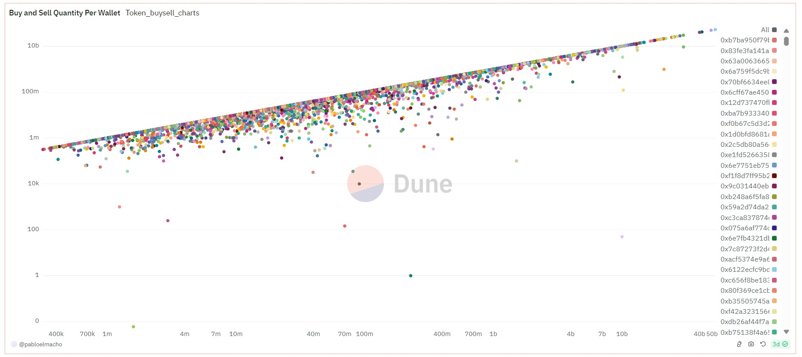
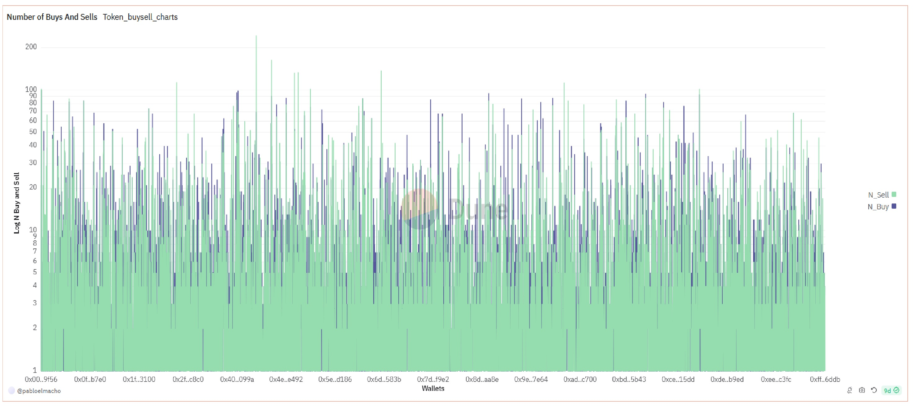
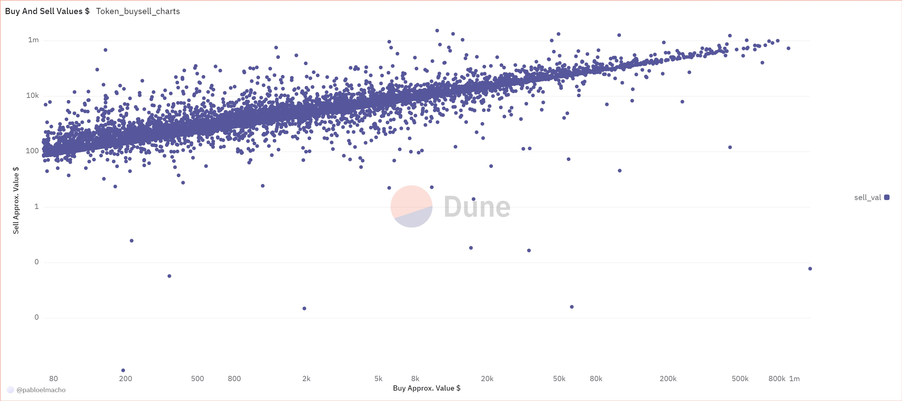

A while back, a friend told me about [ANDY on
Ethereum](https://etherscan.io/token/0x68bbed6a47194eff1cf514b50ea91895597fc91e),
and after looking at [ANDY’s
chart](https://coinmarketcap.com/currencies/boysclubandy) and its
dynamics, I found it quite interesting. This member of the [Boy’s
Club](https://www.boysclubandy.com/) rapidly, almost instantaneously,
increased its market capitalization (MCAP) from nearly $300K to a
staggering $297 million in about 70 days. ANDY is the main token among
several similarly named tokens on other chains, although none of the
others have made their way into the top 500 MCAP tokens.

With the help of Dune Analytics, I aimed to shed some light on the
general dynamics behind this phenomenon. Since it’s nearly impossible to
download data using Dune Analytics’ free plan, I leveraged their SQL
engine to retrieve the data and create the charts directly on their
platform. As a result, I wasn’t able to generate every chart I wanted :(
but I’m still quite happy with the results. (You can see the specific
amounts in the interactive charts on the [Dune
dashboard](https://dune.com/pabloelmacho/token-active-users-analyser/f23762bf-0e78-4267-bae6-79372c50db6d).)

Let’s dive into it! :)

## Price Charts

Below is ANDY’s price and volume chart, with data sourced from the
CoinMarketCap.com WebAPI.

    # Import packages
    import matplotlib.pyplot as plt
    import requests
    import json
    import pandas as pd
    import datetime
    import time
    import mplfinance as mpf
    import numpy as np

    # Ids and links
    BTC_ID = 1
    ANDY_ID = 29879
    USD_ID = 2781
    start = datetime.datetime(2024, 3, 8)
    start_UNIX = int(time.mktime(start.timetuple()))
    end = datetime.datetime(2024, 9, 11)
    end_UNIX = int(time.mktime(end.timetuple()))
    API_address = 'https://api.coinmarketcap.com/data-api/v3/cryptocurrency/historical?'
    BTC_url = f"{API_address}id={BTC_ID}&convertId={
        USD_ID}&timeStart={start_UNIX}&timeEnd={end_UNIX}"
    ANDY_url = f"{API_address}id={ANDY_ID}&convertId={
        USD_ID}&timeStart={start_UNIX}&timeEnd={end_UNIX}"

    # getting data
    # BTC

    r = requests.get(ANDY_url)
    data = []
    cols = ['Open', 'High', 'Low', 'Close', 'Volume', 'date']

    for item in r.json()['data']['quotes']:
        Open = item['quote']['open']
        High = item['quote']['high']
        Low = item['quote']['low']
        Close = item['quote']['close']
        Volume = item['quote']['volume']
        date = item['quote']['timestamp']

        data.append([Open, High, Low, Close, Volume, date])

    data_ANDY = pd.DataFrame(data, columns=cols)

    data_ANDY['date'] = pd.to_datetime(data_ANDY['date'])
    data_ANDY['date'] = data_ANDY['date'].dt.date
    data_ANDY['date'] = pd.to_datetime(data_ANDY['date'])

    print(data_ANDY)

    P_ANDY = data_ANDY.set_index('date')

    # ANDY

    r = None
    r = requests.get(BTC_url)
    data = []
    cols = ['Open', 'High', 'Low', 'Close', 'Volume', 'date']

    for item in r.json()['data']['quotes']:
        Open = item['quote']['open']
        High = item['quote']['high']
        Low = item['quote']['low']
        Close = item['quote']['close']
        Volume = item['quote']['volume']
        date = item['quote']['timestamp']

        data.append([Open, High, Low, Close, Volume, date])

    data_BTC = pd.DataFrame(data, columns=cols)

    data_BTC['date'] = pd.to_datetime(data_BTC['date'])
    data_BTC['date'] = data_BTC['date'].dt.date
    data_BTC['date'] = pd.to_datetime(data_BTC['date'])

    print(data_BTC)

    P_BTC = data_BTC.set_index('date')

    # 30D rolling corr
    window_size = 30
    rolling_corr = P_ANDY['Close'].rolling(window=window_size).corr(P_BTC['Close'])
    print(rolling_corr)

<figure>

<figcaption aria-hidden="true"></figcaption>
</figure>

The chart suggests that before March 31st, both volume and prices were
low, and the volume was negligible in absolute terms compared to what it
would become. In early June, it began to behave similarly to Bitcoin
(green line), though prior to that, it clearly followed a different
trend. The 30-day moving window correlation chart also shows very high
values by the end of June, and this generally remains consistent. In
early June, after the second major surge in volume and the decrease in
Bitcoin’s value, ANDY followed a similar downward pattern.

## Dune Analytics Datasets And Dashboard

All the charts in this section are thanks to Dune Analytics. You can
view my dashboard for this analysis [here](https://dune.com/pabloelmacho/token-active-users-analyser/f23762bf-0e78-4267-bae6-79372c50db6d). On the dashboard, the
charts are more visually appealing and interactive &lt;3.

I used several criteria to create these charts:

    1. The minimum buy value is set around $70.
    2. Prices are based on hourly averages on DEX.
    3. The maximum number of buys per wallet is 100.
    4. Users must have at least covered their buy value in realized profit.

 

### When Did It Become Serious?

<figure>

<figcaption aria-hidden="true"></figcaption>
</figure>

As the above chart shows, there is a significant bump in the amount
bought on the 1st of September, between 16:00 and 21:00. Earlier on the
same day, there was a smaller surge between 04:00 and 06:00. The next
chart shows the approximate amount bought per wallet in USD, with the
horizontal lines indicating when each wallet first purchased ANDY. Those
who first entered in early April bought significantly more than the
rest, even more than those who entered after ANDY’s launch. Besides
these two groups, there are two other notable groups of wallets: the
first around the third week of April, just as the token reached a local
high, and the second in late May, when the token began an upward
movement that mirrored Bitcoin’s rise, albeit with a slight lag, and
ended around the time Bitcoin started to decline.

<figure>

<figcaption aria-hidden="true"></figcaption>
</figure>

 

### Buy and Sell Per Wallet

<figure>

<figcaption aria-hidden="true"></figcaption>
</figure>

This chart shows the amount bought and sold per wallet. Most of the
wallets sold the majority of their holdings during this 7-month period.
Wallets that bought larger quantities seem to hold onto less in their
balances. The next pie chart illustrates the buy and sell quantities per
wallet. Approximately one-third of the overall quantity purchased is by wallets who significantly
bought larger quantities compared to the others. [Dune
dashboard](https://dune.com/pabloelmacho/token-active-users-analyser/f23762bf-0e78-4267-bae6-79372c50db6d).

<figure>

<figcaption aria-hidden="true"></figcaption>
</figure>

The following two charts show the number of buys and sells per wallet,
indicating how many times a wallet bought and sold. At the beginning, as we said, we
set criteria to exclude wallets that bought more than 100 times. This
helps filter out day traders and bots.

 The data suggests that the
majority of wallets had fewer than 20 buy or sell transactions. Since
the higher values on the chart are dominated by the green color, it
indicates that most wallets sold more frequently than they bought.

 This chart shows the
number of sells per wallet and the number of buys per wallet based on
when they first purchased ANDY. (To my knowledge, Dune does not support
3D charts, but these charts certainly deserve one!) This chart suggests
two interesting observations:

First, wallets that entered in early and mid-April show a considerably
higher number of buys and sells. This implies that most of these wallets
were likely not owned by informed players. However, I cannot say the
same for wallets that entered between ANDY’s launch and the end of May.

 For all charts, we separated
wallets where the average selling price was higher than their average
buying price. From these results, we can observe that buy values are
generally lower than sell values. Some wallets held onto a portion of
their tokens and did not sell them. The chart is logarithmic, which
suggests that not many made exceptional profits (in terms of USD. I made some other profit related charts bellow). Many
wallets seemed content with profits around $10K. Wallets that bought
more than $50K worth of tokens did not behave outside the norm, and with
a few exceptions, the same can be said for wallets that bought more than
$20K. In short, these wallets do not appear to belong to particularly
informed or lucky players.

### Sells and Realized Profit

In this section, we examine the ratio of sold tokens to bought tokens
and the realized profit, which reflects the profit rate on the tokens
sold. What I love most about crypto is that profit rates are often
expressed as multiples (X) rather than percentages :D Well, as the saying goes, mega profits are better than micro losses. 

 The chart of
sell ratio to realized profit suggests that the greater the profit
amount, the less a wallet retained its tokens. Additionally, few wallets
achieved more than a 20X realized profit.

 The
chart showing sell and realized profit based on the initial entry into
the market indicates that early buyers, particularly those in May and
the first three days of April, are the ones who achieved more than a 10X
profit. These wallets are mostly concentrated in the initial days of
April or immediately after the launch. The second group, who entered
later, seems to have retained less of their original tokens. Generally,
people who entered after April 1st and met the selection criteria
retained more tokens than earlier holders. Overall, the most active
wallets sold almost all they bought, while most of the holders kept less
than 20% of their purchases.

 The chart showing
realized profit based on the first time of entry is particularly
striking. It reveals that profits exceeding 6X are almost exclusively
associated with wallets that first bought ANDY before April 3rd. Those
who purchased during the semi-trend period on X and Telegram also seem
to be among those who made more than 6X profit. Some wallets that bought
before this time achieved considerable profit rates, suggesting they
were possibly either very informed, happy, or had a strategic plan. Most of these
wallets made less than 200X profit, although one early wallet achieved a
remarkable 3000X.

## Conclusion

Initially, ANDY’s performance was unremarkable, but a sudden surge on
April 1st marked the beginning of significant buying activity. The token
increased in value and subsequently followed Bitcoin’s trajectory with a
delay, reaching a peak. Afterward, it showed a high 30-day moving window
correlation with Bitcoin.

I found these dynamics fascinating, which prompted me to investigate
further. I selected wallets based on specific criteria to analyze their
overall behavior. Some wallets that bought ANDY before April 3rd
achieved more than 6X profits, though their numbers are limited compared
to the total number of ANDY buyers. Most of the wallets we considered
sold almost all of their holdings, while the remainder kept less than
20% of their purchases.

Although I haven’t quantified it, these patterns seem to be related to
ANDY’s Telegram channel and X hashtag activity. If I find a relevant
dataset, I might explore this further in the future. Additionally, I
found Dune Analytics to be a very useful tool! :) I also used ChatGPT
for editing and some Python’s function searches, which significantly
boosted my productivity. And I felt slightly outdated after using it :D

###### *Please inform me about your feedback, I will be deeply grateful for that :)*

###### For disclaimer please see about page.
